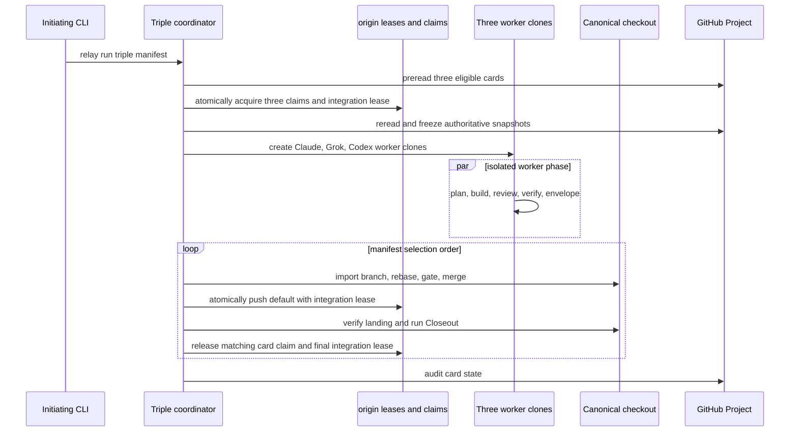

# Triple Manifest Run - Plan

## Goal Capsule

- **Objective:** Let one Relay command safely take three independent GitHub Projects cards, run one card on Claude, one on Grok, and one on Codex at the same time, then land each result without repository or card collisions.
- **Means:** Add a `triple` execution profile, a single batch coordinator, isolated worker clones, atomic remote Git leases, backend specific review evidence, and serial integration on the canonical checkout.
- **Authority:** User request on 2026-09-18, plus the existing Relay invariants in `CLAUDE.md` and `CONCEPTS.md`.
- **Stop conditions:** Do not enable the profile until a throwaway repository proves the remote claim protocol and a live Codex headless review proves its invocation and evidence contract.

## Product Contract

### Summary

Relay will provide one manifest shape for a three card GitHub Projects batch and one coordinator command that launches all three builders from the initiating CLI session.
The coordinator, not three independent Relay runs, owns selection, claims, worker clones, process lifecycles, landing, and closeout.

### Problem Frame

The current runner is deliberately serial and launches every Task in the target checkout.
Launching three ordinary manifests would collide on `HEAD`, the Git index, task branch names, and the existing repository lease.
It can also select one board card twice because the GitHub adapter reads a snapshot and has no reservation operation.
Codex is present as a launch backend but is currently refused because its native review contract was not proven.

### Requirements

**Triple composition**

- R1. A manifest can opt into an exact three slot GitHub Projects batch that contains three distinct, nonterminal cards and exactly one explicit Task for each of `claude`, `grok`, and `codex`.
- R2. One Relay command starts the batch from any initiating CLI session, including Claude Code, without requiring the operator to start one runner per backend.
- R3. The existing serial `run` behavior remains the default and has no changed manifest, state, or output semantics.

**Collision safety**

- R4. A triple batch holds the existing manifest and repository leases for its entire lifetime, and it also holds one remote repository integration lease. Another Relay coordinator cannot start a conflicting local or remote integration while that lease exists.
- R5. Each card receives a unique remote Git claim before a Task process starts, and a second Relay coordinator must fail closed when any selected card has a claim.
- R6. Each Task process runs only in its own coordinator owned clone and unique branch, never in the canonical integration checkout or another worker's Git directory.
- R7. A lost local lease, missing remote card claim, or missing remote integration lease stops new launches and all integration mutation, terminates only identity verified worker process groups, preserves recoverable branches, and never removes an unverified worker clone.

**Execution and landing**

- R8. Only planning, implementation, verification, and review overlap; rebase, gate, merge, push, verify landed, card closeout, and closeout commit remain serialized in the manifest selection order on the canonical checkout.
- R9. Before integration, each completed branch is rebased onto the current default branch and receives a fresh landing baseline. A rebase conflict or external advancement is a named per card halt, never an automatic overwrite or silent rebase of agent work.
- R10. The coordinator first reads three eligible cards, atomically claims their immutable board item identities and the repository integration ref, then rereads and freezes the authoritative card snapshots. Resume consumes that allocation instead of rereading and reassigning the board.
- R11. The coordinator detects unexpected divergence from the persisted expected card state machine before launch and before landing, records the collision evidence, and halts that card without merging it.

**Backend integrity**

- R12. Codex is admitted to triple mode only after `codex exec review --base <default branch>` is proven as a foreground native review step, its completed invocation is observable in Relay evidence, and the Task brief requires fixing its review findings before its envelope.
- R13. The worker clone form of Codex has a verified writable Git metadata root and preserves Relay's existing scope audit and network disclosure for its unenforced permission posture.

**Operator experience**

- R14. `validate`, `run`, `status`, `tail`, `summary`, and `audit` show the triple profile, three backend slots, local and remote leases, worker clones, and each slot phase without treating an out of order build completion as an out of order landing.
- R15. The `/relay` skill and host agnostic authoring guide can create a triple manifest by listing three eligible board cards and assigning the three backends, then validate and launch it from the one initiating session.

### Actors

- A1. The initiating operator creates and launches one triple manifest from Claude Code, Codex, Grok, or a shell.
- A2. The batch coordinator owns local leases, remote claims, worker clones, and serial landing.
- A3. Claude, Grok, and Codex each execute one isolated Task process.
- A4. GitHub Projects supplies the selected cards and remains the human visible work board.

### Key Flows

- F1. Triple launch
  - **Trigger:** A1 runs `relay run <manifest>` for a validated triple manifest.
  - **Steps:** A2 prereads the three cards, atomically acquires all three card claims and one repository integration lease, rereads and freezes the card snapshots, writes batch state, creates three worker clones, and starts one worker per backend.
  - **Outcome:** Exactly three distinct card lanes are running or the batch starts none.
- F2. Serial landing
  - **Trigger:** A worker finishes its build and review.
  - **Steps:** A2 waits for its manifest order, proves the worker stopped, imports its branch from the worker clone, rebases its branch onto the current default branch, gates, merges, atomically pushes the default branch with the integration lease, verifies, then runs the existing Closeout.
  - **Outcome:** A landed card has the same verified state as a serial Relay Task, while later workers can still build.
- F3. Collision or crash recovery
  - **Trigger:** A local lease is lost, a required remote ref disappears, a card snapshot diverges, or a worker exits abnormally.
  - **Steps:** A2 fences all mutation, kills only identity verified process groups from its current epoch, records precise evidence, retains branches, and releases only refs whose remote token still matches its own token.
  - **Outcome:** No unverified code is integrated. A coordinator crash leaves its remote claims in place until an explicit operator break proves the exact token to remove.

### Scope Boundaries

- Included: GitHub Projects, local merge shipping with `shipping.push = true`, exactly three slots, the three named backends, and target repositories whose `origin` accepts atomic custom ref updates.
- Deferred: arbitrary worker counts, Jira and markdown triples, pull request terminal shipping, parallel gates or closeouts, automatic resolution of rebase conflicts, and a generic remote lock service.
- Outside this product's identity: bypassing an external maintainer who edits a card manually. Relay detects changed card state and refuses to integrate, but cannot prevent a human from editing GitHub.

### Acceptance Examples

- AE1. Given three different open GitHub Project cards and no remote claim refs, a valid triple manifest atomically creates the three card claims and one repository integration lease, then starts three processes in three distinct worker clones and records the Claude, Grok, and Codex assignments before any process runs. Covers R1, R2, R4, R5, R6.
- AE2. Given another coordinator already holds a card claim or repository integration lease, a new triple batch returns the lease exit code before creating a worker clone or launching any backend. Covers R4, R5, R7.
- AE3. Given Grok finishes before Claude, the coordinator may classify Grok but integrates Claude first when Claude is first in the manifest. Covers R8, R14.
- AE4. Given the first branch lands and advances the default branch, the second completed branch is rebased and gated against that new default before merge. Covers R8, R9.
- AE5. Given a rebase conflict or a changed card digest, the affected card retains its branch and receives collision evidence while the coordinator never merges it. Covers R9, R11.
- AE6. Given Codex runs in its worker clone, its recorded review evidence contains an unmasked successful foreground `codex exec review --base` invocation, the review output, and the command exit status. Covers R12, R13.

---

## Planning Contract

### Key Technical Decisions

- KTD1. **Use a dedicated `execution.mode = "triple"` manifest profile rather than a generic concurrent task count.** It makes the exact three backend and card safety invariants executable, while leaving serial manifests unchanged. Governs R1, R3, R14.
- KTD2. **Run one coordinator, not three ordinary runners.** The coordinator retains the existing repository lease and is the sole owner of shared Git mutation, selection, state, and cleanup. Governs R2, R4, R7, R8.
- KTD3. **Claim cards and repository integration with nonexpiring remote Git refs.** The coordinator derives a canonical claim key from the GitHub repository node identity and project node identity, then pushes one token commit per selected ProjectV2 item and one integration token to deterministic refs. One `git push --atomic` creates all four refs after an exact `ls-remote` read proves they are absent. Every default branch and Closeout push is another `git push --atomic` transaction that updates the remote default ref and proves the expected integration token with `--force-with-lease`. A claim does not expire on a client clock. An explicit operator break is the only cross machine recovery path after a dead coordinator. Governs R4, R5, R7, R11.
- KTD4. **Use independent worker clones, not linked worktrees.** A linked worktree shares refs, config, hooks, and the common Git directory with every lane, which lets an unenforced worker interfere with another lane. Each worker receives a local no hardlink clone with remotes removed after creation. The coordinator imports a stopped worker branch into the canonical checkout. Governs R6, R7, R8.
- KTD5. **Rebase each ready branch just before integration and separate two baselines.** All workers start from one build baseline, so a fixed baseline cannot pass the present merge tail after a sibling lands. The coordinator retains the build baseline for worker scope evidence, then records a fresh landing baseline for rebase, remote comparison, changed path auditing, and the Closeout commit range. It fails on conflict and never silently changes an agent branch. Governs R8, R9.
- KTD6. **Model review as a backend capability with invocation and evidence rules.** Claude retains its `Skill` based `/code-review` proof, Grok retains its documented `/review` proof and undetectable skip status, and Codex requires an unmasked direct `codex exec review --base <default branch>` command whose normalized evidence includes successful exit status and retained review output. Governs R12.
- KTD7. **Keep tracker writes in Task and Closeout processes.** The coordinator proves ownership with remote Git claims and observes the board. It does not add a runner owned GitHub write path, preserving Relay's tracker safety boundary. Governs R5, R10, R11.
- KTD8. **Require pushed local merge shipping for triple mode.** Remote claims require an `origin` that accepts `--atomic` updates for the claim namespace and credentials that can create, update, and delete those refs. A no push batch has no cross machine collision proof and is refused. Governs R4, R5, R7.

### High Level Technical Design

The coordinator writes one batch record and one slot record per selected card.
Slot state includes the preread and frozen card snapshots, assigned backend, branch, worker clone, process identity, build and landing baselines, remote claim ref and token, review receipt, phase, and recovery evidence.
The batch state also carries the canonical claim key and integration token.
Every operation that mutates a clone, ref, branch, canonical checkout, or tracker adjacent Closeout first checks the current local lease, card token, and integration token.

### Assumptions

- The target repository has a GitHub `origin` that permits atomic updates to custom `refs/relay/claims/` and `refs/relay/integration/` refs. A live proof run must verify this rather than treating Git protocol support as GitHub permission evidence.
- The three selected cards are genuinely independent in code and product scope. The triple profile does not make dependent cards safe.
- A current Codex CLI exposes `codex exec review`, as verified locally on version `0.155.0`. The implementation must pin a tested version and capture real evidence before validation permits it.
- A manual actor can still alter a card or its branch outside Relay. Digest and claim checks detect that conflict, but they cannot provide a lock against arbitrary GitHub UI edits.

### Risks and Dependencies

- Remote claim ref policy might be disabled by a host or repository ruleset. Treat it as a validation failure with a manual remediation message, not a fallback to local only claims.
- Codex review nested inside a headless Codex Task could have authentication, sandbox, or transcript differences. The live proof is a release gate because fixture generated evidence cannot prove that contract.
- Worker clones change Claude and Grok transcript locations. Pass the actual clone cwd to evidence lookup and give Codex only that clone's Git directory.
- Remote claim refs deliberately do not expire from a client time comparison. A crash across machines requires an explicit, exact token guarded break, because automatic takeover without a trusted server clock would weaken collision safety.
- Worker branches can conflict even when cards are independent in the board. A conflict is intentionally recoverable human work, not a scheduler retry.

### Sources and Research

- `docs/ideation/2026-09-08-parallel-builds-in-worktrees.md` establishes the worktree, serial merge, and transcript path constraints.
- `docs/solutions/logic-errors/process-group-kill-resolves-target-lazily.md` requires a captured group id and an exercised survivor kill test.
- `docs/solutions/workflow-issues/backgrounded-child-outlives-the-task-and-no-recorded-state-can-see-it.md` requires foreground worker behavior and explicit host residue checks.
- [Official GitHub Projects API guidance](https://docs.github.com/en/issues/planning-and-tracking-with-projects/automating-your-project/using-the-api-to-manage-projects) documents field update mutations but no conditional compare and swap input, which is why KTD3 uses Git ref leases.
- [Official OpenAI Codex CLI documentation](https://developers.openai.com/es-419/docs/codex/cli) documents Codex review capability, and the local `codex exec review --help` probe on 2026-09-18 confirms the headless command and `--base` interface used by KTD6.

---

## Implementation Units

### U1. Triple manifest contract and single command routing

- **Goal:** Add `execution.mode`, default it to `serial`, and make `relay run <manifest>` dispatch the triple coordinator only for the validated triple profile.
- **Files:** `skills/relay/scripts/relay/manifest.py`, `skills/relay/scripts/relay/cli.py`, `skills/relay/scripts/relay/contracts.py`, `tests/test_manifest.py`, `tests/test_cli.py`.
- **Approach:** Add an immutable execution configuration record. Require GitHub, `local_merge`, `shipping.push = true`, exactly three nonexcluded tasks with distinct ids and explicit backend values matching the set `{claude, grok, codex}`. Require a remote claim namespace and an atomic push capability proof. Preserve serial task backend reason rules outside triple mode and provide triple specific validation messages.
- **Test scenarios:** Default manifests parse as serial. A valid exact triple reaches coordinator routing. Duplicate card ids, missing or repeated backend, excluded card, non GitHub adapter, no push shipping, unsupported atomic ref capability, and an unsupported mode fail before card launch checks. CLI help and invalid profile exits use `EXIT_CONFIG`.
- **Dependencies:** None.

### U2. Atomic remote claim and integration lease protocol

- **Goal:** Provide atomic, cross coordinator card and repository ownership that does not depend on a nontransactional board update or a client clock.
- **Files:** `skills/relay/scripts/relay/gitwrite.py`, `skills/relay/scripts/relay/state.py`, `skills/relay/scripts/relay/contracts.py`, `tests/test_gitwrite.py`, `tests/test_state.py`.
- **Approach:** Read the canonical GitHub repository and ProjectV2 node identities, form deterministic card and integration ref names, and create one unique token commit per ref. Read exact old ref object ids, then acquire all four absent refs with one `git push --atomic` operation. Persist state only after success. Use the integration token as a mandatory `--force-with-lease` guard in each atomic default branch and Closeout push. Never infer stale ownership from a client timestamp. A `relay lease --break` extension must require explicit ref names and matching object ids, then delete only through an exact token guard.
- **Test scenarios:** All four claims acquire together. A conflict on the second card leaves no first claim behind. A live card or integration ref refuses a second coordinator. A competing ref update between read and atomic push fails cleanly. A default branch push that loses the integration token fails atomically. Release and explicit break cannot erase a successor token.
- **Dependencies:** U1.

### U3. Worker clone lifecycle and backend launch context

- **Goal:** Create one independent owned clone per slot, launch each backend there, and remove it only after worker termination is proven.
- **Files:** `skills/relay/scripts/relay/gitwrite.py`, `skills/relay/scripts/relay/launch.py`, `skills/relay/scripts/relay/backends/claude.py`, `skills/relay/scripts/relay/backends/grok.py`, `skills/relay/scripts/relay/backends/codex.py`, `tests/test_gitwrite.py`, `tests/test_launch.py`, `tests/test_backends.py`.
- **Approach:** Add narrow local no hardlink clone, inspect, branch import, and remove helpers rooted in the batch state directory. Remove worker remotes before launch. Accept an explicit cwd through launch and evidence discovery. Give Codex only its clone `.git` directory. Persist leader pid, process group id, session, binary, start identity, and command marker. Verify all still describe the intended process before a reclaim kill, otherwise fence and retain the clone.
- **Test scenarios:** Claude, Grok, and Codex receive distinct cwd values, independent Git directories, and evidence paths. A normal completed worker is imported then cleaned. A live group, mismatched process identity, unknown clone, or mismatched branch refuses cleanup. A surviving child is killed with its captured group id. Codex args include its own clone Git directory and no shared metadata path.
- **Dependencies:** U1.

### U4. Batch state and three slot scheduler

- **Goal:** Replace the serial `for task` path only for triple mode with durable three lane scheduling and resume behavior.
- **Files:** `skills/relay/scripts/relay/run.py`, `skills/relay/scripts/relay/state.py`, `skills/relay/scripts/relay/progress.py`, `tests/test_run.py`, `tests/test_state.py`, `tests/test_progress.py`.
- **Approach:** Persist a batch record after the claims and authoritative snapshots exist, including immutable selection order, backend assignment, preread and frozen snapshots, card and integration tokens, and slot phases. Start all eligible slots after state is durable. Classify completions as they arrive but place ready slots behind the serial integrator cursor. On stale local reclaim, do not take a remote claim automatically. Terminate only identity verified current epoch processes, mark active slots crashed, retain branches, and require an explicit exact token break before a replacement coordinator resumes.
- **Test scenarios:** Three workers start without shared cwd or Git metadata. Out of order completion remains in order for landing. A prelaunch failure starts none. One worker halt follows `on_halt` only after its own state is durable. Crash recovery and duplicate resume do not create another worker, overwrite a slot record, or bypass a remote claim.
- **Dependencies:** U2, U3.

### U5. Frozen board selection and collision detection

- **Goal:** Make a triple manifest use three stable GitHub Project cards and reject external changes at safe boundaries.
- **Files:** `skills/relay/scripts/relay/adapters/github.py`, `skills/relay/scripts/relay/adapters/__init__.py`, `skills/relay/scripts/relay/brief.py`, `skills/relay/scripts/relay/run.py`, `tests/test_adapters.py`, `tests/test_brief.py`, `tests/test_run.py`.
- **Approach:** Extend the GitHub read model with board item node identity and canonical title, body, status, and bounded comment digests. Use an explicit two read protocol: preread eligibility, atomic claims, then a frozen canonical snapshot. Persist an expected delta state machine that permits only the Task transition to In review, its exact branch head comment, and the Closeout's documented comment and terminal transition. Capture the expected comment ids after each Relay owned write. Treat unreadable, evicted, unexpected, or mixed expected plus foreign deltas as `card_collision` evidence. The coordinator only observes the board.
- **Test scenarios:** Board selection returns exactly the declared cards even above the item limit. A changed identity or preread to frozen snapshot mismatch releases claims and starts nothing. Expected Task and Closeout status transitions and captured comments pass. An unreadable board, foreign status, foreign comment, or mixed valid plus foreign mutation halts that slot and no merge follows.
- **Dependencies:** U2, U4.

### U6. Fresh baseline integration and serial closeout

- **Goal:** Safely land work built in parallel without weakening the existing verified local merge path.
- **Files:** `skills/relay/scripts/relay/run.py`, `skills/relay/scripts/relay/gitwrite.py`, `skills/relay/scripts/relay/verify.py`, `skills/relay/scripts/relay/closeout.py`, `tests/test_run.py`, `tests/test_gitwrite.py`, `tests/test_verify.py`, `tests/test_closeout.py`.
- **Approach:** After a worker is ready and its clone is removed, import its branch into the canonical checkout, rebase it onto the current canonical default branch, record a landing baseline, and use a triple aware tail. Preserve the build baseline only for worker audit. Pass the landing baseline to remote comparison, changed path auditing, and `Closeout.commit_range`. Use the integration token in the atomic default branch and Closeout pushes. Do not start closeout until the prior landing is fully verified. Convert rebase failure, remote advancement, or lease fencing into detailed slot halt evidence and leave the branch intact.
- **Test scenarios:** Second and third slots integrate after prior batch pushes. Rebase conflict retains the branch and prevents merge. A remote advance or integration token theft between rebase and push stops the slot atomically. A two slot batch proves the second Closeout range excludes the first slot's commits. Closeout never overlaps a canonical checkout mutation and existing verification evidence still appears on landed records.
- **Dependencies:** U3, U4, U5.

### U7. Codex native review capability proof and classifier support

- **Goal:** Lift Codex rejection only when a real headless review invocation has a dependable evidence contract.
- **Files:** `skills/relay/scripts/relay/contracts.py`, `skills/relay/scripts/relay/backends/__init__.py`, `skills/relay/scripts/relay/backends/codex.py`, `skills/relay/scripts/relay/brief.py`, `skills/relay/templates/brief-local-merge.md`, `skills/relay/scripts/relay/classify.py`, `skills/relay/scripts/relay/manifest.py`, `tests/test_backends.py`, `tests/test_classify.py`, `tests/test_manifest.py`, `tests/test_brief.py`, `tests/fixtures/backends/codex/`.
- **Approach:** Replace the review skill only abstraction with a backend review invocation and evidence matcher. Keep Claude and Grok behavior unchanged. For Codex, require a direct foreground `codex exec review --base <default branch>` command in the brief, preserve its command argv, exit status, and bounded review output in normalized evidence, reject shell wrappers and control operators that can mask failure, and emit review skipped or review failed findings when proof is absent. Keep Codex refused until a captured throwaway repository run confirms nested review authentication, exit behavior, command evidence, output, and remediation loop.
- **Test scenarios:** Codex is refused before capability proof and accepted only after the capability record is complete. The rendered triple brief verifies its assigned clone and branch rather than creating a branch already checked out by the coordinator. The rendered order is plan, build, Codex review, fix, verify, and envelope. A direct successful command counts as review. A lookalike, wrapper, masked failure, nonzero exit, malformed evidence, or missing output cannot manufacture a pass. Claude and Grok fixture behavior remains unchanged.
- **Dependencies:** U1, U3.

### U8. Triple operator views and cleanup visibility

- **Goal:** Make the batch understandable and auditable from one initiating session and later sessions.
- **Files:** `skills/relay/scripts/relay/progress.py`, `skills/relay/scripts/relay/tail.py`, `skills/relay/scripts/relay/summary.py`, `skills/relay/scripts/relay/audit.py`, `skills/relay/scripts/relay/cli.py`, `tests/test_progress.py`, `tests/test_tail.py`, `tests/test_summary.py`, `tests/test_audit.py`, `tests/test_cli.py`.
- **Approach:** Add batch and slot phases to state readers without changing serial output. Show backend, card, clone lifecycle, nonexpiring card and integration tokens, build readiness, and integration cursor. Tail all active slot logs with an unambiguous backend and card prefix. Summary distinguishes a build completion from a verified landing and lists retained branches, claims, and required human checks.
- **Test scenarios:** Status renders three active lanes and one serial landing cursor. Tail handles empty, duplicate, and completed slot logs without duplicate readers. Summary exposes collision, remote claim, review, rebase, and cleanup evidence. Audit remains read only while a batch holds its leases.
- **Dependencies:** U4, U5, U6, U7.

### U9. Authoring workflow and examples

- **Goal:** Let one Claude Code session, or a host agnostic shell operator, construct and launch a correct triple manifest.
- **Files:** `skills/relay/SKILL.md`, `docs/manifest-authoring.md`, `docs/examples/manifest-github-projects.toml`, `README.md`, `CONCEPTS.md`, `tests/test_examples.py`.
- **Approach:** Add a triple authoring path that lists eligible GitHub Project cards, requires an explicit independence statement for the exact three cards, assigns each named backend once, explains atomic remote ref permissions, explicit crash claim breaking, and Codex's scope posture, validates before launch, and uses one `relay run <manifest> --follow --phases --bar --notify --for 540` command. Update concepts to distinguish worker clones, remote card and integration claims, and the integration cursor from the ordinary Task branch.
- **Test scenarios:** Example parses and validates against fixtures after Codex capability is enabled. Documentation contains no claim that three ordinary manifests can run concurrently. The authoring flow names all triple preconditions, state inspection verbs, explicit claim break, and manual collision recovery.
- **Dependencies:** U1 through U8.

### U10. Live proof, release gates, and regression suite

- **Goal:** Prove the contracts that stubs cannot establish before presenting triple mode as available.
- **Files:** `docs/operating-loop.md`, `README.md`, `tests/fixtures/backends/README.md`, optionally a new `docs/solutions/workflow-issues/` learning only if the live proof exposes a nonobvious reusable constraint.
- **Approach:** Run a controlled three card batch against a throwaway GitHub Project and target repository. Prove atomic four ref claim acquisition, exact token guarded release and break, separate worker clones, all three review paths, serial rebase after each landing, atomic integration lease guarded pushes, card closeout, and final audit. Capture scrubbed backend evidence and add fixtures only after it is safe to commit. Do not add a solution document for routine confirmation.
- **Test scenarios:** The complete repository suite passes with `python3 -m unittest discover -s tests`. The live proof verifies real `gh`, Claude, Grok, Codex, and Git host atomic ref behavior. It repeats a competing card claim and a competing integration lease attempt from a second clone, then observes refusal before any worker starts or default branch mutation occurs.
- **Dependencies:** U1 through U9.

---

## Verification Contract

| Scope | Evidence |
| --- | --- |
| Unit regressions | Targeted `python3 -m unittest` modules named in each implementation unit. |
| Full repository | `python3 -m unittest discover -s tests` from the repository root. |
| Manifest and example integrity | `python3 skills/relay/scripts/relay_cli.py validate docs/examples/manifest-github-projects.toml` with fixture safe environment. |
| Local and remote collision safety | Tests force duplicate cards, atomic batch acquisition failure, card and integration claim conflicts, lost leases, active process survivors, unknown clones, remote advancement, and integration token theft. |
| Live integration proof | Controlled throwaway GitHub board and repository, including a second clone competing for a claimed card. |
| Codex review release gate | Captured, scrubbed evidence proves direct `codex exec review --base` in the worker clone with successful exit and review output, then classifier recognition of that receipt. |

## Definition of Done

- A validated triple manifest launches exactly three isolated Task processes from one Relay command, one for each named backend.
- No two Relay coordinators can claim the same card while its remote claim exists, and no coordinator can integrate while another holds the exact remote integration token.
- Every landed slot follows the existing gate, merge, push, verify, Closeout, and audit sequence in selection order.
- Rebase conflict, board divergence, worker crash, claim loss, and cleanup failures are durable, actionable outcomes that leave recoverable work intact.
- Codex participation is backed by a live headless review proof, not an instruction or a fixture derived from the same implementation.
- Serial manifests retain their prior behavior, the full test suite passes, the triple example and documentation are accurate, and no abandoned prototype, worker clone, claim ref, or test fixture remains in the shipped diff.
