# Native Relay 0.4: operator visible dispatch and the open issue queue

**Author:** Native Relay design loop
**Date:** 2026-09-18
**Status:** Draft
**Repo:** `/Users/pgutowski/Documents/PhilAI/native-relay`
**Branch:** `main`
**HEAD:** `eaabd2600be75a5d0cff9e424fdeda0b03907505`
**Plugin version today:** `0.3.1` in `.claude-plugin/plugin.json`. Last unit of this increment bumps it to `0.4.0`.

## Overview

Dual Manifest Dispatch already landed (`70e4a97` Add dual manifest dispatch, `eaabd26` Document that Dispatch must not treat its own landing as a foreign mover). An operator can split a mixed Task list onto `claude` and `grok`, overlap one Task process per native backend in git worktrees, and merge in Pair order on the primary checkout. Serial `run` is unchanged. What has not shipped is the operator facing half of that coordinator, plus the seven open GitHub issues on `philgutowski/native-relay`.

This increment makes Dispatch something an operator can watch and trust, and it closes the issue queue that already describes the trust gaps. The Follower, progress bar, and phase events currently assume one in flight Task. A quota burn still blocks the whole Manifest and exits 0. `validate` still hides a launch time `no_task_branch` refusal behind exit 0. The summary still omits the Envelope verdict, so finished but unmerged reads as died mid work. None of those are new Halt classes. KTD6 stays closed.

## Background & Motivation

### What already shipped

Native mode runs plan in a message, build, built in Review step, project verify, record. No plugin is in the loop. Plan: `docs/plans/2026-09-07-native-mode-plan.md`. Native backends are `claude` and `grok`. `validate` still refuses Codex because it has no verified headless Review step. Grok review skill is `/review`. Skip is undetectable. `review_skipped` is listed not checked. Plan: `docs/plans/2026-09-11-feat-grok-native-review-step-plan.md`.

Dispatch is the coordinator in `run.dispatch` and `_concurrent_loop` (`skills/relay/scripts/relay/run.py`). Pair authoring is `pair.split` / `pair.validate` / `pair.combine` (`pair.py`). Worktrees live under the state directory (`worktree.path_for`). Launch `cwd` is the worktree (`_spawn_flight` passes `cwd=dest` into `launch.launch`). Merges stay on the primary checkout. `gitwrite.local_merge_tail` takes `expected_default` so a sibling landing is not Halt class `remote_advanced`. Serial `run` leaves that argument unset. Shipping today is `local_merge` only. `shipping.push = false` keeps merges local. `pr_terminal` is named and refused.

Two Dispatch traps already paid for, and already in CONCEPTS.md:

1. A finished build waiting its merge turn still occupies that backend's slot. `_concurrent_loop.backend_busy` returns True when the backend is in `slots` or in `waiting`. Freeing the slot at process exit starts another Task on the same backend before the previous one has merged, and steals the stub FIFO in tests.
2. `local_merge_tail` treats default branch movement as a foreign mover unless `expected_default` is the coordinator's last landing SHA, including the Closeout commit. `drain` sets `cfg.expected_default = gitread.rev_parse(cfg.repo, cfg.default)` after `_complete_task` returns. `_complete_task` runs the merge route and the Closeout, so that SHA includes the Closeout commit when Closeout wrote one.

### Why 0.4 exists

`docs/ideation/2026-09-08-parallel-builds-in-worktrees.md` left three operator questions open after the build loop landed: Follower and progress still assume one in flight Task, heartbeat coverage across two `launch.launch` heartbeats plus the merge tail heartbeat, and whether a Closeout for Task N may overlap Task N+1's build. The dual Manifest plan's out of scope note also required one live Task against a throwaway target before calling the worktree `cwd` contract done, because `launch.find_transcript` finds the session by `cwd`. The stub cannot prove that.

Separately, seven open issues describe defects an operator hits on serial `run` as well as on Dispatch. They are in scope here so 0.4 is a complete operator increment, not a Dispatch only delta sitting on a queue of known lies.

### Pain points, quantified from source

- `tail.follow` (`tail.py`) advances a single `cursor` to the highest candidate that has grown past its floor. A candidate below the frontier is treated as a process that has already exited. Dispatch can have two `running` records plus one `merging`. The second Task's log appearing advances the cursor past the first Task's log, and later lines from the first Task are only drained at the terminal record.
- `progress.bar` already lists every in flight record. The module docstring still says "The runner is serial, so the sum is the run's working time." The arithmetic is already a sum of per Task elapsed, not a stopwatch. The sentence is what is stale.
- `_blocked_route` (`run.py`) writes `STATUS_BLOCKED` and returns normally. The serial loop's `else` advances the cursor. `_continue_past` is never consulted. A quota burn of thirteen Tasks writes `RUN_COMPLETED` and exits 0. Source: issue #12 and `docs/solutions/workflow-issues/on-halt-continue-past-task-halt-is-not-the-quota-switch-and-the-path-a-quota-death-takes-decides-whether-the-manifest-votes.md`.
- The running upsert at `run.py` `_begin_task` clears `halt_class` and `halt_stage` and not `halt_message`. `summary.lines` prints `halt_message` when it differs from `cause`. On a landed record `cause` is the landed line, so the stale halt sentence prints. Issue #16.
- `manifest.validate` with `check_repo=True` never composes a Task branch name. `gitwrite.preflight` then refuses at launch on check `no_task_branch`. Operators read validate exit 0 as ready to launch. Issue #10. The CLI has no `--check-repo` flag. `cmd_validate` calls `validate(manifest, check_environment=True)`, so `check_repo` stays at its default True. The warning belongs on that path.
- `summary._task_entry` never reads the digest. The Envelope lives in `digests/<id>.json`, written by `classify.write_digest` from `_complete_task`. A Task that finished and was declined at merge reads as died mid work. Issue #9. Observed on IW-179.
- `tests/test_run.py` `RunCase` drives the markdown adapter. Markdown has an open box and a closed box. An in review card is a state that suite cannot produce unless a test swaps the adapter. `ReturnTheCard` already uses `FakeAdapter`. The shared agreement test between `task_tracker_steps` and `closeout_instructions` does not exist. Issue #13.
- `SKILL.md` path_gate row documents two raisers and has no entry for a refusal on a complete Envelope, where the Task lands and the finding rides along. Issue #18. Not a new Halt class.
- The `/relay` interview and `docs/manifest-authoring.md` still frame `continue_past_task_halt` as a throughput trade. It is halt routing only. Issue #11.

## Goals and non goals

### Goals

1. An operator following a Dispatch sees both live Task logs, tagged by Task id and backend, without a stolen elapsed number and without a phase event notifying twice.
2. Two `_Heartbeat` objects renewing the same Lease stay alive for the whole overlap window, including the merge tail heartbeat beside a concurrent launch heartbeat. A test fails if either goes silent. No third heartbeat object.
3. Closeout for Task N may overlap Task N+1's build when they sit on different backends. `expected_default` includes the Closeout commit. Tests pin both.
4. Worktree removal after the Task process exits and before `gitwrite.local_merge_tail` is confirmed in code and pinned by tests. Current code already does this in `_snapshot_and_remove`.
5. The live worktree `cwd` contract is a done condition for the 0.4 increment (PR 8 and PR 9 together), not a merge gate on the Follower PR. Two live checklist lines on one implementation issue: one Claude Task and one Grok Task, each in a Dispatch worktree against a throwaway target. Assert `launch.find_transcript` found the session and classify produced a real digest. Grok has no glob fallback, so a worktree miss there is `unexpected_error`. The stub cannot prove either path. Implementation units that change launch `cwd` may merge to local main with the suite green. The increment is not done until both live runs are recorded.
6. All seven open issues are designed here and scheduled in the PR Plan. Each behavioral change is pinned against the stub, no network, temporary HOME.

### Non goals (binding, out of scope for 0.4)

- `pr_terminal` shipping mode.
- Lifting the Codex validate refusal.
- Auto assignment of backends.
- More than one process per backend.
- Windows / `fcntl`.
- Changing Task or Closeout brief templates except where issue #13's agreement test forces a wording pin. Do not change behavior.
- A GitHub Project board. Issues on `philgutowski/native-relay` remain the PM tracker. Never Project 4 (that is compound-relay).
- Pushing to origin. Local main is expected to run ahead of origin.
- New Halt classes. KTD6 stays closed. A new outcome is a finding, a run policy `run_status`, or a warning.
- Feature flags.
- Asking the operator questions. Binding assumptions below are final.

## Key Decisions

1. **Consecutive blocked breaker is a Manifest integer, not a Halt class.** New field `on_halt.stop_after_consecutive_blocked`, default `3`, `0` means disabled. `validate` refuses a value that is not an `int`, including `bool` (`isinstance(value, int) and not isinstance(value, bool)`), and refuses negatives. TOML `true` must not become N=1. When the counter hits N the run writes terminal `run_status` `stopped_on_blocked` (`contracts.RUN_STOPPED_ON_BLOCKED`), exits `2` (`run.EXIT_HALTED`), does not launch remaining Tasks. The N blocked Tasks stay `blocked`. Never launched Tasks stay `pending` so a later resume without `--retry-blocked` starts at the first pending. The counter resets on any non blocked outcome (landed, skipped, excluded), not only on landed. A continued past halt resets `cfg.blocked_streak = 0` directly in `_record_halt` and the serial halt handler, never through `_note_settled`. Closeout still runs for each blocked Task as today. A Closeout that itself dies during a burn is the existing Closeout path, unchanged. `continue_past_task_halt` is not this switch and is not consulted. Summary names the stop and the count. Call `_note_settled` only from writers of a new outcome this invocation (`_blocked_route`, `_skip`, the exclude upsert, the landed upsert). Do not read the record after `_one_task` or `_begin_task` returns None. Historical blocked, skipped, and landed early returns must not touch the streak. One helper, shared by serial `run` and Dispatch. `fill()` must not invent a second policy. Trip signal is `_Run.blocked_stop`, set by `_note_settled` when it returns True. Never raise `_Halt` for this policy. Serial `else` after `_one_task` and Dispatch `drain` after `_complete_task` read that flag. Rationale: a blocked Task is a normal outcome under R23, so raising `_Halt` would lie about the Nth record and `handle_halt` would upsert it to `halted`. A distinct `run_status` tells the operator the run stopped on policy, not on a Task fault. Calling the helper from record readers after an early return would trip a later resume on historical blocked rows and never launch the pending remainder.

2. **Closeout may overlap the next build.** Yes. Dispatch already holds the slot until merge including Closeout, because `fill` runs after `drain`, and `drain` calls `_complete_task`, which runs merge and Closeout before returning. A sibling already in `slots` on the other backend keeps building during that window. `expected_default` is captured after `_complete_task`, so it includes the Closeout commit. Pin tests. Rationale: Closeout writes a different card and its own allowed paths. Waiting for it would give back the wall clock Dispatch exists to recover, and the SHA contract already names the Closeout commit (dual Manifest KTD4).

3. **Two in flight Follower.** `tail` and `run --follow` decode both live Task logs, tagged by Task id and backend. Phase events stay one notification per status move and one for the run terminal record. The progress bar counts two running Tasks as in flight. Elapsed is still the sum of per Task elapsed (`progress.py` already says this is not a stopwatch). The estimate stays a sum of per Task remainders on Dispatch (`progress._estimate` already adds `max(0, mean - elapsed)` once per in flight record). Each poll emits every active reader in candidate order, never zipped by backend timestamps. Never merge lines. `--phases` still hides decoded activity. Rationale: the serial cursor in `tail.follow` is the lie. The Runner's observer and the Follower's `note_statuses` already fire per Task id. Do not invent a combined event. Candidate order is Manifest order of Task log then Closeout log, not mtime and not JSON clocks.

4. **Heartbeat.** Two `_Heartbeat` objects renewing the same Lease is allowed and required. The merge tail heartbeat and any concurrent launch heartbeat must both be alive during the overlap window. Current code already does this: each `launch.launch` constructs its own `launch._Heartbeat`, and `_merge_route` constructs another around `local_merge_tail`. `state.StateStore.heartbeat` serializes on `fcntl.flock`, so two threads in one process can stamp the same Lease. Closeout receives `heartbeat=ctx.store.heartbeat` through `launch_kwargs` and is a third window, but it starts after the merge tail `beat.stop()`, so the overlap is launch plus merge tail, then launch plus Closeout, never three objects at once. Add optional `name=` on `_Heartbeat` as test scaffolding. Production call sites pass `launch`, `merge_tail`, or `closeout`. That is a constructor label, not a behavior change. Assert no gap longer than two intervals on each labelled object while its window is open. Do not key the test off `relay-build-*` thread names: `_spawn_flight` names the worker that, but `store.heartbeat` runs on `threading.Timer` threads created by `_Heartbeat._schedule`. Do not add a third heartbeat object. Rationale: two suffice. A third object would hide a silent one. Timer threads are `Thread-N`, not the worker name. The `name=` argument is how the test tells those objects apart.

5. **Live worktree `cwd` gate.** Required before calling the worktree launch contract done. In scope for 0.4 as two checklist lines on one implementation issue, not a merge gate on PR 8 or PR 9. Line one: one live Claude Task in a Dispatch worktree against a throwaway target, asserting `transcript_path` contains `slug_for(realpath(worktree))` and classify produced a real digest. Line two: one live Grok Task in a Dispatch worktree, asserting `transcript_path` contains the urlencoded realpath of the worktree (`backends.grok.evidence_sources`) and digest `transcript_present` is true. Dual dispatch's reason to exist is mixed claude plus grok. Grok has no glob fallback (`launch.find_transcript` globs session id only when `name == "claude"`). A Grok worktree miss classifies as missing transcript, `halt_class` `unexpected_error`, `findings_unavailable` true. The stub cannot prove either path. Rationale: Claude files under a slug of `cwd`. Grok files under urlencoded realpath of `cwd`. Leaving Grok out of 0.4 would call the contract done on the backend that can recover from a miss.

6. **Out of scope for 0.4 is closed.** `pr_terminal`, Codex validate lift, auto assignment, more than one process per backend, Windows/`fcntl`, brief template behavior changes, GitHub Project board, pushing to origin. Rationale: each is a plan of its own with a live run or a product fork this increment does not take.

7. **Plugin version.** If runner or skill behavior changes, bump `.claude-plugin/plugin.json` version as the last unit, from `0.3.1` to `0.4.0`. Marketplace copy is an install, not a link. Rationale: 0.4 is the product name of this increment.

8. **Prose.** Native Relay product prose uses no dashes of any kind. Commas, periods, or a new sentence. Hyphens inside identifiers, filenames, code, and GitHub issue titles are fine. This document follows that rule because it is destined for this repo.

9. **Tests.** Every behavioral change is pinned against the stub. No network. Temporary HOME. After any contract change between processes (Envelope, Closeout terminal line, brief template, halt record, classify digest keys, worktree `cwd`), name the live run gate.

10. **Authoring / PM.** One GitHub issue already exists per open card. New units that are not those issues get issues created at implementation time, not in this design session. Point at this design document from those issues. Never Project 4.

11. **Rollout.** No feature flags. Ship by local merge to main. Rollback is git revert of that unit. `validate` warnings (issue #10) must not change exit 0.

12. **Security.** Runner still never writes the tracker. Child env still scrubs tracker tokens. Worktrees live under the state directory (`store.path("worktrees", task_id)`), mode `0o700` on the parent. Disallow lists still apply. Unenforced audit behavior unchanged.

13. **`validate` branch warnings use the existing `check_repo` path.** There is no CLI `--check-repo` flag. `manifest.validate(..., check_repo=True)` is the default, and `cli.cmd_validate` uses it. Warn (do not fail) for a local hit via `gitread.branch_exists` and for a remote hit via a new `gitread` helper that looks at `refs/remotes/origin/<branch>` and, when origin exists, a bounded `ls-remote`. Catch `subprocess.TimeoutExpired`, `gitread.GitError`, and `OSError` around the remote check. Bound that call shorter than `GIT_TIMEOUT_SECONDS` (a few seconds is enough for a ref existence probe). A skip means we did not look, not that there is no remote branch. A missing origin is not a hit. Surface member warnings from `pair.validate` on `cmd_validate` and `cmd_dispatch` when the target is a pair file. Stay warnings, exit 0. Rationale: issue #10 named `--check-repo` for the function argument the CLI already exercises. SKILL.md's Dispatch path is `pair split` then `pair validate` then `dispatch`. Dropping member warnings there leaves the `no_task_branch` halt this increment is named to make visible.

14. **Envelope verdict is read from the digest file, not reparsed from the log.** `_complete_task` already writes `digests/<id>.json`. It also writes two local enrichments onto that dict before `classify.write_digest`: `commit_count` (length of `gitread.log_oneline(repo, baseline_sha, branch)` when the branch exists, else 0) and `tree` (`begun.tree_at_exit` when Dispatch snapshotted it, else `clean` or `dirty` from `gitread.is_clean` on the launch `cwd`'s repo). Those two keys are run loop additions, the same shape as `task_id` and `timeout`. Keep them off `DIGEST_KEYS`. Do not `digest.get` them from `run.py`. Summary reads the file with `json.load`. Filter on record status: print only on settled non landed statuses that carry an Envelope (`blocked`, `halted`, and the unclean complete case). Exclude `landed`, `running`, `pending`, and `merging`. Line order in `summary.lines`: cause, halt_stage, envelope, halt_message, findings. When `tree` is None, print status and commit count only. CONCEPTS.md Digest currently says nothing in the run loop reads that file back. Update it so summary is named as a reader. Rationale: issue #9's acceptance is sourced from the digest rather than reparsed from the log. `test_contracts.py` scans only `run.py` and `closeout.py`. Digest is written at the start of `_complete_task`, then `_merge_route` upserts `STATUS_MERGING`. A live summary during merge must not print `envelope: complete` on an in flight record.

15. **`RUN_STOPPED_ON_BLOCKED` is a run status, not a Halt class.** Added beside `RUN_COMPLETED`, `RUN_HALTED`, `RUN_CRASHED` in `contracts.py`. Map it to exit 2 in both `cli._follow` and `cli.cmd_summary`. Today both are `return EXIT_HALTED if outcome == contracts.RUN_HALTED else EXIT_OK`. Guard `tail.finish`, `_write_terminal` announce, and `cmd_status` so they never print `class None`. Print the distinct stopped sentence in all three when `run_status` is `stopped_on_blocked`. Add a Follower test that the terminal phase event does not contain `class None`. Rationale: exit 2 is what the operator already reads as "the run did not finish the list." A new exit code would be a third number to teach. `tail.follow`'s `finish` today announces `run %s on %s with class %s` whenever `halt_task` is set.

## Proposed Design

### Current Dispatch shape, cited

```mermaid
sequenceDiagram
    participant Op as Operator
    participant CLI as relay_cli.dispatch
    participant Loop as _concurrent_loop
    participant WT as worktree
    participant Launch as launch.launch
    participant Merge as _complete_task
    participant Tail as local_merge_tail

    Op->>CLI: dispatch pair.toml
    CLI->>Loop: run.dispatch combined Manifest
    Loop->>Loop: fill: one slot per backend
    Loop->>WT: add detached at baseline_sha
    Loop->>Launch: cwd=worktree, heartbeat=store.heartbeat
    Note over Launch: two _Heartbeat objects may run
    Launch-->>Loop: process exits
    Loop->>WT: _snapshot_and_remove
    Note over WT: branch survives, directory gone
    Loop->>Loop: waiting[task] holds the slot
    Loop->>Merge: drain in Pair order
    Merge->>Tail: expected_default=last landing SHA
    Merge->>Merge: Closeout on primary checkout
    Loop->>Loop: expected_default = rev_parse(default)
    Loop->>Loop: fill next free backend
```

The coordinator is one process. `run` stays one Task at a time with `cwd` the repo (`_one_task` -> `_launch_begun(..., cwd=cfg.repo)`). Dispatch overlaps builds (`_spawn_flight` thread per backend) and still merges on the main thread.

Slot occupancy (already shipped, do not change):

```python
# run.py _concurrent_loop
def backend_busy(backend):
    if backend in slots:
        return True
    return any(begun.task.backend == backend for begun, _launched in waiting.values())
```

Worktree lifetime (already shipped, pin tests):

```python
# run.py, when a flight ends
tree, current = _snapshot_and_remove(cfg, flight.worktree)
# ...
waiting[flight.begun.task.id] = (flight.begun, launched)
# later, on the main thread, in drain:
_complete_task(cfg, begun, launched)  # calls _merge_route -> local_merge_tail
```

`_snapshot_and_remove` calls `worktree.remove` before the Task is placed in `waiting`. `local_merge_tail` then `checkout(repo, branch)`. Git refuses to check out a branch another worktree holds. That order is the whole of dual Manifest KTD3.

### 1. Two in flight Follower

**Problem.** `tail.follow` drains forward to a single `frontier()` (highest candidate whose file has grown past `start_offset`), then treats every candidate below that frontier as finished:

```python
# tail.py
while cursor < edge:
    emit(cursor)
    cursor += 1
if cursor < len(readers):
    emit(cursor)
```

The module docstring states the assumption: "A candidate below the frontier belongs to a process that has already exited." Dispatch violates it. Task N+1's log appearing while Task N is still running advances `cursor` past N. Further N lines wait for `drain_the_rest` at the terminal record. An operator watching live sees N go silent the moment N+1 starts, then a burst of N at the end.

Phase headers already name Task id and phase (`== T-1 task ==`). They do not name the backend. Binding requires both.

`--phases` already suppresses decoded activity and keeps headers, status moves, and the terminal event. Keep that.

Notifications: `cli._follow` already gives the notifier to the Follower only when it did not launch the run (`notifier=notify.build(notify and not launched)`). A `dispatch --follow --notify` passes `--notify` to the child Runner and keeps the Follower quiet. `tail --notify` against someone else's run notifies from the Follower. Runner `store.observer` already announces each status move via `_moved_line`. Do not add a combined "two tasks running" event. That would notify twice for one move, or invent a fourth phase event CONCEPTS.md does not name.

**Change.** Stop treating the candidate list as a single advancing cursor of finished processes. Each poll:

1. Read `state.json` once (`poll_state`).
2. Walk every reader in Manifest candidate order (Task log then Closeout log, already `tail.candidates`).
3. If the reader is `active()` (bytes past the floor), `emit` it. `emit` still prints the phase header the first time that file appears, then drains new complete lines.
4. Do not skip an earlier reader because a later one has grown. Each poll emits every active reader in candidate order (Manifest order of Task log then Closeout log), never zipped by backend timestamps. If T-2's log grew first in the poll, T-1's Closeout still prints first because it is earlier in the list. Never concatenate or zip lines from two logs into one synthetic line.
5. Closeout of N may overlap the build of N+1. A Closeout log is just another reader. Drain it when it grows, even if a later Task log is also growing.

Keep `waiting for the run to start` until any reader is active. Keep the floor. Keep `--phases` hiding decoded lines. Keep silent log warnings per reader.

Phase header becomes:

```text
== T-1 task claude ==
== T-2 task grok ==
== T-1 closeout claude ==
```

Existing tests that assert `== T-1 task ==` update in the same unit, including `tests/test_tail.py` `test_every_phase_header_names_its_task_and_phase`. The backend comes from `reader.backend`, already on `_Reader` from `candidates()`. CONCEPTS.md Follower gains one sentence naming the header shape `== <task> <phase> <backend> ==`, so an operator script grepping the old form is told to change.

**Progress bar.** `progress.bar` already appends every in flight entry:

```python
for entry in data["tasks"]:
    if entry["in_manifest"] and entry["status"] in contracts.IN_FLIGHT_STATUSES:
        parts.append("%s %s" % (entry["id"], task_line(entry)))
```

`IN_FLIGHT_STATUSES` is `(running, merging)`. Two running Tasks already appear. Add a test with two `running` records that asserts both ids are in the bar and that `total_seconds` is the sum of both elapsed values. Update the module docstring sentence that says the runner is serial, and the bar docstring that says "the task in flight" (singular, `progress.py` around line 220) so it names tasks in flight. Keep the arithmetic. Binding: elapsed is still the sum of per Task elapsed. The estimate stays a sum of per Task remainders on Dispatch: `_estimate` already adds `max(0, mean - elapsed)` once per in flight record, so two running Tasks add two leftover terms, more pessimistic than wall clock. On Dispatch the elapsed sum is greater than wall clock. The line already says it is not a stopwatch.

`show_bar`'s shape key already includes every in flight id:

```python
key = (tuple(sorted(view["counts"].items())),
       tuple(entry["id"] for entry in view["tasks"]
             if entry["in_manifest"] and entry["status"] in contracts.IN_FLIGHT_STATUSES))
```

Two running Tasks changing to two different ids already reprint the bar. No change required beyond the test and the docstring.

`progress.phrase` stays "N of M settled". Settled does not include `running` or `merging`. A Dispatch with two in flight still reads "2 of 8 settled" while those two run. Correct.

**Elapsed honesty.** `_elapsed` counts a live `running` or `merging` record to `now`. Two such records produce two live elapsed values. Summing them is the existing rule. Do not switch to a wall clock stopwatch. A resumed run still composes across records in the state directory, which a stopwatch would get wrong in two directions. The estimate is the same kind of sum: remainders, not a shared wall clock leftover.

### 2. Heartbeat coverage

**Current.** `launch._Heartbeat` is a `threading.Timer` chain. `start` returns immediately when `interval` is 0 or `beat` is None. Dispatch tests currently pass `heartbeat_interval: 0`, so they never exercise the overlap.

Each in flight `launch.launch` constructs one `_Heartbeat` and calls `store.heartbeat`. `_merge_route` constructs another around `local_merge_tail`:

```python
beat = launch._Heartbeat(ctx.store.heartbeat, interval)
beat.start()
try:
    tail = gitwrite.local_merge_tail(..., still_ours=lambda: not beat.lost, expected_default=ctx.expected_default)
finally:
    beat.stop()
```

`closeout.run` passes `heartbeat=ctx.store.heartbeat` into `launch.launch`, which constructs its own `_Heartbeat`. That happens after the merge tail `finally`, so the objects in play at any instant are at most two: sibling launch plus merge tail, then sibling launch plus Closeout.

`StateStore.heartbeat` takes the state lock, stamps the Manifest Lease if it is ours, then takes the repo lock file flock and stamps the repo Lease. Two threads serialize. Returning False sets `beat.lost` on that object only. The sibling's object keeps ticking until its own beat returns False.

**Change.** Do not add a third object. Add an optional `name=` argument on `launch._Heartbeat` as test scaffolding. Production call sites pass `name="launch"`, `name="merge_tail"`, or `name="closeout"`. That is a constructor label, not a behavior change: `start`, `_tick`, `stop`, and `lost` stay as they are. The test records `(monotonic time, beat.name)` and asserts no gap longer than two intervals on each labelled object while its window is open. Do not key off `relay-build-*`. Those names sit on the worker thread that blocks inside `launch.launch`. `store.heartbeat` runs on Timer threads (`Thread-N`).

Test shape, against the stub, temporary HOME:

1. Construct `_Heartbeat(..., name=...)` so the recorder appends `(monotonic time, name)` where name is `launch`, `merge_tail`, or `closeout`.
2. Dispatch two Tasks, claude sleeping long enough that grok finishes first, with `heartbeat_interval` a small positive (for example 0.05s), not 0.
3. While both builds are alive, assert both launch labelled objects tick, each with no gap longer than two intervals.
4. After grok exits and while claude is still building, assert the claude `launch` label and the grok `merge_tail` then `closeout` labels keep ticking in their windows, each with no gap longer than two intervals.
5. Fail if any labelled object goes quiet for more than two intervals while its window is open. Two intervals, not an exact beat count, so CI load does not flake on a skipped tick.

A silent merge tail heartbeat is the defect the ideation named: the gate is the longest thing the runner does without a child process, and a concurrent launch's heartbeat is not a substitute for the tail's own `still_ours` check. They must both be alive.

### 3. Closeout may overlap the next build

**Current, already the rule.** `_complete_task` runs `_merge_route` which runs `_run_closeout` before returning. `drain` then sets `expected_default`. `fill` is called after `drain` in the same `try`. So:

- Same backend successor does not launch until Closeout of the previous Task on that backend has finished. Slot occupancy plus `fill` after `drain` is the hold.
- Other backend sibling already in `slots` keeps building during merge and Closeout. That is the overlap the binding permits.

```mermaid
gantt
    title Dispatch overlap matches drain
    dateFormat X
    axisFormat %s
    section claude
    T1 build                :a1, 0, 8
    T1 merge plus Closeout  :a2, 8, 3
    T3 build                :a3, 14, 6
    section grok
    T2 build                :b1, 0, 10
    T2 merge plus Closeout  :b2, 11, 3
    section main thread drain
    drain T1 then T2        :c1, 8, 6
```



`drain` loops while the next Task is already in `waiting` (`run.py` 1043 to 1058). `fill` runs only after `drain` returns. Rule: T-3 (same backend as T-1) does not start until `_complete_task` for T-1 returns, and not until `drain` has also consumed every already waiting predecessor.

Worked timeline when T-2 finishes during T-1's Closeout: T-2 is in `waiting` at t=10. T-1's `_complete_task` returns at t=11. `drain` then starts T-2's merge plus Closeout immediately and does not `fill` T-3 until that returns (around t=14). T-3 does not overlap T-2's merge. T-2's build does overlap T-1's Closeout (other backend, already in `slots`). `expected_default` for T-2's merge is the SHA after T-1's Closeout.

**Pin tests.**

1. `expected_default` includes the Closeout commit. After a two Task Dispatch lands, `git log` on the default branch shows T1's merge, then T1's Closeout commit (tracker edit or learning), then T2's merge. T2 must not halt `remote_advanced`. The four Task end to end already asserts merge order. Extend it, or add a sibling, that asserts a Closeout commit sits between the two merges when Closeout writes one. The markdown adapter's landed Closeout edits `tracker.md` and commits, so the stub path produces that commit today (`CLOSE_SH` in `test_run.py`).
2. Same backend successor does not start during Closeout, and does not start while a same backend predecessor sits in `waiting`. Overlap log: T1 grok, T2 claude, T3 claude. T-3 claude must not start while T-2 claude is in `waiting` (the FIFO steal). T-3's start timestamp is greater than T-2's `_complete_task` return, which is after T-1's `_complete_task` if T-1 was already waiting. Reuse the `OVERLAP_LOG` pattern in `test_the_two_backends_overlap_in_wall_clock`.
3. Other backend build does overlap Closeout. T2 start is less than T1 Closeout end. The existing overlap test already shows T2 start less than T1 end (build end). Extend the log through Closeout, or keep that test and add the Closeout variant. Timestamp assertions 2 and 3 still hold. They do not replace the gantt. The gantt is the `drain` rule.

Serial `run` leaves `expected_default` unset. `local_merge_tail` then compares against `baseline_sha`. Do not pass `expected_default` from `run()`. Test already in `test_gitwrite.py`: `test_a_sibling_landing_is_not_a_foreign_mover_when_expected_default_matches` and `test_a_real_foreign_mover_still_refuses_when_expected_default_is_stale`.

If Closeout dies, `_complete_task` raises `_Halt`. `drain` does not update `expected_default`. `handle_halt` updates it only when `_continue_past` is true. A Closeout that left a commit then halted is the existing Closeout path (`closeout_scope_check` may reset). Unchanged.

### 4. Live worktree `cwd` gate

**Contract.** `launch.launch` realpaths `cwd` and passes it to `find_transcript(home, cwd, session_id, backend=...)`. Claude's predicted path is `~/.claude/projects/<slug_for(cwd)>/<session_id>.jsonl`. Grok's is `~/.grok/sessions/<urlencode(cwd)>/<session_id>/updates.jsonl`. Classify reads that file. A worktree `cwd` changes the slug. If the prediction misses, Claude falls back to a glob on session id. Grok has no glob fallback.

**What the stub cannot prove.** `tests/stub-claude` writes the fixture to the path the queue names, independent of `cwd`. A green suite after changing launch `cwd` means the runner handed classify a path the stub populated. It does not mean a real Claude or Grok process filed the transcript under the worktree path.

**Done condition for the increment, not a merge gate.** Two checklist lines on one implementation issue created at implementation time for PRs 8 and 9 together (the 0.4 increment), pointing at this design. A green Follower PR is not a proven `cwd` contract.

Line one, Claude:

1. Throwaway target repository, not this one. Dispatch a Claude Task through `_spawn_flight` and `worktree.add`.
2. After the Task process exits, read the record's `transcript_path` and `session_id`. Assert `os.path.exists(transcript_path)`. Assert the path contains `slug_for(realpath(worktree))`, not `slug_for(realpath(primary repo))`.
3. Assert the digest at `digests/<id>.json` has `transcript_present: true`, `findings_unavailable` not true, and an `envelope` or a Halt class classify actually assigned from that file.
4. Record the session id, predicted vs observed paths, and the digest halt class or Envelope status in the issue comment.

Line two, Grok, in scope for 0.4:

1. Same throwaway target. Dispatch a Grok Task through a worktree.
2. Assert `transcript_path` contains the urlencoded realpath of the worktree (`backends.grok.evidence_sources`). Grok has no glob fallback.
3. Assert digest `transcript_present` is true and `findings_unavailable` is not true.
4. Record predicted vs observed paths in the same issue comment.

Implementation units that touch launch `cwd` may merge to local main with the suite green before these live runs. The increment is not done until both comments exist.

### 5. Worktree removal before merge

**Current code does this.** `_snapshot_and_remove` is the only remove site on the success path, and it runs when the flight thread ends, before `waiting` and before `drain` / `_complete_task` / `local_merge_tail`. `_abandon_build` removes on the abort path. `worktree.remove` force removes or prunes. Missing dest is a prune, not an error.

**Missing tests.** `test_worktree.py` covers add, two worktrees at one SHA, remove, and branch survival. `test_dispatch.py` asserts after a halt that T-2's worktree directory is gone, and after a full land that no `relay/*` branches remain. Nothing asserts the order against `local_merge_tail`.

**Add:**

1. After `test_four_tasks_land_in_manifest_order_even_when_grok_finishes_first`, assert `store.path("worktrees")` is missing or empty. A leftover worktree is a merge hazard for the next run.
2. A unit that patches or spies the order: `worktree.remove` for T-1 is called before `gitwrite.local_merge_tail` for T-1. A `unittest.mock` on both, recording a call list, is enough. Fail if merge is called while that dest still exists.
3. Slot occupancy through `waiting`. Overlap log or launch timestamps: T-1 grok, T-2 claude, T-3 claude. T-3 claude must not start while T-2 claude is in `waiting`. Freeing the slot at process exit is the FIFO steal. Keep the Closeout hold test as a separate assertion (same backend successor does not start until `_complete_task` returns).
4. Keep the existing halt test that the abandoned sibling's worktree is gone and its record is `pending`.

Do not delete the Task branch in `_snapshot_and_remove`. The branch is what the merge tail checks out. `worktree.remove` leaves the branch. `test_a_branch_created_in_the_worktree_survives_remove` already pins that.

### 6. Issue #18. path_gate row, docs only

**Not a new Halt class.** `classify.py` promotes a denied Edit or Write under `.claude/` to a `path_gate` finding. Precedence then reads the Envelope first. On `status: complete` it sets `routable = True` and assigns no Halt class. Verify-landed may land the Task. The finding rides along. `summary._pending_checks` emits `path_gate_denial` with no status filter, so a landed record still gets a check by hand line. The merge tail backstop cannot fire: the write was denied, so nothing under `.claude/` is in the diff.

Replace the `path_gate` row in `skills/relay/SKILL.md` with the wording the issue already proposed, liftable as written. Also add one sentence to CONCEPTS.md Finding, that a `path_gate` finding on a landed record is the complete Envelope case and the repair is a follow up edit on a merged commit, not a resume.

Do not change `classify.py`. The code is behaving as designed at all three gates. The row is what is missing a sentence.

Authoring check from the solutions doc (scope spanning `.claude/`, exclude or split, ordering last buys nothing) belongs in `docs/manifest-authoring.md` as a short warning under the `.claude/` scan paragraph, not as a new halt.

### 7. Issue #16. Clear `halt_message` on the running upsert

**Mechanism.** `_begin_task` running upsert:

```python
store.upsert(task.id, status=contracts.STATUS_RUNNING, ...,
             halt_class=None, halt_stage=None, ...)
```

`halt_message` is written in the serial halt handler and in `_record_halt`. `summary.lines` prints it when it is present and differs from `cause`. On a landed record the cause is `landed at {ref}`, so the stale sentence prints.

**Change.** Add `halt_message=None` to that running upsert, beside `halt_class` and `halt_stage`. `_abandon_build` already clears it. Add `halt_message` to `state.RECORD_FIELDS` so `new_record` carries it as None rather than growing the key only on halt.

**Test.** Halt a Task (dirty tree timeout or `no_task_branch` is heavier than needed: the existing unclean exit path where the Envelope is complete and the branch has no commits works). Relaunch with a success fixture so it lands. Assert `summary.build` for that Task has no `halt_message` line. Prove the guard bites by the test failing if the upsert line is reverted.

Do not clear `halt_evidence` here. A landed record's evidence is unused by the landed cause line, and other readers may still want the previous attempt's evidence until overwrite. The issue names `halt_message` only.

### 8. Issue #13. In review, reopened, unreadable as states the suite can produce

**Blind spot.** `RunCase` loads the markdown example shape. Markdown `closeout_instructions` ignore `return_to`. `task_tracker_steps` for markdown says there is no tracker write. A card stuck at in review cannot appear. `ReturnTheCard` in `test_run.py` already uses `FakeAdapter.Stuck` to force in review after the first read. `test_audit.py` already covers stale in review, reopened, and unreadable at the audit layer. What is missing is run loop coverage that does not depend on markdown, and a shared agreement test across the two briefs.

**Run loop coverage, `FakeAdapter`.** Add a `test_run.py` class that builds the Manifest with `adapter = "github"` (or injects `FakeAdapter` via `run(..., adapter=...)` the way `ReturnTheCard.go_stuck` already does) and covers:

1. In review. Already `ReturnTheCard`. Keep it. Add a sibling that uses a github shaped `in_review_status` (for example `In Progress`) so the test is not accidentally using markdown's unused field as the only spelling.
2. Reopened. Land T-1. After Closeout, the fake's `status` returns non terminal. Final verify should halt `partial_landing` or fail `card_terminal`. The suite already has verify tests. The run loop test asserts the run does not report landed when the card came back open.
3. Unreadable. `FakeAdapter` already models `{"skipped": "reason"}`. `test_an_unreadable_tracker_card_excludes_the_task_instead_of_launching_it` exists on markdown. Duplicate it with `FakeAdapter` so the skip is produced by `adapter.status` returning `skipped`, not by a missing markdown line.

**GitHub and Jira adapters, no network.** `test_adapters.py` already injects transports. Add fixture statuses for in review, reopened (closed then open), and unreadable (transport error -> `adapters.skipped`). Assert `status()` returns `terminal` correctly for each. This is adapter coverage, not run loop.

**Shared agreement test.** New test in `test_adapters.py` (or `test_brief.py` if it needs a rendered Task brief). For each of github and jira:

1. Render `adapters.task_tracker_steps(manifest, branch)["start_step"]`. Assert it names `manifest.tracker.in_review_status` and tells the process to move the card there now.
2. Render `adapter.closeout_instructions("blocked", return_to="Todo")` and the halted equivalent. Assert the text names `Todo` as the return and does not say "Do not transition" / "Do not move its project item" as the whole instruction.
3. Render `closeout_instructions("blocked")` with `return_to=None`. Assert it does not name a return move (the three `return_to_for` refusals).
4. Render markdown `start_step` and markdown `closeout_instructions("blocked", return_to="Todo")`. Assert start_step is the no write sentence, and closeout ignores `return_to` (already `test_markdown_ignores_return_to` adjacent). Markdown must not be forced into a move it cannot make.

Acceptance from the issue: a deliberately reintroduced "Do not transition the card: a blocked task keeps its current status" as the only blocked sentence, ignoring `return_to`, fails this test. Pin that by asserting `return_to` appears in the github and jira blocked/halted text when supplied.

Do not change brief template behavior. If a wording pin is needed to make the assertion exact, pin the existing sentences, do not rewrite them.

### 9. Issue #12. Consecutive blocked breaker

**Where it lives.** `manifest.OnHalt` gains `stop_after_consecutive_blocked: int`. `load` picks it with default `3`, recorded in `defaults_applied` the way `continue_past_task_halt` is. `validate` refuses unless `isinstance(value, int) and not isinstance(value, bool)` and the value is not negative. `0` is valid and disables the breaker. Tests for TOML `true`, `-1`, `"3"`, and `0`.

`_Run` carries `blocked_streak: int = 0` and `blocked_stop: bool = False`. One helper `_note_settled(cfg, status)` updates the streak. When it returns True it also sets `cfg.blocked_stop = True`. Call it only from writers of a new outcome this invocation:

- `_blocked_route` after the blocked upsert (including clean tree timeout, which takes this route).
- `_skip` after the skipped upsert.
- the exclude upsert in `_begin_task`.
- the landed upsert at the end of `_merge_route`.

Do not call it after `_one_task` or `_begin_task` returns None. Do not read the record to decide. Historical blocked, skipped, and landed early returns must not touch the streak. `fill()` treating `_begin_task` returning None as settled (`run.py` 1028 to 1030) must not invent a second policy. Those ids are already settled from a prior invocation or from a writer that already called the helper this invocation.

Helper rules:

- `status == blocked`: increment. If `cfg.manifest.on_halt.stop_after_consecutive_blocked > 0` and streak >= N, set `cfg.blocked_stop = True` and return True (tripped).
- `status` in `{landed, skipped, excluded}`: set `cfg.blocked_streak = 0`, return False.
- Halted is not a blocked outcome and is not passed into `_note_settled`. When `_continue_past` returns True, `_record_halt` and the serial halt handler (`run.py` 332 to 358, the same upsert) set `cfg.blocked_streak = 0` directly. Do not count a continued past halt as blocked.

Never raise `_Halt` for this policy. `_blocked_route` returns after the upsert as today. `_one_task` still ignores `_complete_task`'s return. The loops read `cfg.blocked_stop`.

Serial `else` after `_one_task` (`run.py` 326 to 328) today always `set_cursor` and `continue`. Change it to:

```python
else:
    store.set_cursor(index + 1)
    if config.blocked_stop:
        _audit_cards(config)
        _write_terminal(store, env, contracts.RUN_STOPPED_ON_BLOCKED,
                        halt_task=task.id, halt_class=None,
                        used_backends=config.used_backends, announce=announce)
        wrote_terminal = True
        return RunOutcome(EXIT_HALTED, task.id, None, message, store, store.records())
    continue
```

Dispatch `drain` after `_complete_task` (`run.py` 1053 to 1058):

```python
begun, launched = waiting.pop(task.id)
_complete_task(cfg, begun, launched)
if cfg.blocked_stop:
    _abort_siblings(cfg, slots, waiting, task.id)
    _audit_cards(cfg)
    _write_terminal(cfg.store, cfg.env, contracts.RUN_STOPPED_ON_BLOCKED,
                    halt_task=task.id, halt_class=None,
                    cfg.used_backends, announce=announce)
    return RunOutcome(EXIT_HALTED, task.id, None, message,
                      cfg.store, cfg.store.records())
settled.add(task.id)
cfg.expected_default = gitread.rev_parse(cfg.repo, cfg.default)
next_merge += 1
cfg.store.set_cursor(next_merge)
```

`drain` returns that `RunOutcome` on trip, else None. Every `try: drain(); fill()` site (`run.py` 1075 to 1077 and 1120 to 1122) must see the returned outcome or `cfg.blocked_stop` before calling `fill`:

```python
stopped = drain()
if stopped is not None:
    return stopped
fill()
```

The Nth Task stays `blocked`. `handle_halt` is not this path. Remaining Tasks are never launched, so they stay `pending`. `continue_past_task_halt` is not consulted. Message names the count and the field.

**Terminal record.**

```python
RUN_STOPPED_ON_BLOCKED = "stopped_on_blocked"
```

`_write_terminal` today appends `halted on %s with class %s` when `halt_task` is set. For this status, announce:

```text
run stopped_on_blocked: <counts>; stopped after 3 consecutive blocked tasks
```

Pass `halt_task` as the Nth blocked Task id so `status` can name where the streak ended, and `halt_class` as None. Guard every printer on `halt_class is not None` before using the class template, and print the distinct stopped sentence when `run_status == RUN_STOPPED_ON_BLOCKED`:

- `_write_terminal` announce (`run.py` 492 to 493 today appends `; halted on %s with class %s` whenever `halt_task` is set).
- `tail.follow` `finish` (`tail.py` 336 to 338 today announces `run %s on %s with class %s` whenever `halt_task` is set).
- `cli.cmd_status` (`cli.py` 354 to 356 today prints `halted on %s with class %s` whenever `halt_task` is set).

None of those three may print `class None`.

**Exit mapping.** Today `_follow` and `cmd_summary` are both `return EXIT_HALTED if outcome == contracts.RUN_HALTED else EXIT_OK` (`cli.py` 423 and 472). Map `RUN_STOPPED_ON_BLOCKED` to `EXIT_HALTED` in both. `cmd_run` / `cmd_dispatch` already return `outcome.exit_code`. Add a Follower test that the terminal phase event for a tripped breaker does not contain `class None`.

**Summary.** `summary.lines` head is `relay run %s`. That picks up the new status. Add a pending check:

```python
{"kind": "consecutive_blocked", "task": halt_task,
 "text": "the run stopped after %d consecutive blocked tasks. Remaining tasks were not launched and stay pending. Repair the account or the blockers, then run again. Blocked tasks retry only with --retry-blocked." % n}
```

Carry `n` on the terminal record as `blocked_streak` (unknown keys are kept) or derive it by counting the trailing blocked records in Manifest order. Deriving from records is simpler and stays true if someone edits the file. Prefer counting trailing `blocked` records in Manifest order up to the cursor.

**Resume.** Never launched Tasks stay `pending`. `_begin_task` launches pending. Blocked stay blocked unless `--retry-blocked`. Because the helper is not called on historical blocked early returns, a later resume without `--retry-blocked` of `[blocked, blocked, blocked, pending, pending]` does not trip on the three historical rows. The two pending launch. `run_status` is not `stopped_on_blocked` from that history. That is the recovery the solutions doc already describes, now with a stop instead of a completed burn.

**Not consulted:** `continue_past_task_halt` as the quota switch, `RUN_SCOPED_HALT_CLASSES`, `_Halt` as the trip signal. A blocked Task never raises. A continued past halt still resets the streak as named above.

**Tests, stub, temporary HOME:**

1. Three Tasks, all blocked, default N=3. Exit 2, `run_status == stopped_on_blocked`, all three `blocked`, no fourth Task if a fourth is listed (`pending` or absent).
2. N=3, four Tasks, first two blocked, third landed, fourth blocked. Streak reset. Run completes 0 if the fourth is the only trailing blocked. (Reset on landed.)
3. N=3, T-1 blocked, T-2 skipped this run, T-3 and T-4 blocked. Skip resets. Streak at T-4 is 2. Run does not stop. Pin this case on both serial `run` and Dispatch, because `fill()` skipping a None begun must not count as a missing reset.
4. N=0 disables. Five blocked, exit 0, `RUN_COMPLETED`.
5. Validate: `true` is an error (must not become N=1), `-1` is an error, `"3"` is an error, `0` is valid.
6. Dispatch fixture, N=2. T-1 claude blocks (streak 1). T-2 grok still in `slots` building. `fill` may start T-3 claude into `slots`. T-2 then blocks (streak 2, trip). At the trip T-2 is the Task just written blocked, T-3 is in `slots`, T-4 was never in `slots` or `waiting`. Abort T-3 to `pending` (kill, remove worktree, delete half built branch). T-4 never launched stays `pending`. T-1 and T-2 stay `blocked` (not `halted`). Exit 2. `run_status` is `stopped_on_blocked`. Pin against a `fill` after trip: wrap or spy `fill` so a call after `blocked_stop` is True fails the test, and T-4 has no running upsert.
7. Resume: after fixture 1 with two extra pending Tasks, start a second run without `--retry-blocked`. Assert the two pending launch and `run_status` is not `stopped_on_blocked` from the historical three.
8. Summary names the stop and the count. Follower terminal phase event does not contain `class None`.
9. A Closeout unfinished finding on a blocked Task does not change the streak (Closeout path unchanged).
10. N=3, T-1 blocked (streak 1), T-2 halt with `continue_past_task_halt` true (streak reset to 0 in `_record_halt` or the serial halt handler, not through `_note_settled`), T-3 and T-4 blocked. Streak at T-4 is 2. Run does not stop. Pin on both serial `run` and Dispatch.

Default 3 is a behavior change for existing Manifests that omit the key. `validate` prints `default applied: on_halt.stop_after_consecutive_blocked = 3`. Examples write the key explicitly. The SKILL.md interview sentence for this field, and the note to set `0` to keep burning the list, land in PR 7 with the field, not only in PR 10. Operators who want today's burn the list behavior set `0`.

### 10. Issue #11. Reword `continue_past_task_halt`

Docs only. `skills/relay/SKILL.md` authoring interview (the "third degraded path" paragraph) and `docs/manifest-authoring.md` section 8, plus the `# Off, the first halt...` comments in `docs/examples/*.toml`.

Required framing, all of it:

- Ask it on Task independence alone.
- Default is `false`. Write it explicitly rather than omit it.
- Cost of `true`: every stepped over halt strands its own Task branch, the runner never deletes it, and the next run refuses that Task on `no_task_branch`.
- It is not a quota, cascade, or blast radius control. Point at sizing and staging. PR 7 adds the sentence that names `on_halt.stop_after_consecutive_blocked` when that field ships.

Do not describe it as a throughput trade. Acceptance is that neither document uses that framing.

Sequence: PR 2 lands the #11 wording with staging as the named breaker. PR 7 adds the interview sentence for `stop_after_consecutive_blocked` and the "set 0 to keep burning the list" note in the same unit as the field. PR 10 does not reintroduce dashes and does not delay that operator facing sentence.

### 11. Issue #10. `validate` warns on an existing Task branch

**`manifest.validate`**, inside `if check_repo:`, after the existing origin and identity checks. For each Task that is not `excluded`:

1. `branch = gitwrite.task_branch_for(task.id, manifest.project.branch_prefix)`.
2. If `gitread.branch_exists(repo, branch)`: warning, local hit.
3. If `"origin" in gitread.remotes(repo)`: check `refs/remotes/origin/<branch>` via `git show-ref --verify --quiet` (new `gitread.remote_branch_exists(repo, branch, remote="origin")`). If missing locally, `git ls-remote --heads origin <branch>` with `check=False` and a timeout shorter than `GIT_TIMEOUT_SECONDS` (a few seconds, not 120). Catch `subprocess.TimeoutExpired`, `gitread.GitError`, and `OSError`. A hit is a remote warning. A caught failure is a skip. A skip means we did not look, not that there is no remote branch. Do not print a "no remote branch" sentence on a skip.

Warning text names the repair from `docs/solutions/workflow-issues/task-branch-in-flight-from-an-earlier-run-fails-no-task-branch-preflight-and-validate-never-warns.md`:

```text
warning: task T-70 already has branch relay/70 locally. Pre flight will refuse at launch on no_task_branch. Rename it out of the prefix to keep the commits (git branch -m relay/70 <other>), leave any remote copy as a backup, and put the resume instruction on the tracker card, which is the only thing a fresh Task process reads.
```

Remote only hit names the remote ref and the same repair (rename is local; the remote copy stays).

Do not fail. Exit 0 with warnings, same as missing disallow patterns. Tests: local hit, remote tracking hit, remote only via `ls-remote` fake if the test repo can be given a fake remote, no origin so no remote check, `check_repo=False` so no warnings, `ls-remote` TimeoutExpired is a skip not an error.

`pair.validate` today copies only `result.errors` from each member (`pair.py` 180 to 187) and drops warnings. `cmd_validate` on a pair file and `cmd_dispatch` both use that path (`cli.py` 513 to 529 and 541 to 546) and test `if errors:` on a list. SKILL.md's Dispatch path is `pair split` then `pair validate` then `dispatch`. Change `pair.validate` to return a small result object with `.errors` and `.warnings`, mirroring `manifest.ValidationResult`. Do not return a raw tuple. Callers test `if result.errors`. Print warnings from `cmd_validate` and `cmd_dispatch` with `claude member:` / `grok member:`. Stay warnings, exit 0, do not refuse dispatch. This is in PR 5, not deferred.

SKILL.md "Author a manifest" and "Resume" gain one sentence: a Task branch already in flight from an earlier run is a validate warning, not a validate error, and pre flight will still refuse until the operator renames it.

### 12. Issue #9. Summary prints the Envelope verdict

**Source.** `summary._task_entry` reads the digest file `store.path("digests", "%s.json" % task_id)` when it exists. Parse JSON. Take `envelope.status`. Take `commit_count` and `tree` if present (run loop enrichments written in `_complete_task` before `write_digest`).

**When to print.** Filter on record status, not on whether a digest file exists. `_complete_task` writes `digests/<id>.json` and does not delete it on relaunch. `_merge_route` then upserts `STATUS_MERGING` (`run.py` 1213). Print Envelope only on settled non landed statuses that carry an Envelope (`blocked`, `halted`, and the unclean complete case). Exclude `landed`, `running`, `pending`, and `merging`. Skipped and excluded have no Envelope, no line. A running, pending, or merging record with a leftover digest prints no Envelope line.

**Text.**

```text
    envelope: complete, 3 commit(s), tree clean
    envelope: complete, 0 commit(s)
    envelope: blocked
    envelope: failed
```

When `tree` is None (GitError, or an older digest), print status and commit count only. A complete Envelope with 0 commits is the `unclean_exit` shape and is useful. JSON fields on the task entry: `envelope_status`, `envelope_commit_count`, `envelope_tree`. `lines()` names those sources, R46 direction unchanged.

**Line order in `summary.lines`:** cause, halt_stage, envelope, halt_message, findings. Envelope sits under the backstop stage (the merge refusal) and above halt_message and findings, so IW-179 reads as finished but unmerged before the earlier phase findings.

**`_complete_task` enrichment**, after classify, before `write_digest`:

```python
if gitread.branch_exists(cfg.repo, branch):
    digest["commit_count"] = len(gitread.log_oneline(cfg.repo, baseline_sha, branch))
else:
    digest["commit_count"] = 0
if begun.tree_at_exit:
    digest["tree"] = begun.tree_at_exit
else:
    try:
        digest["tree"] = "clean" if gitread.is_clean(cfg.repo) else "dirty"
    except gitread.GitError:
        digest["tree"] = None
```

These keys are local additions. Keep them off `DIGEST_KEYS`. Do not `digest.get("commit_count")` or `digest.get("tree")` from `run.py`. Write them with `digest["commit_count"] =` only, the same shape as `task_id` and `timeout`. Closeout does not read them. Summary reads the file with `json.load`, which `test_contracts.py` does not scan (`DigestKeysContract` covers `run.py` and `closeout.py` only). CONCEPTS.md Digest currently says nothing in the run loop reads that file back. Update that paragraph in PR 4 so summary is named as a reader of the file. Add a test that `test_contracts.py` still passes with the enrichment present.

**Live run gate.** This changes what the summary claims about a process exit, sourced from the digest the Closeout brief also reads. The Envelope keys themselves are unchanged. No brief template change. No live run required beyond the suite, unless a later unit changes Envelope grammar.

**Test.** Fixture: halt a Task whose Envelope is `complete` (complete with no commits is unclean_exit; complete with a `.claude/` backstop is path_gate with commits). Assert the summary entry for that Task contains `envelope: complete` and a commit count, and that the envelope line sits after halt_stage and before halt_message and findings. A blocked Task prints `envelope: blocked` and not a died mid work reading. A landed Task does not print an Envelope line (the cause already names the landing). A running record with a leftover digest from a previous attempt does not grow an Envelope line. A merging record with a leftover digest does not grow an Envelope line. When `tree` is None, the line has status and commit count only.

## API / Interface Changes

### Manifest

```toml
[on_halt]
continue_past_task_halt = false
stop_after_consecutive_blocked = 3
```

```python
@dataclass(frozen=True)
class OnHalt:
    continue_past_task_halt: bool
    stop_after_consecutive_blocked: int  # default 3, 0 disables. Refuse bool and negatives.
```

`pair.split` already copies the `on_halt` table into both members (`pair._emit_manifest_toml` includes `"on_halt"`). `pair.validate` today returns a list of errors, and callers do `if errors:` (`cli.py` `_validate_pair_path` and `cmd_dispatch`, `tests/test_pair.py` asserts `== []`). Change it to return a small result object that mirrors `manifest.ValidationResult`, with `.errors` and `.warnings`. Do not return a raw tuple: a two-tuple is always truthy, so `if errors:` would refuse every pair. Callers test `if result.errors`. Warnings print with `claude member:` / `grok member:` and a `warning:` prefix. Warnings do not change exit 0 and do not refuse dispatch.

### Contracts

```python
RUN_COMPLETED = "completed"
RUN_HALTED = "halted"
RUN_CRASHED = "crashed"
RUN_STOPPED_ON_BLOCKED = "stopped_on_blocked"
```

No new Halt class. No new finding class. `RECORD_FIELDS` gains `halt_message`.

### CLI

No new verbs. No new flags. `validate` warnings print on the existing path and on the pair path (`pair.validate` member warnings reach `cmd_validate` and `cmd_dispatch`). `summary` text gains Envelope lines. `tail` phase headers gain a backend token. `_follow` and `cmd_summary` map `stopped_on_blocked` to exit 2. `tail.finish`, `_write_terminal`, and `cmd_status` never print `class None`.

Exit codes unchanged: 0 reached the end of the Manifest, 1 config, 2 halted or stopped on blocked, 3 lease.

### Follower

`== <task> <phase> <backend> ==` instead of `== <task> <phase> ==`. Each poll emits every active reader in candidate order, never zipped by backend timestamps. `--phases`, `--bar`, `--notify` semantics unchanged, except the bar may name two in flight Tasks (already could, now tested). CONCEPTS Follower names the header.

### Digest file

Additive keys `commit_count` and `tree` written by the run loop. Readers that only know `DIGEST_KEYS` ignore them. Summary is the new reader.

## Data Model Changes

State schema version stays 2. Additive keys on records and on the terminal record are already allowed (`upsert` keeps unknown keys). Terminal record may carry `halt_task` set and `halt_class` null for `stopped_on_blocked`. Older `summary` / `status` builds must not crash on that. `cmd_status` should not print "halted on X with class None".

Digest files gain two keys. Older summaries ignore them. Newer summaries degrade to status and commit count when `tree` is None, and to Envelope status only when the keys are absent (a digest written by an older runner).

No migration. No rewrite of existing state directories.

## Alternatives Considered

### Consecutive blocked as a Halt class

Raise `_Halt` with a new class `blocked_streak` when N is hit. Rejected. KTD6 is closed. A blocked Task is a normal outcome. Relabeling the Nth as halted would make `--retry-blocked` the wrong recovery (halted retries without that flag, blocked do not). Binding requires the N Tasks stay `blocked`.

### Consecutive blocked as a CLI flag

`--stop-after-blocked N`. Rejected. Every project specific fact belongs in the Manifest. A flag would let two launches of the same file disagree, and `validate` could not default it.

### Stop on first blocked

N=1 by default. Rejected. A single blocked Task is a normal outcome (R23) and is often a real blocker, not a quota death. Default 3 matches the binding and still stops a burn before the rest of a long Manifest.

### Follower: one merged stream

Combine two logs into one chronological stream by JSON timestamps. Rejected. Backends clock themselves. Merging lines would interleave a grok token with a claude tool call inside one paragraph. Each poll emits every active reader in candidate order, never zipped by backend timestamps. Never merge lines. Keep phase headers as the separator.

### Follower: two windows, two processes

Launch two `tail` processes. Rejected. One Follower per Manifest is the CONCEPTS.md shape. Two processes would double notify and fight over `--bar`.

### Heartbeat: one shared object on the coordinator

A single `_Heartbeat` on `_concurrent_loop` covering all children. Rejected. `launch.launch` would have to grow a "do not start your own" flag, and the merge tail's `still_ours` would share fate with a sibling's lost beat. Two objects are already correct. A silent one must fail a test, not be deleted.

### Closeout never overlaps

Wait for Closeout before considering the sibling live. Rejected. Binding says yes, overlap. Dual Manifest KTD4 already includes the Closeout SHA. Waiting would erase the wall clock gain on the other backend for the length of every Closeout.

### `validate` fails on an existing Task branch

Exit 1. Rejected. A hit is not always wrong (the operator may be about to rename, or the remote copy is a backup). Binding: warn, do not fail, exit 0 unchanged.

### Envelope verdict from `halt_evidence` or the stdout log

Rejected. Issue #9's acceptance is the digest. Reparsing the log is what the summary exists to avoid. `halt_evidence` does not carry Envelope status on every class.

## Security & Privacy Considerations

Threat model is unchanged from native mode.

- The Runner still never writes the tracker. Consecutive blocked, card return, and audit remain read then instruct a Closeout process.
- Child env still goes through `launch.child_env`, which scrubs tracker tokens and nesting markers. Worktree launches use the same `child_env`. `cwd` is the only new input, and it is a directory under `~/.relay/<hash>/worktrees/<task-id>/` with parent mode `0o700`.
- Disallow lists still apply per process. Closeout still gets `CLOSEOUT_DISALLOWED_EXTRA`.
- Unenforced audit behavior unchanged. Codex remains refused at validate.
- `ls-remote` during validate talks to origin when origin exists. It is read only. Catch `TimeoutExpired`, `GitError`, and `OSError`. Bound shorter than `GIT_TIMEOUT_SECONDS`. A skip means we did not look, not that there is no remote branch. Under `shipping.push = false` a repo with no origin skips it.
- Digest files already hold Envelope blockers and last messages. Adding `commit_count` and `tree` does not add secrets. State directory permissions stay `0o700` / `0o600`.
- Two heartbeats on one Lease do not widen the reclaim window. TTL stays 600 seconds, interval 60 seconds.

## Observability

| Signal | Where | What 0.4 changes |
|---|---|---|
| Phase event, status move | Runner `store.observer`, Follower `note_statuses` | Unchanged shape, now may fire for two Tasks in one poll, one line each |
| Phase event, log start | Follower `emit` header | Header gains backend |
| Phase event, run terminal | `_write_terminal` | New `stopped_on_blocked` sentence |
| Progress bar | `progress.bar` | Two in flight ids, already rendered, now tested |
| Elapsed | `progress._elapsed` | Still per Task sum, docstring no longer says serial |
| Cause line | `summary` | Envelope verdict for non landed Tasks. `halt_message` no longer stale after relaunch |
| Validate | stdout warnings | Existing Task branch, local and remote |
| Desktop notify | `notify.send` | Still one per phase event. Follower stays quiet when it launched the run |
| Heartbeat | `StateStore.heartbeat` | Two objects, one test that they both tick |

No new metrics process. No alerting beyond existing notifications.

Latency: Follower poll stays 1.0s. Bar interval stays 60s. Heartbeat stays 60s. Validate `ls-remote` uses a bound shorter than `GIT_TIMEOUT_SECONDS` (a few seconds). `check=False` plus catch `TimeoutExpired`. An offline origin must not sit on 120 seconds during authoring.

## Rollout Plan

No feature flags. Each unit is a local feature branch, suite green, merged to local main, branch deleted. Rollback is `git revert` of that merge. Do not push.

Order in the PR Plan below puts docs only and the summary/upsert fixes first, then validate warnings, then adapter tests, then the consecutive blocked policy, then Dispatch follower work, then the final docs and plugin version.

`validate` warnings must not change exit 0. A unit that accidentally turns the branch hit into an error is a failed unit, not a rollout surprise.

Default `stop_after_consecutive_blocked = 3` changes the meaning of an omitted key. PR 7 prints the applied default, updates examples to write the key, and adds the SKILL.md interview sentence plus the "set 0 to keep burning the list" note in that same unit. Operators who need the old burn the list behavior set `0`.

Live worktree `cwd` gate is a done condition for the 0.4 increment (PR 8 and PR 9 together), not a merge gate on the Follower PR. Both Claude and Grok live checklist lines live on one implementation issue. Those units may merge with the suite green. The increment is not called done until both live runs are recorded.

## Risks

| Risk | Severity | Mitigation |
|---|---|---|
| Live Claude or Grok worktree `cwd` miss | high | Two live checklist lines on the increment issue. Suite green is not proof. Grok has no glob fallback, so a miss is `unexpected_error`. Increment is not done until both comments exist. |
| Default 3 stops three real blockers, not only a quota burn | medium | PR 7 prints the applied default, writes the key in examples, and tells the operator to set `0` to keep burning the list. Resume without `--retry-blocked` still launches pending remainder because the helper ignores historical blocked rows. |
| Follower header `== T-1 task ==` becomes `== T-1 task claude ==` | low | Update `test_tail.py` in PR 9. CONCEPTS Follower names the new header. |
| Heartbeat test flakes on CI load | low | Assert no gap longer than two intervals per labelled object, not an exact beat count. Optional `name=` on `_Heartbeat` is the label. Do not key off `relay-build-*`. |
| `ls-remote` hang or exception on validate | medium | Bound shorter than `GIT_TIMEOUT_SECONDS`. Catch `TimeoutExpired`, `GitError`, `OSError`. A skip means we did not look. Pair path prints member warnings so Dispatch authoring sees local hits without `ls-remote`. |
| Digest key drift if a later reader `digest.get`s `commit_count` | low | Keep keys off `DIGEST_KEYS`. Do not `digest.get` them from `run.py`. CONCEPTS names summary as a file reader. `test_contracts.py` still passes with the enrichment present. |
| Slot occupancy through `waiting` regresses | high | PR 8 overlap log: T-3 claude must not start while T-2 claude is in `waiting`. That is the FIFO steal, separate from the Closeout hold. |
| `class None` on a stopped run | medium | Guard `tail.finish`, `_write_terminal`, `cmd_status`. Map `stopped_on_blocked` to exit 2 in `_follow` and `cmd_summary`. Follower test forbids `class None`. |
| Raising `_Halt` on trip relabels the Nth Task halted | high | `_Run.blocked_stop` is the only trip signal. Serial `else` and Dispatch `drain` read it. `drain` returns the outcome before `fill`. Test 6 spies `fill` after trip. |

## Open Questions

None. Binding assumptions in Key Decisions resolved every product fork. The trip signal is `_Run.blocked_stop`, never `_Halt`. `pair.validate` returns a result object, not a tuple. Continued past halt resets `blocked_streak` directly. Envelope print excludes `merging`. `_Heartbeat` takes optional `name=`. The heading is Goals and non goals.

## References

- `docs/plans/2026-09-17-feat-dual-manifest-dispatch-plan.md`
- `docs/ideation/2026-09-08-parallel-builds-in-worktrees.md`
- `docs/plans/2026-09-07-native-mode-plan.md`
- `docs/plans/2026-09-11-feat-grok-native-review-step-plan.md`
- `docs/solutions/workflow-issues/a-refused-claude-dir-edit-on-a-complete-envelope-is-a-finding-not-a-halt-so-the-task-lands-with-its-skill-file-stale.md` (issue #18)
- `docs/solutions/workflow-issues/on-halt-continue-past-task-halt-is-not-the-quota-switch-and-the-path-a-quota-death-takes-decides-whether-the-manifest-votes.md` (issues #12, #11)
- `docs/solutions/workflow-issues/quota-exhaustion-reads-as-no-envelope-and-the-rate-limit-telemetry-is-already-discarded.md` (parent of #12)
- `docs/solutions/workflow-issues/task-branch-in-flight-from-an-earlier-run-fails-no-task-branch-preflight-and-validate-never-warns.md` (issue #10)
- `docs/solutions/workflow-issues/two-instructions-to-two-processes-written-weeks-apart-disagreed-about-moving-the-card-back-and-the-adapter-couldnt-see-it.md` (issue #13)
- `docs/solutions/workflow-issues/headless-dontask-blocks-claude-dir-edits.md` (issue #9, IW-179)
- `docs/solutions/logic-errors/local-merge-tail-compared-default-against-the-launch-baseline-so-dispatch-second-landing-halted-remote-advanced.md`
- `docs/solutions/logic-errors/stubbed-seams-agree-by-construction-first-live-run-found-five-contract-defects.md`
- GitHub issues #18, #16, #13, #12, #11, #10, #9 on `philgutowski/native-relay`
- `CONCEPTS.md` Pair, Dispatch, Follower, Phase event, Halt class, Finding, Envelope, Digest, Shipping mode
- HEAD `eaabd26`, dual Manifest `70e4a97`

## PR Plan

In this repo a "PR" is a local feature branch merged to main, never a GitHub pull request. Each item is independently reviewable and mergeable, suite green, one concern. New units that are not the seven open issues get issues created at implementation time, pointing at this document.

### PR 1. Document the complete Envelope path_gate finding

- **PR title:** Document path_gate finding on a complete envelope
- **Files/components:** `skills/relay/SKILL.md` (path_gate row), `CONCEPTS.md` (Finding, one sentence), `docs/manifest-authoring.md` (short `.claude/` spanning warning)
- **Dependencies:** none
- **Description:** Issue #18. Replace the path_gate row with the three outcome wording. Not a new Halt class. No runner change.

### PR 2. Reword continue_past_task_halt as halt routing

- **PR title:** Reword continue_past_task_halt as halt routing only
- **Files/components:** `skills/relay/SKILL.md` (interview), `docs/manifest-authoring.md` section 8, comments in `docs/examples/*.toml` and `docs/examples/pair/*.toml`
- **Dependencies:** none
- **Description:** Issue #11. Independence, default false, write it explicitly, stranded branch cost, not a quota or cascade control. Staging remains the named breaker until PR 7.

### PR 3. Clear halt_message on relaunch

- **PR title:** Clear halt_message on the running upsert
- **Files/components:** `run.py` `_begin_task` running upsert, `state.py` `RECORD_FIELDS`, `tests/test_run.py`, `tests/test_summary.py`
- **Dependencies:** none
- **Description:** Issue #16. Set `halt_message=None` beside `halt_class` and `halt_stage`. Test: halt, relaunch to land, summary for that Task carries no halt sentence.

### PR 4. Print Envelope verdict in the summary

- **PR title:** Print envelope verdict for tasks that did not land
- **Files/components:** `run.py` `_complete_task` digest enrichment (`commit_count`, `tree` via `digest["key"] =` only, never `digest.get`), `summary.py` `_task_entry` and `lines` (status filter including `merging`, line order), `CONCEPTS.md` Digest (summary is a reader of the file), `tests/test_summary.py`, `tests/test_run.py`, `tests/test_contracts.py` still green
- **Dependencies:** none
- **Description:** Issue #9. Read `digests/<id>.json`. Print Envelope only on settled non landed statuses that carry an Envelope (`blocked`, `halted`, unclean complete). Exclude `landed`, `running`, `pending`, `merging`. Line order: cause, halt_stage, envelope, halt_message, findings. When `tree` is None, status and commit count only. Test leftover digest on a running record and on a merging record. Keep keys off `DIGEST_KEYS`.

### PR 5. Warn when a Task branch already exists

- **PR title:** Warn from validate when a task branch already exists
- **Files/components:** `manifest.py` `validate`, `gitread.py` (remote branch helper, short timeout, catch TimeoutExpired/GitError/OSError), `pair.py` (`validate` returns a result object with `.errors` and `.warnings`, not a tuple), `cli.py` `cmd_validate` and `cmd_dispatch` print member warnings and test `if result.errors`, `gitwrite.task_branch_for` (already exists, reuse), `tests/test_manifest.py`, `tests/test_pair.py`, `tests/test_cli.py`, `skills/relay/SKILL.md` Author and Resume sentences
- **Dependencies:** none
- **Description:** Issue #10. Under `check_repo=True` (CLI default), warn on local and remote hits. Do not fail. Exit 0 unchanged. A skip means we did not look. `pair.validate` returns a result object. Callers test `if result.errors`. Warnings print with `claude member:` / `grok member:` and do not refuse dispatch. Warning names the rename plus card instruction repair.

### PR 6. Adapter agreement and richer tracker states in the suite

- **PR title:** Cover in review, reopened, and unreadable cards in the suite
- **Files/components:** `tests/test_adapters.py` (shared start_step plus closeout_instructions agreement test, github/jira fixture statuses), `tests/test_run.py` (FakeAdapter run loop cases), `tests/_fakes.py` only if FakeAdapter needs a reopened helper. No brief template behavior change.
- **Dependencies:** none
- **Description:** Issue #13. A reintroduced "do not transition" closeout sentence that ignores `return_to` fails the agreement test. Run loop can produce in review, reopened, and unreadable without the markdown adapter.

### PR 7. Consecutive blocked run policy

- **PR title:** Stop after consecutive blocked tasks
- **Files/components:** `contracts.py` (`RUN_STOPPED_ON_BLOCKED`), `manifest.py` (`OnHalt`, `load`, `validate` including bool refuse), `run.py` (`_Run.blocked_stop` and `blocked_streak`, `_note_settled` from the four writers, serial `else` and Dispatch `drain` read the flag, `_record_halt` and serial halt handler reset streak on continued, `_write_terminal` announce), `summary.py` (pending check), `cli.py` (`_follow` and `cmd_summary` exit map, `cmd_status` line), `tail.py` `finish`, `skills/relay/SKILL.md` (interview sentence for the new field, set 0 to keep burning the list), `docs/manifest-authoring.md` (same note), `docs/examples/*.toml`, `tests/test_run.py`, `tests/test_dispatch.py`, `tests/test_manifest.py`, `tests/test_summary.py`, `tests/test_tail.py`, `tests/test_contracts.py`
- **Dependencies:** none required. Lands after the docs and summary fixes so the policy is not mixed with wording PRs. PR 2 already reworded `continue_past_task_halt`.
- **Description:** Issue #12. Field `on_halt.stop_after_consecutive_blocked`, default 3, 0 disables, bool and negatives refused. Distinct `run_status`, exit 2 in `_follow` and `cmd_summary`. Never raise `_Halt` for this policy. `blocked_stop` is the signal. N Tasks stay blocked, remainder pending. Helper never reads historical early returns. Resume test, Dispatch fixture N=2 pinned against a `fill` after trip, continued past halt resets streak. Guard `class None`. Interview sentence lands here, not only in PR 10.

### PR 8. Pin Dispatch Closeout overlap, slot hold, worktree order, heartbeat

- **PR title:** Pin dispatch closeout overlap, worktree removal, and heartbeat coverage
- **Files/components:** `launch.py` (`_Heartbeat` gains optional `name=`), `run.py` and `closeout.py` pass `name=` at the three call sites, `tests/test_dispatch.py`, `tests/test_worktree.py` (order spy if kept here), `tests/test_launch.py` if the constructor is unit tested
- **Dependencies:** none. Pins shipped behavior from `70e4a97` / `eaabd26`. `name=` is test scaffolding, not a behavior change.
- **Description:** Closeout of N may overlap N+1's other backend build. `expected_default` includes the Closeout commit. Slot occupancy: T-3 claude must not start while T-2 claude is in `waiting`. Same backend successor also does not start until `_complete_task` returns. Worktree removed before `local_merge_tail` (order spy). Empty `store.path("worktrees")` after the four Task land. Optional `name=` on `_Heartbeat` labels launch vs merge tail vs closeout. Assert no gap longer than two intervals while each window is open. Do not key off `relay-build-*`. No third object. Live cwd checklist for the increment is recorded on this issue together with PR 9, not as a merge gate.

### PR 9. Two in flight Follower and progress

- **PR title:** Follow two in flight tasks without lying about elapsed
- **Files/components:** `tail.py` (`follow` drain loop, phase header), `progress.py` (serial docstring, singular "the task in flight" bar docstring, bar test for two running including `total_seconds` sum), `tests/test_tail.py` (header assertions), `tests/test_progress.py`, `CONCEPTS.md` Follower (header shape, two logs)
- **Dependencies:** PR 8 preferred so heartbeat and worktree facts are pinned before the observer changes. Not a hard code dependency.
- **Description:** Each poll emits every active reader in candidate order, never zipped by backend timestamps. Never merge lines. Tag headers with Task id and backend. One notification per status move, one for the terminal record. Bar names both in flight Tasks. Elapsed stays the per Task sum. Estimate stays a sum of per Task remainders. `--phases` still hides decoded activity. Live cwd checklist (Claude and Grok) is a done condition for the 0.4 increment shared with PR 8, not a merge gate on this PR.

### PR 10. Final docs, CONCEPTS, SKILL, authoring, plugin 0.4.0

- **PR title:** Document native relay 0.4 and bump the plugin version
- **Files/components:** `CONCEPTS.md` (Dispatch Follower notes, `stopped_on_blocked` as a run outcome not a Halt class, consecutive blocked), `skills/relay/SKILL.md` (verbs, halt table, exit code sentence, no reintroduced dashes), `docs/manifest-authoring.md`, `docs/examples/*`, `.claude-plugin/plugin.json` version `0.3.1` to `0.4.0` and description prose (today it says "serially and unattended"), `README.md` if it still says serial only in the lead
- **Dependencies:** PRs 1 through 9
- **Description:** One concern: operator facing copy matches shipped behavior. Plugin version last. Plugin description is part of the prose pass, not only the version bump. Marketplace copy is an install, not a link. The consecutive blocked interview sentence already landed in PR 7. Create GitHub issues for PR 8, PR 9, and PR 10 at implementation time, pointing at this design. Issues #18, #16, #13, #12, #11, #10, #9 close as their PRs merge. Live Claude and Grok cwd comments on the PR 8/9 issue are the increment done condition.
