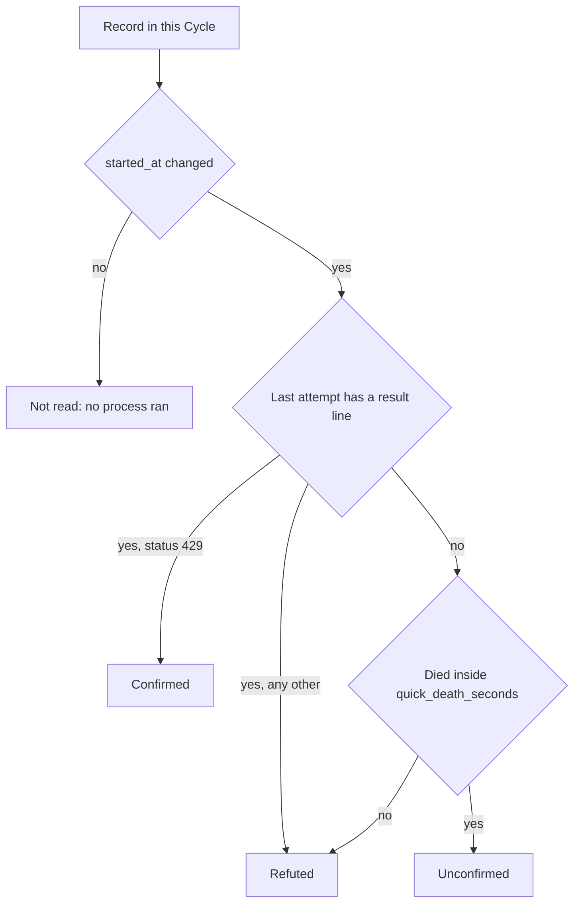
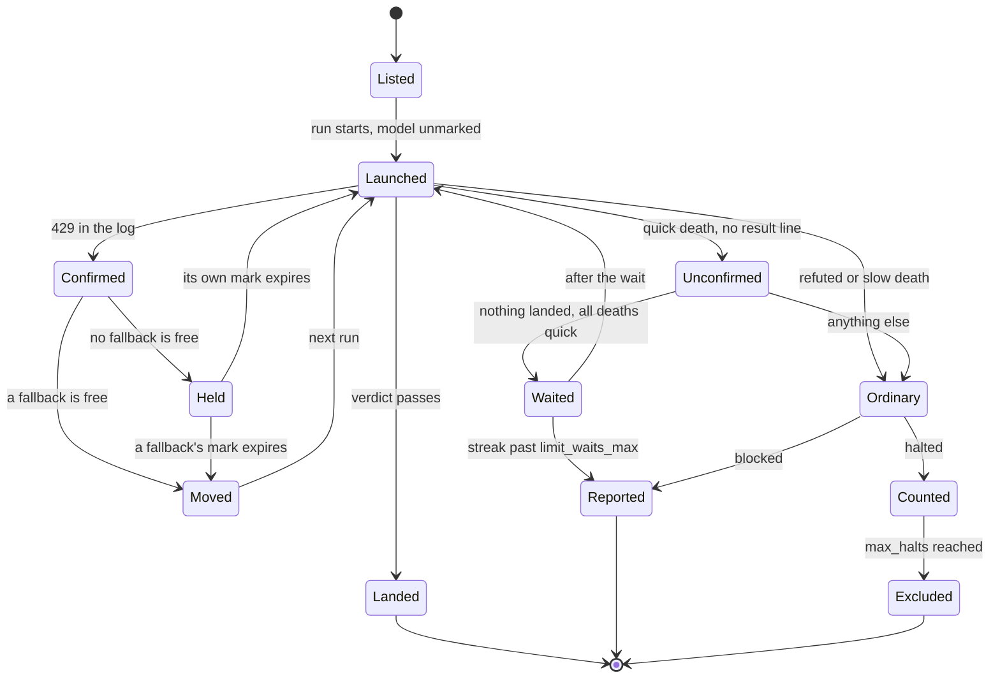
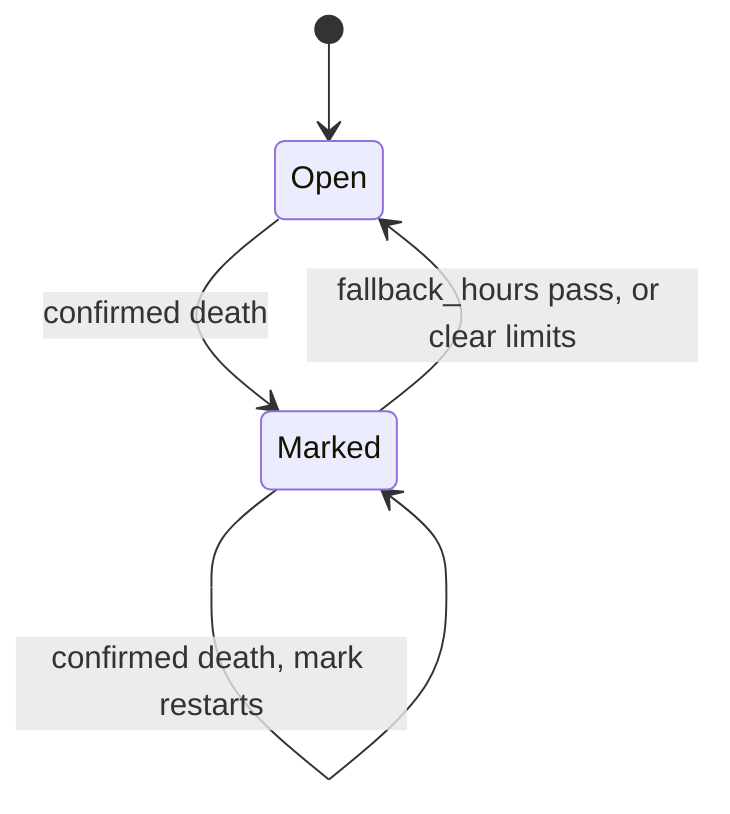
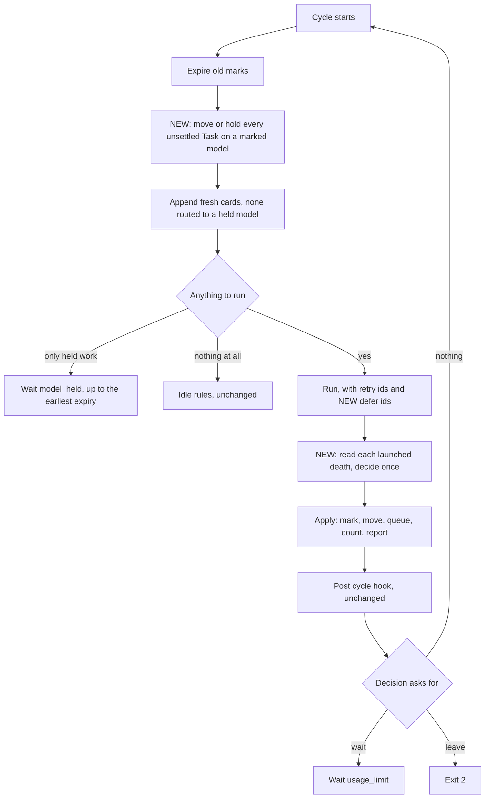
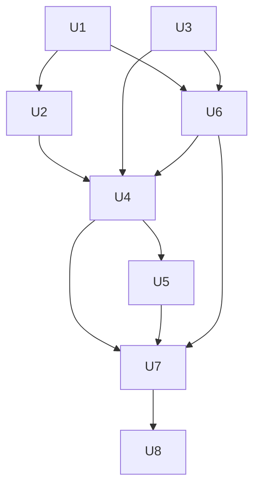

# Usage Limit State Machine Plan

## Goal Capsule

- **Objective:** An operator can leave a Feeder or a Runner unattended under any fallback table, and a usage limit costs a small, known number of dead Task processes. Every Task the limit touched is afterwards either landed, waiting for a named model to come back, or reported to a person with the reason.
- **Means:** One written state machine, decided from the log's own limit signal, with the model mark as the only bound (KTD1, KTD2, KTD4).
- **Authority:** This plan, then `CONCEPTS.md`, then the code. Issue #68 is the brief and its five questions are answered under Key Technical Decisions.
- **Execution profile:** Built unattended by Native Relay, one Task process per unit, in dependency order, one unit per Cycle. U8 is attended.
- **Stop conditions:** Stop and report when a unit cannot meet its done criteria without changing a requirement here, when the halt class set in `contracts.py` would have to grow, or when a unit needs a file outside its own list.
- **Who finishes:** The supervising session runs U8, the live proof, and closes issues #68, #67, and #12 with the evidence.

---

## Product Contract

### Summary

Replace the four layered usage limit rules in the Feeder with one state machine that reads the CLI's own limit signal first and falls back to timing only when a log has no answer. Give the Runner the same reading, so a run with no Feeder above it stops launching on a model that has just reported its limit. Add the one Runner flag the Feeder needs to leave a halted Task alone for a run.

### Problem Frame

The Feeder's usage limit handling was patched four times in one run (issues #39, #45, #54, #52), and the fourth patch reopened the defect the third had closed. Each patch was correct for its own card. The defects live between the rules.

Three defects are open at `0ae4256`, all confirmed by reading the code path:

1. Under a mutual fallback, a Task that blocks in seconds with no `result` line in its log is moved, held, released, and moved again for as long as other cards land beside it. Nothing strikes, because the streak needs a Cycle where nothing landed.
2. A model that landed one Task in a Cycle is never held, even when the later deaths on it carry a confirmed 429. The next Cycle appends fresh cards onto the dead model. The move path ignores the same landing, so the two per model paths disagree.
3. A halted Task is read as a limit death on timing alone, with no look at its log. One quick halt for any reason takes a model out for `fallback_hours`.

Two more gaps sit beside them. A halted limit death on a held model is relaunched by the Runner on every run and excluded after two deaths, though the cause was the account (issue #67). And a Runner with no Feeder above it burns every remaining Task when the account runs out, records each one blocked, and exits 0 (issue #12).

The cost is real processes. Every limit death is a Task process and then a Closeout process, and an unattended run can spend a night producing nothing but those.

### Key Decisions

- **The model is the unit that is bounded, not the Task and not the Feeder.** A per Task counter was built for #54 and dropped after two reviews, because it disagreed with the streak at every restart and the disagreement landed on exclusion. Governs R4, R5, R9.
- **Unconfirmed deaths keep the whole Cycle wait and lose the per model path.** Timing alone may still pause a Feeder. It may no longer take a model out. Governs R2, R8.
- **Issues #67 and #12 are inside this plan. Issues #81 and #74 stay outside.** #67 and #12 are the same limit seen from the Runner, and the state machine is incomplete without them. #81, the Feeder budget, is already a card a session can build, and it bounds a run that is working, which is a different thing. #74 is about report keys and shares only the state file. Governs R10, R11.

### Requirements

**Detection**

- R1. A death is read as a usage limit from the `result` line of the last attempt in the Task's log. An `api_error_status` of 429 confirms it. Any other `result` line refutes it. This holds for halted and blocked records alike, whatever the record's class and however long the process ran.
- R2. A death whose last attempt has no `result` line is unconfirmed. An unconfirmed death never marks, moves, or holds a model. It acts only through the whole Cycle wait of R8.
- R3. Only a death whose process was launched in this Cycle is read as a usage limit. A record the run refused before launch, or never reached, carries an old attempt's timings and log and is no evidence of a limit. A halted record the run refused before launch is still counted toward `max_halts` as an ordinary halt, as it is today, so a Task that is refused every Cycle is excluded and a person is told. A Task the Feeder deferred, or the run passed over under R11, is not counted.

**Model marks**

- R4. A confirmed limit death marks its model. The mark expires at the reset time the CLI printed for that death, when the log carries one and it lies ahead. Otherwise it expires `fallback_hours` after the death. A landing on the same model earlier in the Cycle does not prevent the mark. A later confirmed death on a marked model replaces the mark with that death's own. The operator is notified when a model goes from unmarked to marked, and not again until it has been unmarked.
- R5. No Task is launched on a marked model. Before each run, every unsettled Task and every queued retry the Manifest lists on a marked model is moved to the first free model along its fallback chain. With none free it is held. A held blocked Task keeps its place in the retry queue and is not passed to the run. Every other held Task, halted or never launched, is named to the run as deferred (R10). A held Task takes no room in the batch.
- R6. A confirmed limit death is never counted toward `max_halts`. A blocked one is queued for a retry and is not reported as an ordinary blocked Task while that retry is queued.
- R7. When held work is all that is left, the Feeder waits with reason `model_held`. The wait is no longer than the time until the earliest mark that holds that work expires.

**Whole Cycle wait**

- R8. A Cycle where nothing landed, every death was quick, and at least one death was unconfirmed is waited out with reason `usage_limit`, and the streak `limit_waits` is struck. Past `limit_waits_max` the Feeder leaves with exit 2 and reason `limit_waits_exhausted`. The confirmed deaths in such a Cycle still get R4 to R6. The unconfirmed ones are not counted as halts, and the blocked ones among them are queued for a retry.
- R9. The streak survives a Feeder restart. It is cleared by a Cycle in which something landed, a death was slow, or nothing died. It is cleared when the Feeder leaves on `limit_waits_exhausted`, since a person has then been told. It is cleared by `feed --clear-limits`.

**Runner**

- R10. `run --defer ID` passes over one listed Task for one run. The Task's record, branch, and card are left exactly as they were. The flag may be given more than once. An id the Manifest does not list refuses the run.
- R11. After a Task ends in a confirmed limit death, a serial run launches no further Task on that model in that run. The Tasks it passes over keep whatever record they had. The run's terminal record and its summary name them and the model. The run still ends completed with exit 0.

**Visibility**

- R12. `feed --status` shows every marked model with the time its mark expires and where that time came from, every held Task with the model that holds it, and the streak. The events file carries one `limit` event each time a model is marked, a Task is moved, or a Task is held.
- R13. `feed --clear-limits` clears the marks, the streak, and the retry queue's deferrals in one step, for an operator who knows the limit is over.
- R14. The usage limit rules are stated once, in `CONCEPTS.md`, as the state machine with every transition named. `README.md`, the skill document, and the authoring document cite that entry and carry no second statement of the rules. The complete lists of waiting and leaving reason words live in one place.

### Acceptance Examples

- AE1. Covers R1, R4, R5. **Given** `fallback = { fable = "opus", opus = "fable" }`, default sonnet, and sonnet cards landing every Cycle. **When** Task T dies on fable with a 429 in its log. **Then** fable is marked, T is moved to opus, and T relaunches on opus. **When** T dies on opus with a 429. **Then** opus is marked and T is held. **When** fable's mark expires. **Then** T is moved to fable before the run and launched there. T is launched at most once per mark period and never on a marked model.
- AE2. Covers R1, R2. **Given** the same table. **When** Task T blocks in eight seconds with no `result` line in its log, beside a landing. **Then** no model is marked, T is not moved, and T is reported blocked once.
- AE3. Covers R4. **Given** no fallback for fable. **When** Task 1 lands on fable and Tasks 2 and 3 then block on fable with a 429. **Then** fable is marked, 2 and 3 are queued and held, and the next Cycle appends no card routed to fable.
- AE4. Covers R1. **Given** `fallback = { fable = "opus" }`. **When** a Task on fable halts in eight seconds with class `unclean_exit` and a `result` line whose status is 404. **Then** no model is marked, the Task is not moved, and its halt is counted.
- AE5. Covers R5, R6, R10. **Given** fable marked with no free fallback. **When** a halted Task listed on fable is unsettled at the start of a Cycle. **Then** the run is started with that id deferred, the Task is not launched, and its halt count does not change.
- AE6. Covers R8, R9. **Given** a backend whose logs have no `result` line. **When** every Task in a Cycle halts in seconds and nothing lands. **Then** the Feeder waits with reason `usage_limit` and the streak reads 1. **When** the Feeder is restarted. **Then** the streak still reads 1.
- AE7. Covers R11. **Given** a Manifest of five Tasks, the first three on fable and the last two on sonnet, run with no Feeder. **When** the first Task dies on fable with a 429. **Then** the second and third are not launched, the fourth and fifth are, and the summary names the two that were passed over and the model.
- AE8. Covers R3. **Given** a halted Task whose branch carries commits from an earlier attempt. **When** the run refuses it before launch in two Cycles in a row. **Then** its halt is counted twice, it is excluded at `max_halts`, and the operator is notified.
- AE9. Covers R4, R7. **Given** a Task that dies with a 429 at 20:06, and a log whose last attempt carries a rejected `rate_limit_event` with a reset at 20:20. **Then** the model's mark expires at 20:20, not five hours later.
- AE10. Covers R5. **Given** batch 3, fable held, and two never launched Tasks listed on fable. **When** a Cycle starts with three ready cards routed to sonnet. **Then** both fable Tasks are deferred and all three sonnet cards are appended.

### Scope Boundaries

- The halt class set in `contracts.py` does not change. No new digest key is added.
- The Feeder still never merges, pushes, moves a card, or writes to a Tracker.
- Dispatch runs get `--defer` and nothing else. A Manifest whose execution mode is triple refuses `--defer`, since a triple is three cards run together. The breaker of R11 is for the serial run loop.

#### Deferred to Follow-Up Work

- Telling an account wide limit from a single model's limit. Both carry the same 429. Under this plan an account wide limit marks each model in turn, at one death per model, and each mark carries the same reset time.
- Reading the reset time out of the limit message's own text. R4 reads it from the `rate_limit_event` line only.
- Sizing the whole Cycle wait of R8 from a reset time. An unconfirmed death has none.
- A limit signal for grok and codex. Their logs carry no `result` line in this shape, so their deaths are always unconfirmed (R2).
- Skipping the Closeout process of a confirmed limit death when the Closeout would run on the marked model.
- Issue #81, the Feeder budget, and issue #74, report keys across a restart.

---

## Planning Contract

### Key Technical Decisions

- KTD1. **Evidence first, timing last.** The reader returns one of three answers for a death: confirmed, refuted, or unconfirmed. Timing is consulted only for the unconfirmed ones, and only by the whole Cycle wait. This answers issue #68's detection question: yes, the signal is read wherever a log exists. It removes defect 3, because a halted record is read the same way as a blocked one.
- KTD2. **The mark is the bound.** With R5 in force a model sees at most one Cycle's worth of deaths per mark period, and with R11 in force it sees one. That is a rate bound, not a count. A Task on a model that stays limited is probed once per mark, which is what an operator would do by hand. No per Task counter exists, so nothing needs clearing in five places. This answers the bounded unit question and removes defect 1.
- KTD3. **One reader, shared, and it reads the log.** The reader lives in a new module, `skills/relay/scripts/relay/limits.py`, with no imports from the Feeder or the Runner. Both import it. Keeping detection a log read means no halt class, no finding class, and no digest key changes, so the closed set of KTD6 in the native mode plan stands. The alternative, a `usage_limit` finding written by classify, was rejected because it changes a contract between processes for the sake of a reading the log already holds.
- KTD4. **Decisions are a pure function.** `limits.py` also holds the state machine as a function from a Cycle's facts to a decision record: which models to mark, which Tasks to move and where, which to hold, which to queue, which halts to count, which to report, and whether to wait or leave. The Feeder applies the record. This answers the one state machine question. It lets the machine be tested as a table with no Feeder, no clock tricks, and no files.
- KTD5. **One function writes marks, and every confirmed death restamps.** Today `fall_back` restamps and `mark_held` does not. A mark says the model was at its limit at this time and until that one, so a newer death is newer truth. The reason `mark_held` refused to restamp was the halted Task that died on a held model every Cycle, and R5 removes that Task from the run.
- KTD6. **A held halted Task is deferred, not excluded and not counted.** This is issue #67's decision. `--defer` is the mirror of `--retry-blocked`: one names the blocked records to launch, the other names the listed Tasks to leave alone.
- KTD7. **The breaker follows the evidence, not a count of failures.** Issue #12 proposed stopping after N blocked Tasks in a row. A count cannot tell a burn from five cards that are each blocked for a real reason. The 429 can. Its five questions resolve as follows. It is neither a Manifest field nor a flag, it is always on, since no operator wants the alternative. It is not a halt and not a new run status, the run completes. There is no counter to reset. A Task passed over keeps its record, so a later run launches it like any Task never reached. The card audit and the Closeout path do not change.
- KTD8. **The streak is kept across a restart and cleared by evidence.** This answers the persistence question. Zeroing at start was added so that a Feeder restarted after a repair would not leave at once on a stale count. Clearing on `limit_waits_exhausted` and `--clear-limits` covers that case by name. `idle_waits` and `unreadable_waits` are still zeroed at start, since they describe the queue and not the account.
- KTD9. **Launched this Cycle is decided by `started_at`.** The Feeder already reads every record before the run. A record whose `started_at` is unchanged after the run was not launched, and is never read as a limit death. This is the rule `prune_retries` applies to queued retries today, widened to every record, and it retires the stale `wall_seconds` trap. It bars the limit reading and nothing else: the halt of a record the run refused is still counted (R3).
- KTD10. **The mark takes its length from the CLI when the CLI gives one.** In the run logs on this machine 15 of 24 limit deaths were the account's session limit, and one run died fourteen minutes before its reset. A mark of `fallback_hours` would have idled every model for five hours past that. The rejected `rate_limit_event` line sits in the same log tail, a few lines above the `result` line, and carries `resetsAt`. The reader returns it beside the confirmed reading. `fallback_hours` remains the length when no reset time is found.

### High-Level Technical Design

The reading of one death, in the order the checks run:

The states a Task passes through once a limit has touched it. Every arrow is a transition the glossary entry names.

The states a model passes through:

A model is held when it is marked and no model along its fallback chain is open. Held is derived from the marks and the table each time it is asked. It is never stored.

One Cycle, with the new steps marked:

### Assumptions

These are choices this plan made without a person confirming them. Each is reversible by editing the requirement it names.

- The per model path is given up for unconfirmed deaths (R2). A Feeder on grok or codex with a fallback table loses the move it has today and keeps only the whole Cycle wait.
- A 429 late in a long Task is read like a 429 in the first second (R1). The model is marked either way. A long Task that leaves commits on its branch is then refused at relaunch by the existing stranded branch check, and needs a person, as it does today.
- The breaker of R11 has no off switch.
- A reset time days away, a weekly limit for one, holds the model for days. The notification names the expiry time, and `feed --clear-limits` ends it early.
- The mark period stays `fallback_hours`, when the log gives no reset time, for a model with no fallback entry. The key keeps its name.
- A run scoped halt whose own Task died of a confirmed limit is treated as the limit it is, and does not stop the Feeder.
- `--clear-limits` does not touch `halts`, `refused`, or `reported`.

### Sequencing

U1 and U3 depend on nothing. U2 needs U1. U6 needs U1 and U3. U4 needs U2, U3, and U6. U5 needs U4. U7 needs U4, U5, and U6. U8 is last and attended. Built one at a time, the order is U1, U3, U2, U6, U4, U5, U7, U8.

### Risks

| Risk | Mitigation |
|---|---|
| U4 rewrites `apply_rules`, the function four patches already fought over | U2 lands the decisions first as a pure table with tests, so U4 is wiring. U4 changes the pinned tests named in its own list and no others. |
| A new time bounded wait hangs the suite, because a test sleep does not move the clock | U4 builds its cases on `HeldModel.deps`, which moves the clock, and runs each new test class alone under a timeout before the whole suite. |
| The stub cannot die of a usage limit, since it always prints its own `result` line last | U1 adds a stub entry key that replaces the closing `result` line. |
| A sidecar or flag an older pinned extract does not know refuses that extract | This plan adds no sidecar key. `--defer` and `--clear-limits` are flags of the same tree the Feeder launches its Runner from. |
| The `CONCEPTS.md` entry and the code drift again | R14 leaves one statement of the rules. U7 deletes the other three. |
| Reason words are read by watchers | No reason word is renamed or removed. The `limit` event is an addition. |

### Sources

- Issue #68 is the brief. Issues #67 and #12 are folded in. Issues #39, #45, #54, #52 are the patches, merged at `2c68d07`, `933b7e9`, `0a03084`, `20b17c4`.
- `docs/solutions/logic-errors/a-fallback-move-reset-the-usage-limit-streak-so-mutual-fallback-never-reached-exit-2.md` is why there is no per Task counter.
- `docs/solutions/logic-errors/a-summary-record-names-the-model-a-task-died-on-so-a-moved-retry-read-through-it-waited-on-the-dead-models-mark.md` is why a death is read from the record's model and a launch from the Manifest's.
- `docs/solutions/workflow-issues/a-usage-limit-death-recorded-blocked-needs-the-429-not-terminal-reason-and-the-log-holds-every-attempt.md` is why the reader takes `api_error_status` and stops at the last attempt's `init` line.
- `docs/solutions/workflow-issues/quota-exhaustion-reads-as-no-envelope-and-the-rate-limit-telemetry-is-already-discarded.md` and `docs/solutions/workflow-issues/on-halt-continue-past-task-halt-is-not-the-quota-switch-and-the-path-a-quota-death-takes-decides-whether-the-manifest-votes.md` describe the Runner side burn.
- `docs/solutions/logic-errors/a-hold-beside-a-rules-stop-was-recorded-and-logged-but-never-notified.md` describes the join in `Feeder.settle` that any new outcome passes through.
- `docs/solutions/workflow-issues/feeder-emit-silently-overwrites-five-reserved-event-field-names.md` lists the five field names a new event must avoid.
- A real limit death, read from a task log on this machine on 2026-09-27. The last attempt holds, in this order: a `system` line with subtype `init`, a `rate_limit_event` line whose `rate_limit_info` has `status` `rejected`, a `resetsAt` in epoch seconds, and a `rateLimitType`, then a `result` line with `is_error` true, `terminal_reason` `api_error`, `api_error_status` 429, and the limit message as `result`. An earlier `rate_limit_event` with status `allowed_warning` can sit above the `init` line and belongs to no attempt.
- Code: `skills/relay/scripts/relay/feeder.py`, functions `result_event`, `blocked_by_usage_limit`, `model_limit_moves`, and methods `apply_rules`, `fall_back`, `mark_held`, `pending_retries`, `route`. `skills/relay/scripts/relay/run.py`, functions `_begin_task`, `_blocked_route`, `retries_blocked`, and the serial loop in `run`.
- Tests: `tests/test_feeder.py`, helpers `FeederCase`, `halted`, `LIMIT_LOG`, `MISSING_MODEL_LOG`, `BlockedLimit.blocked`, `HeldModel.deps`.

---

## Implementation Units

### U1. The limit reader and a stub that can die of a limit

- **Goal:** One function answers confirmed, refuted, or unconfirmed for a death, from a record and the tail of its log. The stub can end a process the way the CLI ends one at its limit.
- **Requirements:** R1, R2. KTD1, KTD3.
- **Dependencies:** none.
- **Files:**
  - create `skills/relay/scripts/relay/limits.py`
  - create `tests/test_limits.py`
  - modify `skills/relay/scripts/relay/feeder.py`
  - modify `tests/stub-claude/_stub.py`
  - modify `tests/test_feeder.py` only where an import moves
- **Approach:**
  1. Move `result_event`, the 429 constant, and the log tail size from `feeder.py` into `limits.py`. Move the log tail read there as a plain function.
  2. Add the reading function. It takes a record, the log tail, and `quick_death_seconds`, and returns one of three named constants, and beside a confirmed reading the reset time when the last attempt carries a rejected `rate_limit_event` (KTD10). It does not look at the record's status or class.
  3. Keep `blocked_by_usage_limit` and `limit_blocked` in `feeder.py` working exactly as today, calling the moved functions. This unit changes no Feeder behaviour.
  4. Add a stub queue entry key that replaces the stub's closing `result` line with the lines the entry supplies, and one that makes the stub print a `system` line with subtype `init` first. Without the second, the reader cannot find where the last attempt begins.
- **Patterns to follow:** `tests/test_feeder.py` `LIMIT_LOG` and `MISSING_MODEL_LOG` for log shapes. `RunCase.queue_entry` in `tests/test_run.py` for staging a stub entry.
- **Test scenarios:**
  - A log ending in a `result` line with status 429 reads confirmed, for a record that ran 8 seconds and for one that ran 3000.
  - A log ending in a `result` line with status 404 reads refuted.
  - A log ending in a `result` line with no `api_error_status` reads refuted.
  - A log with no `result` line and a record that ran 8 seconds reads unconfirmed.
  - A log with no `result` line and a record that ran 3000 seconds reads refuted.
  - A record with no log path, which ran 8 seconds, reads unconfirmed.
  - A record with no wall time reads refuted, whatever the log says, since no process ran.
  - Covers AE9. A log in the real shape recorded under Sources reads confirmed and returns the reset time as a time, not as epoch seconds.
  - A confirmed log with no `rate_limit_event` line returns no reset time.
  - A confirmed log whose only `rate_limit_event` has status `allowed_warning` returns no reset time.
  - A confirmed log whose rejected `rate_limit_event` sits above the last attempt's `init` line returns no reset time.
  - A log holding two attempts, the first ending in 429 and the second with an `init` line and no `result` line, reads unconfirmed.
  - A log whose first line is torn, as a tail's first line can be, is read past.
  - The same record and log read the same whether the record's status is halted or blocked, and whatever its class.
  - Through the real stub: an entry with the new keys produces a log the reader reads as confirmed.
  - Every existing test in `tests/test_feeder.py` still passes unchanged.
- **Verification:** The full suite passes. `limits.py` imports nothing from `feeder.py` or `run.py`.

### U2. The state machine as a pure decision

- **Goal:** One function turns a Cycle's facts into a decision record. Nothing calls it yet.
- **Requirements:** R1 to R9. KTD2, KTD4, KTD5, KTD9.
- **Dependencies:** U1.
- **Files:**
  - modify `skills/relay/scripts/relay/limits.py`
  - modify `tests/test_limits.py`
- **Approach:**
  1. Define the facts the function takes: the records before the run and after it for this Cycle's Tasks, each death's reading from U1, the model each Task died on, the model the Manifest lists each on, the fallback table, the marks with their expiry times, the streak, the ids deferred and the ids the run passed over, the queued retries, the time now, and the config values it needs.
  2. Define the decision record it returns: marks to write, moves as Task, from, and to, Tasks to hold, Tasks to queue for a retry, halts to count, Tasks to report blocked, the new streak value, and one outcome out of go round, wait with a reason and a length, or leave with a code and a reason.
  3. Add a second function for the start of a Cycle. It takes the unsettled Tasks, the queued retries, the Manifest's models, the marks, and the table, and returns the moves to make before the run, the ids to retry, and the ids to defer. It also returns the wait of R7 when held work is all there is.
  4. Both functions are pure. They read no file, no clock, and no state object, and they write nothing.
- **Execution note:** Write the table of cases first, from the Acceptance Examples and the scenarios below, and make them fail before the function exists.
- **Technical design:** Directional only. The order inside the after run function: set aside the records that were not launched, so that none is read as a limit death, read each launched death, mark for every confirmed death, resolve a move or a hold for each confirmed death against the marks as they stand after this Cycle's marks, decide the whole Cycle wait from the unconfirmed deaths, then sort what is left, the unlaunched halted records among it, into counted halts and reported blocked Tasks. A Task that was deferred or passed over this Cycle is in neither.
- **Patterns to follow:** `resolve_fallback` in `feeder.py` for walking a chain once. It moves into `limits.py` in this unit.
- **Test scenarios:**
  - Covers AE1. The mutual fallback walk, step by step, with confirmed deaths: marked and moved, then marked and held, then moved back when the first mark expires. The streak never changes.
  - Covers AE2. A quick blocked death with no `result` line beside a landing: no mark, no move, reported blocked.
  - Covers AE3. A landing on a model and two confirmed deaths on it in one Cycle: the model is marked and both Tasks are held.
  - Covers AE4. A quick halt with a 404: no mark, halt counted.
  - A confirmed death with a free fallback, beside a landing on the same model: marked and moved. The move path and the hold path agree.
  - Two models that both die confirmed in one Cycle and fall back to each other: both marked, neither Task moved, both held.
  - A confirmed halted death: the halt is not counted, whether moved or held.
  - A confirmed death on an already marked model: the mark's start moves to the new death, and the record says not to notify.
  - Covers AE6. Nothing landed, three quick deaths, all unconfirmed: wait `usage_limit`, streak up by one, no halt counted, blocked ones queued.
  - Nothing landed, two quick deaths, one confirmed and one unconfirmed: the confirmed one is marked and moved or held, and the Cycle still waits.
  - Nothing landed, every death confirmed and moved: no wait, streak unchanged.
  - Something landed beside an unconfirmed quick halt: halt counted, streak cleared.
  - A slow death alone: streak cleared.
  - The streak at `limit_waits_max` and one more waited Cycle: leave with exit 2, reason `limit_waits_exhausted`, the blocked ones reported, streak cleared.
  - A blocked record whose `started_at` did not change, with a 429 in its log, marks nothing and moves nothing.
  - Covers AE8. A halted record whose `started_at` did not change is counted as an ordinary halt, and at `max_halts` the record names it for exclusion.
  - A halted record whose `started_at` did not change and whose id was deferred this Cycle is not counted.
  - A halted record whose `started_at` did not change and whose id the run passed over under R11 is not counted.
  - Covers AE9. A confirmed death with a reset time 14 minutes ahead marks the model until that time. One with a reset time in the past marks it for `fallback_hours`.
  - A halted record at `max_halts` minus one that dies ordinary: counted, and the record names it for exclusion.
  - Start of a Cycle: a queued retry listed on a marked model with a free fallback is moved and retried on the fallback.
  - Start of a Cycle: a halted Task listed on a held model is deferred. Covers AE5.
  - Start of a Cycle: a Task with no record, listed on a held model, is deferred.
  - Covers AE10. Start of a Cycle: two held Tasks and batch 3 leave room for three fresh cards.
  - Start of a Cycle: only held work, two marks expiring in 40 and 90 minutes, `limit_wait_seconds` 1800: the wait is 1800. With the first mark expiring in 10 minutes the wait is 600.
  - Start of a Cycle: no marks at all returns no moves, no deferrals, and the retry queue unchanged.
- **Verification:** The full suite passes. No file outside the two listed changed. The functions take no Feeder object.

### U3. A run can defer a listed Task

- **Goal:** `run --defer ID` leaves one listed Task alone for one run.
- **Requirements:** R10. KTD6.
- **Dependencies:** none.
- **Files:**
  - modify `skills/relay/scripts/relay/cli.py`
  - modify `skills/relay/scripts/relay/run.py`
  - modify `tests/test_run.py`
  - modify `tests/test_cli.py`
- **Approach:**
  1. Add the flag to the `run` verb, repeatable, and to `dispatch`. Carry it the way `retry_blocked` is carried, as a frozenset on the run's config, and pass it to a child run the way `retry_blocked_argv` does.
  2. In `_begin_task`, return early for a deferred id, after the exclusion check and before anything is read or written. No record upsert, no branch, no tracker read.
  3. Refuse the run, before the Lease is taken, when a deferred id is not listed. Follow the refusal `--retry-blocked` makes for an unknown id.
  4. An id given to both `--defer` and `--retry-blocked` is deferred. Say so in the flag's help.
  5. Refuse `--defer` on a Manifest whose execution mode is triple, with the config exit, before the Lease is taken. `cmd_run` hands one set of keyword arguments to either `run` or `run_triple`, so give `run_triple` the keyword too.
  6. Print one line per deferred Task on the run's stream, and leave the terminal record's Task lists as they are.
- **Patterns to follow:** `retries_blocked` and `retry_blocked_argv` in `run.py`. The unknown id refusal in `cli.py`.
- **Test scenarios:**
  - A halted record named in `--defer` is not launched, and its record is byte for byte what it was.
  - A Task with no record named in `--defer` is not launched and still has no record.
  - A blocked record named in both flags is not launched.
  - A deferred Task does not stop the Tasks after it from launching.
  - A deferred id the Manifest does not list refuses the run with the config exit, and no Lease is taken.
  - Two `--defer` flags defer two Tasks.
  - A run with every Task deferred ends completed with exit 0.
  - The next run without the flag launches the halted Task as it would have.
  - A detached run passes the flag through to its child.
  - `--defer` on a triple Manifest refuses the run with the config exit, and no Lease is taken.
  - A triple Manifest run without the flag runs as before.
- **Verification:** The full suite passes. `run --help` shows the flag.

### U4. The Feeder runs on the state machine

- **Goal:** `Feeder.apply_rules` and the start of `Feeder.cycle` apply the decisions of U2. The three defects are gone.
- **Requirements:** R1 to R8, R12 for the event. KTD2, KTD4, KTD5, KTD6, KTD9.
- **Dependencies:** U2, U3, U6.
- **Files:**
  - modify `skills/relay/scripts/relay/feeder.py`
  - modify `tests/test_feeder.py`
- **Approach:**
  1. At the start of a Cycle, after old marks expire, call the start function of U2. Write its moves to the Manifest through `manifestedit.set_model`. Pass its retry ids and its defer ids to `deps.run_cycle`, and have the real `run_cycle` pass `--defer`.
  2. In `apply_rules`, keep the skipped reports, the run scoped halt stop, and the exclusion write where they are. Replace everything between them with one call to the after run function and one pass that applies its record. Read the halting Task's death before the run scoped halt stop, and skip the stop when that death reads confirmed.
  3. Read the ids the run passed over from the summary's new key, the one U6 adds, and hand them to the decision with the ids this Cycle deferred. Leave held Tasks out of the count that sizes the batch's room.
  4. Replace `fall_back` and `mark_held` with one method that writes marks and one that writes moves. A move the Manifest edit refuses leaves the Task held.
  5. Remove `limit_blocked`, `blocked_by_usage_limit`, `model_limit_readings`, `model_limit_moves`, and `looks_like_usage_limit` once nothing calls them.
  6. Size the `model_held` wait from the decision. Store each mark with its expiry time and the source of that time. Read a mark written by an older Feeder, a bare start time, as expiring `fallback_hours` after it.
  7. Emit a `limit` event for each mark, move, and hold, with fields `action`, `model`, `to`, `tasks`, and `until`. None of those is one of the five reserved names.
  8. Pass any wait or stop through the join in `settle` unchanged, so the post cycle hook and its hold behave as they do now.
  9. Rewrite the module docstring's rules section to describe the machine and drop the word heuristic from the confirmed path.
- **Execution note:** Run each new or changed test class alone under a timeout before the whole suite. A wait that no run ends hangs with no output unless the case's sleep moves the clock.
- **Patterns to follow:** `HeldModel.deps` for a clock that moves. `BlockedLimit.blocked` for a record with a real log file. `BlockedLimit.mutual_fallback_past_the_first_mark` for a walk across a mark's expiry.
- **Test scenarios:**
  - Covers AE1. Mutual fallback with confirmed deaths and sonnet landings beside them, run across two mark periods: T is launched once per period, never on a marked model, and each launch appears in `ran_on` with the model the decision chose.
  - Covers AE2. The defect 1 shape: no mark, no move, one blocked report, and no relaunch in any later Cycle.
  - Covers AE3. The defect 2 shape. `HeldModel.test_a_landing_on_the_same_model_rules_out_a_hold` is replaced by its opposite for a confirmed death, and kept in spirit for an unconfirmed one: no mark.
  - Covers AE4. The defect 3 shape. `ModelFallback.test_a_fable_quick_death_beside_opus_landings_falls_back_to_opus` is rewritten to give the halt a log with a 429, and a twin with a 404 asserts no move.
  - Covers AE5. A halted Task on a held model: `--defer` is passed, the Task is absent from `ran_on`, and `halts` does not change. `HeldModel.test_a_halted_death_beside_a_landing_marks_its_model_and_holds_its_cards` loses its counted halt.
  - `BlockedLimit.test_a_quick_blocked_death_with_no_result_line_is_read_by_the_time_rule` is rewritten: beside a landing the death is ordinary, and alone in a Cycle it is waited out.
  - A queued retry on a marked model with a free fallback relaunches on the fallback, and the Manifest lists it there.
  - A Manifest edit that refuses a move leaves the Task held, logs the refusal, and still marks the model.
  - Only held work left: one `waiting` event with reason `model_held` and a length no longer than the time to the earliest expiry.
  - A mark, a move, and a hold each write one `limit` event with the five fields.
  - A waited Cycle beside a post cycle hook that holds: the hold wins, as today, and is notified.
  - A run that exits 3 or 1 applies no decision and changes no mark.
  - Covers AE8. A Task refused before launch in two Cycles in a row is counted twice, excluded in the Manifest, and notified.
  - Covers AE10. Two held Tasks and batch 3: three fresh cards are appended.
  - A Task the run passed over under R11 is not counted, and the next Cycle moves or defers it.
  - A run that halts with class `unexpected_error` on a Task whose log carries a 429: the model is marked and the Feeder does not leave. The same halt with no 429 stops the Feeder with `run_scoped_halt`, as today.
  - A mark sized from a reset time 14 minutes ahead: the `model_held` wait is 14 minutes, and the Task launches in the Cycle after it.
  - Through the real Runner over the stub, using the keys U1 added: one Cycle in which a Task dies of a limit on a model with a fallback, and the next Cycle launches it on the fallback.
- **Verification:** The full suite passes. No function in `feeder.py` reads a death from timing except through the decision of U2. One method adds or replaces an entry in `state["exhausted"]`. The expiry in `exhausted_models` only removes entries and stays where it is.

### U5. The streak survives a restart, and the operator can see and clear the limits

- **Goal:** A restart no longer hands out a fresh streak. The limit state is visible and can be cleared by name.
- **Requirements:** R9, R12, R13. KTD8.
- **Dependencies:** U4.
- **Files:**
  - modify `skills/relay/scripts/relay/feeder.py`
  - modify `skills/relay/scripts/relay/cli.py`
  - modify `tests/test_feeder.py`
  - modify `tests/test_cli.py`
- **Approach:**
  1. At Feeder start, zero `idle_waits` and `unreadable_waits` and leave `limit_waits` alone.
  2. Clear `limit_waits` when the Feeder leaves on `limit_waits_exhausted`.
  3. Add `feed --clear-limits`. With no Feeder alive it clears the marks and the streak in the state file and leaves. With `--restart` it clears them as the new Feeder takes over. With a Feeder alive and no `--restart` it refuses and says why. Follow `feed --release` for the shape.
  4. Add the marks with their expiry times, the held Tasks with their models, the queued retries, and the streak to `status_report`, in the text form and the JSON form.
- **Patterns to follow:** `release_hold` and the `--release` flag. `status_lines` for the text form.
- **Test scenarios:**
  - Covers AE6. A Feeder that waited once and is restarted starts with the streak at 1.
  - `Exits.test_a_feeder_that_leaves_on_the_stop_file_hands_no_partial_count_to_the_next` is rewritten to assert the count is handed on.
  - `Exits.test_once_keeps_the_streak_counts_between_cycles` still passes.
  - A Feeder that left on `limit_waits_exhausted` and is restarted starts with the streak at 0.
  - `idle_waits` and `unreadable_waits` are still zeroed at start.
  - `--clear-limits` with no Feeder alive empties the marks and zeroes the streak, and leaves `halts`, `refused`, `reported`, and `retry_blocked` as they were.
  - `--clear-limits` with a Feeder alive and no `--restart` refuses with the config exit and changes nothing.
  - `--clear-limits --restart` clears and takes over.
  - `--status` with one marked model and one held Task prints the model, the expiry time, whether that time came from the CLI or from `fallback_hours`, and the Task. `--status --json` carries the same under named keys.
  - `--status` with no marks prints no limit lines.
- **Verification:** The full suite passes. `feed --help` shows the flag.

### U6. A run stops launching on a model that reported its limit

- **Goal:** A serial run with no Feeder above it loses one Task per model to a usage limit, not every Task that is left.
- **Requirements:** R11. KTD3, KTD7.
- **Dependencies:** U1, U3.
- **Files:**
  - modify `skills/relay/scripts/relay/run.py`
  - modify `skills/relay/scripts/relay/state.py`
  - modify `skills/relay/scripts/relay/summary.py`
  - modify `tests/test_run.py`
  - modify `tests/test_state.py`
  - modify `tests/test_summary.py`
- **Approach:**
  1. After a Task ends blocked or halted in the serial loop, read its death with the reader of U1. On confirmed, add the model the Task ran on to a set held for this run only.
  2. In `_begin_task`, return early for a Task whose model is in that set, at the same point `--defer` returns, with no record write.
  3. Write the ids passed over and their model into the run's terminal record under one new key, carried into `StateStore.write_terminal` as a parameter the way `surviving_flights` is, and print them in the summary's check by hand list with a sentence that names the model and says a later run will launch them.
  4. Leave `quick_death_seconds` out of it. The Runner has no such setting, so it acts on confirmed readings only.
  5. Leave the concurrent loop and the triple path alone.
- **Patterns to follow:** The early returns at the top of `_begin_task`. `_pending_checks` in `summary.py` for a line in the check by hand list.
- **Test scenarios:**
  - Covers AE7. Five Tasks, three on one model, the first dies confirmed: the second and third are not launched, the fourth and fifth are, the run ends completed, exit 0.
  - The two passed over have no record after the run. A second run launches them.
  - A Task that dies with a 404 stops nothing.
  - A Task that dies with no `result` line stops nothing.
  - A Task with a blocked record from an earlier run, named in `--retry-blocked`, on the model that just died, is passed over and its record is unchanged.
  - The summary names the Tasks passed over and the model, in the text form and the JSON form.
  - A run in which no Task dies of a limit writes the new key empty and prints nothing about it.
  - A confirmed death on the last Task of a run passes over nothing.
- **Verification:** The full suite passes. No halt class and no digest key was added. `contracts.py` is unchanged.

### U7. One statement of the rules

- **Goal:** The usage limit rules are written once, the reason words are listed once, and the other documents point there.
- **Requirements:** R14.
- **Dependencies:** U4, U5, U6.
- **Files:**
  - modify `CONCEPTS.md`
  - modify `README.md`
  - modify `skills/relay/SKILL.md`
  - modify `docs/manifest-authoring.md`
  - modify `docs/examples/feeder/manifest-github-projects.feeder.toml`
- **Approach:**
  1. In `CONCEPTS.md`, replace the three paragraphs on usage limits under Feeder with a new entry, Usage limit, under The continuous run. It defines confirmed, refuted, and unconfirmed, Mark, Held, Moved, Deferred, and the whole Cycle wait, and carries the three state diagrams of this plan as prose tables, one row per transition.
  2. Add one entry, Reason words, with the complete lists: six waiting words and nineteen leaving words as they stand in `feeder.py`, each with one line on what it means.
  3. In the other three documents, replace each restatement of the rules with two or three sentences and a pointer to the `CONCEPTS.md` entry. Keep each document's own material: the flags in the skill document, the sidecar keys in the authoring document.
  4. Document `run --defer`, `feed --clear-limits`, the `limit` event, the new lines in `feed --status`, and the breaker.
  5. Remove the sentence that calls the usage limit rule a heuristic and not a detection, in all four places, and say what is detected and what is still inferred from timing.
  6. Remove the warning against running unattended under a mutual fallback.
- **Test scenarios:** Test expectation: none, this unit changes documents only. The suite's document checks, where they exist, must still pass.
- **Verification:** `grep` for the old rule sentences finds them in `CONCEPTS.md` alone. Every reason word in `feeder.py` appears in the Reason words entry, and no word in the entry is absent from the code. No document uses a dash in prose.

### U8. Live proof, attended

- **Goal:** One real Task through the new Runner and one real Cycle through the new Feeder, against the throwaway target, since U3 and U6 changed how a run starts and ends.
- **Requirements:** R10, R11, R12.
- **Dependencies:** U7.
- **Files:** none in this repository.
- **Approach:** Run by the supervising session, not by a Task process. One Task that lands, with a second Task deferred by `--defer`. One Feeder Cycle with `--once`. A usage limit cannot be produced on demand, so the confirmed path is proven by the suite over the stub and recorded as such.
- **Test scenarios:** Test expectation: none, this is a live observation.
- **Verification:** The landed Task's summary carries the new terminal record key, empty. The deferred Task has no record. `feed --status` prints with no limit lines. The result is recorded on issue #68.

---

## Verification Contract

| Gate | Command | Applies to |
|---|---|---|
| The suite | `python3 -m unittest discover -s tests`, about eleven minutes, 1662 tests at `0ae4256` | every unit |
| One module | `python3 -m unittest test_limits`, run from `tests/` | U1, U2 |
| One module | `python3 -m unittest test_feeder`, run from `tests/` | U4, U5 |
| One module | `python3 -m unittest test_run`, run from `tests/` | U3, U6 |
| No network | every new test module imports `_paths` first | U1 |
| Live | one Task and one Cycle against the throwaway target | U8 |

---

## Definition of Done

**For every unit**

- Its test scenarios exist as tests and pass.
- The suite passes.
- Only the files in its own list changed, plus a solution document under `docs/solutions/` when the unit found something worth one.
- No code from an approach that was tried and dropped is left in the diff.

**For the plan**

- Each Acceptance Example, AE1 to AE10, is a passing test.
- The three defects of issue #68 each have a test that fails at `0ae4256` and passes now.
- `contracts.py` is unchanged.
- One function writes marks, and one function reads a death.
- U8 is recorded on issue #68, and issues #68, #67, and #12 are closed with a pointer to the merges.
