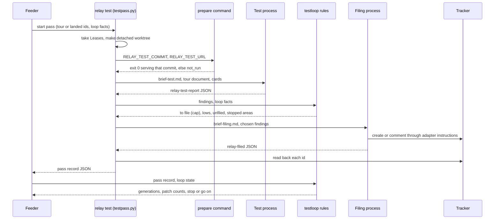
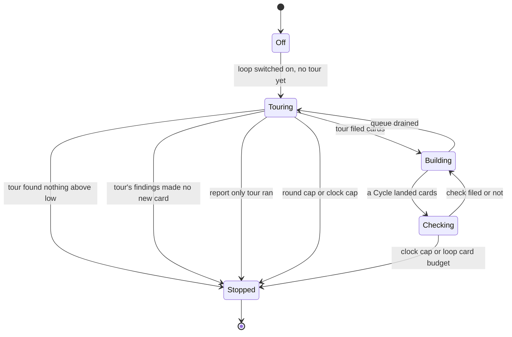

# Browser Test Loop - Plan

## Goal Capsule

- **Objective:** An operator can switch on, for one Manifest, a loop that tests the running web app after each landing, files what it finds as cards the same Feeder builds, retests the fixes, and stops on its own at a rule it can check, with nobody attending.
- **Means:** Each Test pass is one `relay test` invocation that launches a Test process to find and a Filing process to file, with the loop's rules decided in code between them (KTD1, KTD2, KTD3).
- **Authority:** This plan, then `CONCEPTS.md`, then the code. Issue #34 is the brief, and its four open questions (driver, stop condition, triage, per project inputs) are answered under Key Decisions.
- **Execution profile:** Built unattended by this repository's own Feeder, one Task process per unit, in dependency order, by a Feeder started with `feed <manifest> --pin` from an extract of the default branch, so no unit is built by a half built runner. U9, the live proof, is attended and run by the supervising session.
- **Stop conditions:** A unit stops and reports blocked when it cannot meet its Done when lines without changing a requirement here, when the halt class set in `contracts.py` would have to grow, or when it needs a file outside its own list.
- **Who finishes:** The supervising session runs U9 and closes issue #34 with the evidence.
- **Open blockers:** None.

---

## Product Contract

**Product Contract preservation:** changed R12, R13, R15, R16, R17, R21. Filing moves from the Test process to a separate Filing process so the per pass cap is enforced in code before any card is written (KTD1), and the same code file rule becomes a Feeder batching rule, because a batch rule holds on every Tracker while a written wait holds only where a ready source reads it (KTD11). Document review then found three ways the loop could stop or run on a false account: a filed card the ready source never offers, a tour whose findings all matched open cards reading as clean, and filing that fans out across check passes. R13 now carries the loop's labels, R16 separates a clean tour from a tour with open findings, and R17 adds a budget for the whole loop. R21 gains a second line of defense. Everything else is unchanged.

### Summary

A Feeder setting that runs a Test pass after each landed Cycle and at each full tour. The Test process drives the app under test in a headless browser, traces each defect to its cause, and reports it; a Filing process then files the high and medium findings as cards on the Manifest's own Tracker, or they go to a findings file in report only mode. The Feeder counts rounds, cards per pass, and each card's generation, and ends the loop on a stop rule enforced in code.

### Problem Frame

The loop has already been run by hand against a web app board, on 2026-09-25. An attended session served the app from a pinned worktree of the default branch, checked every landed card in the browser against real data after each batch, read the code for each defect's cause, filed one card per defect, and ran the full gate between batches. It found real defects. It also cost an attended session for every pass, and it lost eight Cycles overnight when the browser extension it drove disconnected.

Two failures from this repository's own history bound what an unattended version can be. A process that files cards for a builder can feed itself: the self run of 2026-09-26 started with 9 cards and landed 29, with 13 still queued a day later, because every review finding became a card the same ready source picked up (`docs/solutions/workflow-issues/a-feeders-ready-command-must-scope-to-one-plan-and-gate-on-dependency-closure-or-the-queue-refills-itself.md`). And a local server can serve code from before the latest merge behind a page that looks current, so a tester that does not check what it is serving files defects that are already fixed.

### Actors

- A1. The operator, who switches the loop on, writes the app's tour document, and signs the app in once.
- A2. The Feeder, which starts each Test pass, holds the loop state, and decides when the loop stops.
- A3. The Test process, a fresh headless agent invocation that tests the app and reports what it finds.
- A4. The Task process, which builds a filed card like any other card.
- A5. The app under test, served from a worktree of its own.
- A6. The Filing process, a short launched process that writes the chosen findings to the Tracker.

### Key Flows

- F1. **Start.** The loop is switched on and the Feeder starts. Before the first build, a full tour runs and files what it finds. Covers R5.
- F2. **Check a landing.** A Cycle lands cards. The app under test is moved to the new default branch and confirmed. A Test pass checks only the landed cards and files what it finds. The Feeder records each filed card's generation. Covers R4, R6, R18.
- F3. **Drain.** The queue empties. A full tour runs. If it files nothing above low, or a cap is reached, the loop stops and the Feeder says why. Otherwise the Feeder builds what it filed. Covers R5, R16.

### Key Decisions

- **The loop is a Feeder feature switched on per Manifest.** (session-settled: user-directed, chosen over a recurring tracker card the Feeder builds, and over both: a feature keeps its caps in the Feeder's code and every project gets it without rewriting it.) Governs R1, R3.
- **Every finding becomes one card on the Manifest's own Tracker, built by the same Feeder, and the loop files nowhere else.** (session-settled: user-directed, chosen over filing on the tool's own board: the cards belong to the backlog of the app under test.) Governs R12, R13.
- **No questions to the operator while the loop runs.** (session-settled: user-directed, chosen over an attended triage step: the loop runs to its stop rule unattended, and anything that needs a person becomes an `attended` card.) Governs R16, R19.
- **A card that changes what a user sees builds on the design model with the design skill the project names.** (session-settled: user-directed, chosen over routing every filed card the same way: a visible change needs design judgment, and the project already routes design cards this way by hand.) Governs R14.
- **This feature is built by this repository's own Feeder from this plan, unattended to the end.** (session-settled: user-directed, chosen over building it in an attended session: the plan's units are the queue.)
- **The Test process is a third process kind with its own Brief, and the loop's caps live in the Feeder's code.** A detached `post_cycle` hook running an operator script was set aside because its caps would live in a prompt and every project would rewrite it. Governs R2, R3.
- **Driver: a headless browser driven from the shell.** This answers issue #34's driver question. A Task process launches with a fixed tool allowlist and cannot reach the browser extension, and the extension also drops overnight. Governs R8, R9.
- **Stop condition: a clean full tour, a round cap, or a clock cap, whichever comes first.** This answers issue #34's stop question, per the long running task rule that a stop must be checkable. Governs R16, R17, R18, R19.
- **Triage: report only mode for boards without standing agent control.** This answers issue #34's triage question. A holding status on the board was not chosen, since it needs a person to approve each card, which the no questions decision rules out. Governs R23, R24.

### Requirements

**Switch and shape**

- R1. The loop is off unless a Manifest's Feeder sidecar switches it on, and a Manifest without that setting behaves exactly as it does today.
- R2. The Test process is launched from its own Brief template, which carries nothing project specific and nothing plugin specific; project facts reach it as sidecar data and from the project's tour document.
- R3. The Feeder holds the loop state, meaning tour rounds, cards filed per pass, each filed card's generation, and patch counts per area, in its own state file, where it survives a Feeder restart, and enforces every cap and the stop rule in code.

**When it tests**

- R4. After a Cycle that landed at least one card, a Test pass checks the landed cards only.
- R5. A full tour of the features the tour document lists runs when the loop starts and each time the queue drains.
- R6. A Test pass runs only against an app confirmed to be serving the default branch commit it is meant to test; when that cannot be confirmed, the pass is recorded as not run and files nothing.
- R7. The app under test is served from a worktree of its own, outside the checkout the Runner merges into, and the sidecar names how to move it to a commit and how to confirm what it serves.

**Driver**

- R8. The Test process drives the app through a headless browser from the shell, and never assumes the browser extension.
- R9. The browser driver is the project's own tooling, installed outside the Runner, and the Runner package stays Python standard library only.

**Finding and filing**

- R10. Before reporting a finding, the Test process reads the code for its cause, naming the file and line and whether it is a defect or intended.
- R11. Each finding carries a severity; high and medium findings become cards, and low findings go to one lows file beside the Manifest and never to the Tracker.
- R12. Each card holds one defect or one improvement, with the cause, the steps to reproduce, and Done when lines, and is written by a launched process through the Tracker adapter's own instructions, so the Feeder and the Runner still never write to a Tracker.
- R13. A filed card carries the loop's labels and reaches the queue only through the Feeder's existing ready source, and the Feeder never appends two filed cards that name the same cause file to one batch.
- R14. A finding that changes what a user sees is filed as a design card carrying the design instruction the sidecar supplies, and the Feeder routes it to the sidecar's design model.
- R15. Before filing, the process that files looks for an open card that already describes the same defect and adds to it instead of filing a second one.

**Stop rule and caps**

- R16. The loop stops when a full tour finds nothing above low, when a full tour's high and medium findings produce no new card, after 6 tour rounds, or after 24 hours, whichever comes first, and each stop names its own reason; the caps are sidecar settings with these defaults.
- R17. One pass files at most 10 cards and the whole loop at most 30, and the findings past either cap are written to the pass's findings record rather than filed.
- R18. A card filed from checking a landed fix is the last generation: its own fix lands on the gate alone and is never checked for new cards.
- R19. An area that has taken three patches and still fails gets one planning card labelled `attended`, and the loop stops testing that area.
- R20. When the loop stops, the Feeder records why and notifies once, and it goes on building the cards already filed under its ordinary rules.

**Safety**

- R21. The Test process never approves or performs an action that writes outside the app under test; a feature that ends in an external write is tested up to its approval step and no further, and the operator's `prepare` serves the app with its outbound integrations stubbed so the Brief's rule is not the only defense.
- R22. The Test process never types a credential; it uses a session the operator signed in, or records the pass as not run.

**Report only mode**

- R23. A report only setting writes every finding to a file beside the Manifest instead of the Tracker, and a report only loop runs one full tour and stops.
- R24. An operator can run one Test pass by hand, a full tour or a named set of cards, report only or filing, without a Feeder running.

**The shipped example**

- R25. The repository ships a generic example: a sidecar section that switches the loop on, a tour document template, and a browser driver recipe using headless Playwright from the shell, none of it naming a real project.

**Visibility**

- R26. `feed --status` shows the loop's round, the cards filed per pass, the generations, the areas stopped, and the stop reason, and every Test pass writes one event to the events file with its transcript path.

### Acceptance Examples

- AE1. Covers R4, R12, R18. **Given** the loop is on and card A, filed by a full tour, lands. **When** the check of A finds defect B in A's feature. **Then** B is filed as the last generation. **When** B lands. **Then** no Test pass checks B for new cards.
- AE2. Covers R11, R16. **Given** round 3. **When** a full tour finds only low findings. **Then** the loop stops with a clean stop reason, the lows file lists them, and nothing reaches the Tracker.
- AE3. Covers R17. **Given** one pass finds 14 high or medium findings. **Then** 10 are filed and the other 4 are named in the pass's findings record.
- AE4. Covers R21. **Given** a feature that ends by sending a message to an external system through an approval step. **When** the Test process tests it. **Then** it checks the approval step renders correctly and never approves it.
- AE5. Covers R6. **Given** the app is serving a commit older than the default branch and cannot be moved. **Then** the pass is recorded as not run, files nothing, and the Feeder says so.
- AE6. Covers R23. **Given** report only mode. **When** the full tour finds two defects. **Then** both are written to the findings file beside the Manifest, the Tracker is untouched, and the loop stops.
- AE7. Covers R19. **Given** an area whose cards have landed three times and still fail. **Then** one planning card labelled `attended` is filed for it, and later passes skip that area.
- AE8. Covers R1. **Given** a sidecar with no loop setting. **Then** the Feeder starts no Test pass and its state file and events are what they are today.
- AE10. Covers R16. **Given** a drained queue whose only open cards are blocked. **When** the full tour's two high findings both match those open cards and are added to them. **Then** the loop stops with the open findings reason, not the clean one.
- AE11. Covers R17. **Given** the loop has filed 28 cards. **When** a pass finds 5 high findings. **Then** 2 are filed, 3 are named as past the loop budget, and the loop stops with the budget reason.
- AE9. Covers R13. **Given** two filed cards whose causes name the same file are both ready. **Then** the Feeder appends the first and holds the second out of that batch until the first settles.

### Scope Boundaries

- Pushing stays the Manifest's shipping choice; the loop never pushes.
- The attended independent code review of complex diffs stays outside the loop.
- The merge inbox (issue #38) and a separate review model setting are out.
- A tour document for any real app belongs in that app's repository, not here.
- Switching the loop on for any live board is the operator's step, not part of this plan.
- The browser extension as a driver is out.
- The Feeder's own run budget (issue #81) stays its own card; the loop's caps bound the loop, not the Feeder.

#### Deferred to Follow-Up Work

- A Test pass on grok or codex. The first build runs the Test and Filing processes on `claude` only, and `validate` refuses a loop whose backend is anything else.
- A screenshot comparison baseline for visual defects. The first build leaves visual judgment to the Test process reading its own screenshots.
- A markdown Tracker under a Manifest that pushes. The Filing commit would stay local while the adapter reads the tracker at the remote, so every filing would read as unconfirmed; `relay test` refuses that pairing (KTD13) rather than push.

### Dependencies / Assumptions

- The Feeder's `post_cycle` hook (issue #37) is landed and exposes each Cycle's landed ids and merge range.
- The Tracker adapters already hand launched processes their write instructions for GitHub, Jira, and markdown, through `closeout_instructions` and `closeout_allowed_tools`.
- On Claude, Jira writes go through Atlassian MCP, so a Filing process on Jira gets the Closeout's tools plus card creation and search (KTD5).

### Sources / Research

- Issue #34, the feature brief and its four open questions.
- `docs/solutions/workflow-issues/a-feeders-ready-command-must-scope-to-one-plan-and-gate-on-dependency-closure-or-the-queue-refills-itself.md`, the self feeding queue.
- `docs/solutions/logic-errors/stubbed-seams-agree-by-construction-first-live-run-found-five-contract-defects.md`, why a new Brief needs a live run.
- `docs/manifest-authoring.md` section 11, the sidecar, the hooks, and the detached hook's own worktree rule.

---

## Planning Contract

### Key Technical Decisions

- KTD1. **Two launched processes per pass, with code between them.** The Test process finds and reports and holds no Tracker write tool. The pass code then applies the cap, the lows, report only mode, the stopped areas, and the generations, and only then launches a Filing process with exactly the findings chosen to file. This is the same split as the Task and Closeout processes. The alternative, a Test process that files directly and is counted afterwards, can only detect a pass that filed fifteen cards, never prevent it, which fails R3 and R17. Governs R3, R11, R12, R15, R17, R23.
- KTD2. **One pass is one `relay test` invocation, and the Feeder starts it as a subprocess.** A new module, `skills/relay/scripts/relay/testpass.py`, runs a pass end to end and writes a pass record as JSON beside the Manifest. `relay_cli.py test <manifest>` is its verb, which is also the hand run of R24. The Feeder calls the verb the way it calls `run`, then reads the pass record, so the processes a pass launches never share the Feeder's own process or signal handling. The detached `post_cycle` hook was rejected because it runs beside the next Cycle while a pass needs a quiet app, and its caps would live outside the Feeder's state file. Governs R2, R3, R24.
- KTD3. **The loop's rules are a pure module.** `skills/relay/scripts/relay/testloop.py` holds the loop as functions from facts to decisions, the way `limits.py` holds the usage limit machine: which landed cards to check, which findings to file under the cap, each filed card's generation, patch counts per area and when an area stops, and whether the loop stops. Both `testpass.py` and the Feeder import it, and it imports neither. Governs R3, R16, R17, R18, R19.
- KTD4. **The Test report contract.** The Test process ends its final message with one fenced block tagged `relay-test-report` holding one JSON object: a `status` of `ran` or `not_run`, a `reason`, and a `findings` array. Each finding carries a title, a severity of `high`, `medium`, or `low`, a kind of `defect` or `improvement`, the area as the tour document names it, a `design` flag, the cause as a file, a line, and a verdict of `defect` or `intended`, the steps, what was expected and observed, and Done when lines, and on a check pass the id of the checked card it came from. Only the last such block in the final message counts, read from the full final message in the transcript, since the digest keeps only its last 200 characters. The pass code then checks in code that a check pass finding names one of the cards it sent, and takes generation 2 when it names none or another, and that every area is a heading of the tour document, sending a finding with an unknown area to the findings record as invalid. Text copied from the app travels only in the `observed` field, which the Filing process renders as a quoted block and never as a title or a Done when line. A missing or malformed block records the pass as failed with the parse error, and nothing is filed. JSON was chosen over the Task Envelope's line grammar because a finding is nested and the envelope grammar has already cost several contract defects. Governs R10, R11.
- KTD5. **The Filing contract.** The Filing process receives the chosen findings, numbered, inside the Brief's data fence, with the adapter's filing instructions. It ends with one fenced block tagged `relay-filed` holding a JSON array of `{finding, action, id}`, where `action` is `filed` or `commented`. The pass code reads every named id back through the adapter's `read` and records only confirmed cards; an unconfirmed claim is a note on the pass record, never a filed card. Each adapter gains `filing_instructions`, which applies the sidecar's `labels` to every card, and `filing_allowed_tools`: the Closeout's tools, plus `createJiraIssue` and `searchJiraIssuesUsingJql` on Jira. After confirming, the pass makes one ready read and notes every confirmed card the ready source does not return. Governs R12, R13, R14, R15, R19.
- KTD6. **Where each process runs.** The Test process runs in a detached worktree of the tested commit, placed in the state directory outside the repository and removed when the pass ends, with the tools `Bash`, `Read`, `Grep`, and `Glob` by default, and the Manifest's disallow list, the Runner's own, and `Bash(gh *)` denied. It is not started in the checkout the Runner merges into, and the pass records that checkout's HEAD and status before the Test process and compares them after, failing the pass and filing nothing on any change. The Filing process runs in that checkout like a Closeout process. For a markdown Tracker its commit is checked against the tracker file alone and reset when it touches anything else, reusing the Closeout's scope check. Governs R12, R21.
- KTD7. **The app under test is prepared in code.** The sidecar's `prepare` argument list runs in its own process group under a timeout, with `RELAY_TEST_COMMIT` and `RELAY_TEST_URL` in its environment. Exit 0 means the app now serves that commit; anything else records the pass as `not_run` with the command's last output line. The Lease heartbeat runs while it does, as it does around the gate in `run.py`. A launched process cannot stop a server (`skills/relay/templates/brief-local-merge.md` forbids it), so moving and restarting the server can only live here. Governs R6, R7.
- KTD8. **Leases.** A pass takes the Manifest Lease and the repository Lease for its whole length and renews them on the heartbeat, as `run` does. The Feeder only starts a pass between runs, and the Lease also stops another Manifest's runner from merging while a markdown filing commits. Governs R3, R12.
- KTD9. **When the Feeder starts a pass.** At the first Cycle of a loop with no tour yet, a full tour. After `settle` of a Cycle that landed cards, a check of the landed cards `testloop` selects, after the `post_cycle` hook. In `idle`, before leaving on a true empty queue, a full tour; when that tour filed a card, the Feeder goes round again instead of leaving. A report only loop runs one tour and stops. Governs R4, R5, R20, R23.
- KTD10. **Loop state and events.** The state file gains one key, `test_loop`, holding the start time, the round count, a record per pass, a map of filed card ids to generation, area, design flag, and cause file, patch counts per area, the stopped areas, and the stop record. The events file gains two words, `test_pass` and `test_loop_stopped`; no existing word changes. Governs R3, R20, R26.
- KTD11. **Design routing and same file batching are Feeder rules.** `route` gives a card the loop filed as a design card the sidecar's `design_model`, after the routing file and before a `**Model:**` body line, so it works where the ready source returns empty bodies. `select` holds a filed card out of a batch while another filed card with the same cause file is in that batch or unsettled in the Manifest. Governs R13, R14.
- KTD13. **A markdown Tracker pairs only with a Manifest that does not push.** The markdown adapter reads the tracker at the remote when the Manifest pushes, and the loop never pushes, so `relay test` refuses the pairing at load. Governs R12.
- KTD14. **The operator's sign in lives in a browser storage state file.** The tour document names its path, the example driver loads it, and a one time headed sign in writes it. A missing file or a login page is `not_run`. Governs R22.
- KTD12. **No new Halt class.** A pass is not a Task and writes no Task record. Its outcomes are the pass record's own `status` words, `ran`, `not_run`, and `failed`, plus notes, so the closed set in `contracts.py` is untouched.

### High-Level Technical Design

One pass, from the Feeder's side:



The loop's own states, as the Feeder holds them:



A card's generation: a card the loop did not file, or a tour filing, is generation 1 when filed from it. A card filed by checking a generation 1 card is generation 2, the last. A landed generation 2 card is never checked (R18).

### Assumptions

- The Test and Filing processes run on `claude` only in this build, since only its launch seam and transcript reader are verified for a process that is not a Task.
- A pass's default timeout is 60 minutes and the Filing process's is the Manifest's closeout timeout.
- The Test process's model and effort default to the sidecar's `[models]` default; the Filing process runs on the Manifest's closeout model.
- Lows, findings, and pass records live beside the Manifest as `<stem>.lows.md`, `<stem>.findings.md`, and `<stem>.test/pass-<n>.json`.
- An area is the heading of a section in the tour document, and a finding names it verbatim; the pass checks the name against the headings.
- A card filed by the loop that the ready source does not return is a configuration problem for the operator, notified once, not a reason for another tour.

### Output Structure

```text
skills/relay/scripts/relay/
  testloop.py          # pure rules (U1)
  testbrief.py         # Test brief render and report parse (U3)
  filing.py            # Filing brief render, parse, confirm (U4)
  testpass.py          # one pass end to end (U5)
skills/relay/templates/
  brief-test.md        # U3
  brief-filing.md      # U4
docs/examples/browser-test-loop/
  README.md            # U8
  example.feeder.toml  # U8
  tour-template.md     # U8
  drive.py             # U8, the Playwright recipe
```

### Sequencing

U1 and U2 start first and are independent. U3 needs U1, and U4 needs U1 and U3. U5 needs U2, U3, and U4. U6 needs U1, U2, and U5. U7 needs U6. U8 needs U2, U6, and U7. U9 is attended and needs everything.

---

## Implementation Units

### U1. The loop's rules as a pure module

**Goal:** Every decision the loop makes is a pure function with a table of tests, and nothing else in the codebase decides it.

**Requirements:** R3, R11, R16, R17, R18, R19; KTD3.

**Dependencies:** None.

**Files:**
- `skills/relay/scripts/relay/testloop.py` (new)
- `tests/test_testloop.py` (new)

**Approach:**
1. Define the finding shape KTD4 names, and a validator that returns the problems with one finding.
2. `select_findings`: given findings, the per pass cap, the cards left in the loop's budget, and the stopped areas, split them into to file (high and medium, highest severity first, in report order, at most the smaller of the two), lows, over a cap, and dropped for a stopped area.
3. `cards_to_check`: given the landed ids and the filed map, return the landed ids that are not the last generation.
4. `generation_for`: a tour filing is generation 1; a filing from checking a card of generation 1 is generation 2; a filing from checking a card the loop did not file is generation 1; a check pass finding that names no checked card, or one the pass did not send, is generation 2.
5. `area_patches`: count, per area, the landed loop cards whose check filed a finding in the same area again, and name the areas that reached the patch cap.
6. `should_stop`: stop on a clean tour (no high or medium finding of any outcome), a tour whose high and medium findings produced no new card (`open_findings`), the round cap, the clock cap, the loop card budget, or a report only tour, and return the reason word.

**Patterns to follow:** `skills/relay/scripts/relay/limits.py` and `tests/test_limits.py`, a pure module tested as a table.

**Test scenarios:**
- Covers AE3. Fourteen high and medium findings with a cap of 10 file 10, highest severity first, and name 4 as over the cap.
- Lows never appear in the to file list, whatever the room.
- A finding in a stopped area is dropped and named as dropped.
- Covers AE1. A landed generation 2 card is not in `cards_to_check`; a landed generation 1 card and a card the loop never filed are.
- A filing from checking a generation 1 card is generation 2; from a tour, generation 1.
- Covers AE7. An area whose loop cards landed three times and each check filed in that area again reaches the cap; two times does not.
- Covers AE2. A tour with only lows stops with the clean reason; a check pass with only lows does not stop the loop.
- Covers AE10. A tour whose high findings were all commented onto open cards stops with `open_findings`, not clean; so does one whose high findings were all dropped for stopped areas.
- Covers AE11. With 2 cards left in the loop budget, 5 high findings file 2 and name 3 as past the budget, and `should_stop` then returns the budget reason.
- A check pass finding naming a card the pass did not send takes generation 2.
- The round cap stops at round 6, not 5; the clock cap stops at 24 hours from the loop's start time.
- A finding missing a severity or naming an unknown severity is reported by the validator.

**Verification:** The module imports nothing from the Feeder or the Runner, and every rule above has a test.

### U2. The sidecar's `[test_loop]` section

**Goal:** A sidecar can switch the loop on and set every loop value, and a typo is refused the way every other sidecar key is.

**Requirements:** R1, R7, R13, R14, R16, R17, R19, R23; KTD7.

**Dependencies:** None.

**Files:**
- `skills/relay/scripts/relay/feeder.py` (the `Config` dataclass, `_SCHEMA`, `load_config`)
- `tests/test_testloop_config.py` (new)

**Approach:**
1. Add a `[test_loop]` table: `enabled` (false), `report_only` (false), `tour` (a path relative to the target repository), `url`, `prepare` (an argument list), `prepare_timeout_seconds` (600), `model` and `effort` (default to the `[models]` values), `timeout_minutes` (60), `max_rounds` (6), `max_hours` (24), `max_cards_per_pass` (10), `max_patches_per_area` (3), `max_cards_total` (30), `labels` (the labels every filed card carries, empty by default), `allowed_tools` (`Bash`, `Read`, `Grep`, `Glob`), `design_model` (unset), `design_note` (empty).
2. Refuse, with the other sidecar problems: `enabled` without `tour`, `url`, and `prepare`; a `design_model` outside `models.allowed`; `prepare` as a string rather than an argument list.
3. A sidecar with no `[test_loop]` table loads exactly as it does today.

**Patterns to follow:** the `[hooks]` keys in `load_config`, and the argument list rule for `*_command` settings.

**Test scenarios:**
- Covers AE8. A sidecar with no `[test_loop]` produces a `Config` equal to today's defaults.
- A full `[test_loop]` table loads every value.
- `test_loop.enable = true` is refused as not a feeder setting.
- `enabled = true` with no `prepare` is refused and the message names `prepare`.
- `prepare = "make serve"` is refused as a shell string.
- A `design_model` outside `models.allowed` is refused.
- `max_cards_per_pass = 0` is refused as not a positive integer.
- `labels = "loop"` is refused as not an array of strings.

**Verification:** Every existing feeder test passes unchanged, and each refusal names the key.

### U3. The Test brief and the Test report contract

**Goal:** A Test process is told exactly what to test and how to report, and its report is read by one parser.

**Requirements:** R2, R4, R5, R8, R10, R21, R22; KTD4, KTD6.

**Dependencies:** U1.

**Files:**
- `skills/relay/templates/brief-test.md` (new)
- `skills/relay/scripts/relay/testbrief.py` (new)
- `skills/relay/scripts/relay/contracts.py` (the `relay-test-report` tag constant)
- `tests/test_testbrief.py` (new)
- `tests/fixtures/transcripts/_make.py` (a Test process transcript with a report, and one without)

**Approach:**
1. The template says: you are unattended; the app is at `$url` and already serves `$commit`; the tour document is below; for a check, the landed cards are below; drive the app only through a headless browser from the shell, starting and stopping it inside one command; read the code for each cause; never approve, send, or post anything that leaves the app, and stop at the approval step (R21); never type a credential, and report `not_run` when the app asks for one (R22); skip the stopped areas; report every finding in the JSON block of KTD4.
2. Tour document text, card text, and the stopped areas go inside the data fence, the way `brief.py` fences card text, and are defanged the same way.
3. `testbrief.render` is deterministic. `testbrief.parse` reads the full last assistant message from the Test process's transcript itself, never the digest's 200 character `last_message_tail` from `classify.py`, takes the last `relay-test-report` block, and returns the report or a parse error, validating each finding with U1's validator. `filing.py` reuses the same reader (KTD4).
4. The template tells the Test process to put any text copied from the app only in a finding's `observed` field.
5. Nothing project specific and nothing plugin specific enters the template.

**Execution note:** Write the parser's tests first, against fixture transcripts, since the parser is the contract.

**Patterns to follow:** `skills/relay/scripts/relay/closeout.py` `render` and `parse`; `skills/relay/scripts/relay/brief.py` `defang` and the data fence.

**Test scenarios:**
- The same inputs render byte identical text twice.
- A tour pass renders the tour document and no card list; a check pass renders the landed cards.
- Card text holding a fence closer is defanged and cannot close the fence.
- The rendered text carries no project or plugin name, checked against a list of the repository's known product words.
- A final message ending in a valid block parses to its findings.
- Two blocks: the last one wins.
- A block followed by more prose after it is still read, since only the last block counts.
- No block, malformed JSON, or a finding with no severity each return a parse error naming the problem.
- A `not_run` report with a reason parses with no findings.
- A report block longer than 200 characters, with ten findings, parses whole.
- Covers AE4. The rendered brief carries the never approve rule and the tour document's approval steps inside the data fence, and a fixture report that checked an approval step parses with that step recorded as checked and not approved.

**Verification:** Every template variable is supplied by `render`, and a rendered brief passes the `.claude/` scan in `brief.scan`.

### U4. The Filing brief, adapter filing instructions, and the Filing contract

**Goal:** The chosen findings reach the Tracker through a launched process, and the pass code confirms each card exists.

**Requirements:** R12, R14, R15, R19; KTD5, KTD6.

**Dependencies:** U1, U3.

**Files:**
- `skills/relay/templates/brief-filing.md` (new)
- `skills/relay/scripts/relay/filing.py` (new)
- `skills/relay/scripts/relay/adapters/github.py`, `skills/relay/scripts/relay/adapters/jira.py`, `skills/relay/scripts/relay/adapters/markdown.py` (`filing_instructions`)
- `skills/relay/scripts/relay/contracts.py` (the `relay-filed` tag constant)
- `tests/test_filing.py` (new)
- `tests/test_adapters.py`

**Approach:**
1. `filing_instructions(labels, design_note)` per adapter, with `labels` from the sidecar's `[test_loop] labels`. GitHub: create the issue with those labels and add it to the Manifest's project. Jira: create the issue through Atlassian MCP in the Manifest's project. Markdown: append an unchecked line with the next free id in the file's own scheme, then commit that file alone and do not push.
2. `filing_allowed_tools(backend)` per adapter: the Closeout's tools, plus `mcp__atlassian__createJiraIssue` and `mcp__atlassian__searchJiraIssuesUsingJql` on Jira; GitHub and markdown return their Closeout tools unchanged.
3. The template: file exactly one card per finding and name it; for each numbered finding, first look for an open card describing the same defect and comment on it instead (R15); otherwise file one card with the title, cause, steps, and Done when lines, with the finding's `observed` text only inside a quoted Observed block; add the design note to a design finding's body (R14); a finding marked as the attended planning card of R19 gets the `attended` label or its Tracker's equivalent; never write the `.claude/` path segment into a card, describing the location instead; end with the `relay-filed` block.
4. `filing.parse` reads the block with U3's full message reader. `filing.confirm` reads each id back through `adapter.read` and returns the confirmed ids and the notes for the rest.
5. The Filing process uses `filing_allowed_tools` and the Manifest's closeout model.

**Execution note:** Start from the parser and `confirm`, with a fake adapter, before the template.

**Patterns to follow:** `closeout_instructions` in each adapter; `skills/relay/scripts/relay/closeout.py` `run` for render, launch, and read.

**Test scenarios:**
- Each adapter's `filing_instructions` names its own write path and never the Runner.
- The markdown instructions name the tracker file and say not to push.
- A valid `relay-filed` block parses to `{finding, action, id}` entries.
- `confirm` keeps an id the fake adapter can read and notes one it cannot.
- A `commented` entry is confirmed by reading the existing card, and does not count as a new card.
- A malformed block returns a parse error and confirms nothing.
- The rendered brief carries every chosen finding and none of the lows or over the cap findings.
- Jira's `filing_allowed_tools` include card creation and search; GitHub's and markdown's equal their Closeout tools.
- A finding's `observed` text appears in the rendered brief only inside the quoted Observed instruction, never as a title or Done when line.

**Verification:** No Runner or Feeder code path gains a Tracker write; the only new writes are instructions to a launched process.

### U5. One pass end to end: `testpass.py` and the `test` verb

**Goal:** `relay test <manifest>` runs one pass, tour or named cards, filing or report only, and leaves a pass record the Feeder can read.

**Requirements:** R6, R7, R11, R17, R21, R23, R24; KTD1, KTD2, KTD6, KTD7, KTD8, KTD12.

**Dependencies:** U2, U3, U4.

**Files:**
- `skills/relay/scripts/relay/testpass.py` (new)
- `skills/relay/scripts/relay/cli.py` (the `test` verb)
- `tests/test_testpass.py` (new)
- `tests/test_cli.py`

**Approach:**
1. Load the Manifest and sidecar and refuse when `[test_loop]` is not enabled, the backend is not `claude`, the Tracker is markdown under a Manifest that pushes (KTD13), or, on GitHub, `labels` lacks a `[ready] labels` value. Take both Leases (KTD8).
2. Run `prepare` (KTD7) under the Lease heartbeat. A nonzero exit or a timeout writes a `not_run` record and stops.
3. Record the checkout's HEAD and status. Add a detached worktree of the default branch's commit under the state directory, render the Test brief (U3), and launch it through `launch.launch` with the model and effort given on the command line or the sidecar's, the timeout, the tools, and `Bash(gh *)` added to the disallow list (KTD6). Remove the worktree in a `finally`.
4. Compare the checkout with the record; any change writes a `failed` record and files nothing. Parse the report; a parse error writes a `failed` record with the error. Check each finding's card and area (KTD4).
5. Apply `testloop.select_findings` with the cap, the loop budget left, and the stopped areas passed on the command line. For each area named by `--plan-area`, add one synthesized planning finding marked attended, outside the cap (R19). Append lows to `<stem>.lows.md`. In report only mode, write every finding to `<stem>.findings.md` and stop.
6. Launch the Filing process (U4) in the checkout, run the markdown scope check, confirm the ids, then make one ready read and note every confirmed id the ready source does not return.
7. Write `<stem>.test/pass-<n>.json`: kind, commit, cards checked, status, findings with their outcome, confirmed filed ids with each finding's area, design flag, and cause file, over the cap findings, notes, both transcript paths, and timings. Print its path last.
8. The verb takes `--tour` or `--cards ID...`, `--report-only`, `--stopped-area NAME...`, `--plan-area NAME...`, `--budget N`, and `--model NAME`, and exits 0 on `ran`, 2 on `not_run` or `failed`, 1 on a configuration refusal, 3 when a Lease is held.

**Patterns to follow:** `cmd_run` and `closeout.run` for the launch; `worktree.add` and `worktree.remove`; the Lease handling and gate heartbeat in `run.py`. The tests drive `tests/stub-claude` through its existing queue entries: fixture transcripts from `tests/fixtures/transcripts/_make.py`, plus a `git.sh` for a markdown filing commit.

**Test scenarios:**
- A tour against the stub with two high findings files both, and the record names both confirmed ids.
- Covers AE5. A `prepare` that exits 1 writes `not_run`, launches nothing, and files nothing.
- A `prepare` that outlives its timeout has its process group ended and writes `not_run`.
- Covers AE6. Report only mode writes both findings to the findings file and launches no Filing process.
- Covers AE3. Fourteen findings file 10 and the record lists 4 over the cap.
- A report with lows appends them to the lows file and files none.
- A Test process with no report writes `failed` with the parse error.
- A markdown filing commit that also touched a source file is reset, and the record says so.
- The detached worktree is gone after a pass, including one that failed.
- A held Lease exits 3 and launches nothing.
- `--cards` renders the named cards; `--tour` renders the tour document.
- A sidecar without `[test_loop]` is refused with a sentence naming the table.
- A markdown Tracker under a Manifest with `push = true` is refused before anything launches.
- A Test process that leaves the checkout dirty fails the pass and launches no Filing process.
- The Test process's disallow list carries `Bash(gh *)`.
- A finding naming an unknown area goes to the findings record as invalid and is not filed.
- Covers AE7. `--plan-area Search` files one attended planning card for that area, outside the cap.
- A confirmed card the ready source does not return is noted on the pass record.

**Verification:** A pass against the stub leaves the checkout clean and on its default branch, and nothing outside the lows, findings, and pass record files changes beside the Manifest.

### U6. The Feeder runs the loop

**Goal:** A Feeder with the loop on starts the passes, holds the loop state, and stops the loop by its rules, with no change for a Feeder without it.

**Requirements:** R1, R3, R4, R5, R16, R18, R19, R20, R23, R26; KTD9, KTD10.

**Dependencies:** U1, U2, U5.

**Files:**
- `skills/relay/scripts/relay/feeder.py` (a `run_test_pass` dependency in `Deps`, the three call sites, loop state, events)
- `tests/test_feeder_testloop.py` (new)

**Approach:**
1. Add `run_test_pass` to `Deps`, built like `run_cycle` over the `test` verb, returning the pass record.
2. At the first Cycle of a loop with no tour recorded, run a tour before the ready read.
3. After `settle` and its hook, when the Cycle landed cards, run a check of `testloop.cards_to_check`, passing the stopped areas; each finding names the checked card it came from, which is what `generation_for` reads.
4. In `idle`, before leaving on a true empty queue, run a tour. When it confirmed a filed card, go round again instead of leaving.
5. After each pass, record it under `test_loop`, record each confirmed card's generation, area, design flag, and cause file, update patch counts, add stopped areas, and ask `testloop.should_stop`. A stop writes the stop record, emits `test_loop_stopped`, and notifies once.
6. Emit `test_pass` for every pass with its kind, status, filed ids, and transcript paths.
7. A pass that is `not_run` or `failed` is logged and notified once per reason and does not count as a round.
8. Each pass runs on the sidecar's loop model, moved along the `[models] fallback` chain when that model is marked; when every model on the chain is held, the pass waits for the next pass point.
9. An area newly at the patch cap is passed once with `--plan-area` on the next pass and recorded as planned. The loop budget left is passed with `--budget`.
10. A pass whose confirmed cards the ready source does not return notifies once, naming them, and the Feeder does not go round again for that tour.

**Execution note:** Drive the loop with the fake `Deps` the existing feeder tests use, with a fake `run_test_pass` returning scripted pass records.

**Patterns to follow:** `run_cycle` in `build_deps`; `settle` and `post_cycle`; `report_once`; the `last_cycle` handling in `emit`.

**Test scenarios:**
- Covers AE8. With the loop off, a Cycle's events and state keys are exactly today's.
- The first Cycle with the loop on runs a tour before appending.
- A Cycle that landed a generation 1 card runs a check of it; a Cycle that landed only generation 2 cards runs no check.
- Covers AE1. A card filed from checking a generation 1 card is recorded as generation 2.
- A drained queue runs a tour; a tour that filed a card makes the Feeder go round instead of leaving.
- Covers AE2. A drained queue whose tour files nothing above low stops the loop with the clean reason and the Feeder leaves on the empty queue.
- The seventh tour is never started when `max_rounds` is 6.
- A loop started 24 hours ago stops at the next pass point.
- Covers AE6. Report only runs one tour and stops the loop.
- Covers AE7. An area reaching the patch cap is added to the stopped areas passed to later passes.
- A `not_run` pass is notified once and not counted as a round.
- The loop state survives a Feeder restart: rounds, the filed map, and the stop record are read back.
- Covers AE7. An area reaching the patch cap is passed once as a planned area and never again.
- A drain tour whose filed cards were not returned by the ready source notifies once and the Feeder leaves on the empty queue rather than touring again.
- A pass while the loop model is marked runs on its fallback.
- A stopped loop starts no further pass while the Feeder goes on building filed cards.

**Verification:** The whole existing feeder suite passes unchanged, and the new tests cover each call site.

### U7. Design routing, same file batching, and the loop in `feed --status`

**Goal:** Filed design cards build on the design model, two cards touching one file never share a batch, and an operator can read the loop's state.

**Requirements:** R13, R14, R26; KTD10, KTD11.

**Dependencies:** U6.

**Files:**
- `skills/relay/scripts/relay/feeder.py` (`route`, `select`, the status block)
- `skills/relay/scripts/relay/cli.py` (the status printing, if it lives there)
- `tests/test_feeder_testloop_routing.py` (new)

**Approach:**
1. In `route`, after the routing file and before the body line, a card the loop filed as a design card goes to `design_model` when one is set.
2. In `select`, a filed card whose cause file matches another filed card already in the batch, or listed and unsettled, is held out and logged once.
3. `feed --status` prints the loop's state: on or off, report only, round and cap, hours used and cap, cards filed per pass, generation counts, stopped areas, and the stop reason.

**Patterns to follow:** `choose_model` and the `held` handling in `select`; the existing `--status` blocks for marks and holds.

**Test scenarios:**
- A design card with `design_model = "fable"` routes to fable; the same card with a routing file line routes to that line's model.
- A design card with no `design_model` set routes as today.
- Covers AE9. Two ready filed cards with the same cause file: the first is appended and the second held; after the first settles, the second is appended.
- A filed card whose cause file matches a card the loop did not file is not held.
- `feed --status` on a Feeder with the loop off prints no loop block; with it on, prints each field above.

**Verification:** Routing and batching for cards the loop did not file are unchanged.

### U8. The shipped example and the documentation

**Goal:** An operator can switch the loop on for a web app from the repository's own documents alone.

**Requirements:** R9, R25, R2; KTD7.

**Dependencies:** U2, U6, U7.

**Files:**
- `docs/examples/browser-test-loop/README.md` (new)
- `docs/examples/browser-test-loop/example.feeder.toml` (new)
- `docs/examples/browser-test-loop/tour-template.md` (new)
- `docs/examples/browser-test-loop/drive.py` (new)
- `docs/manifest-authoring.md` (a section on the loop after section 11)
- `CONCEPTS.md` (Test process, Filing process, Test pass, Tour document, Generation)
- `README.md`, `skills/relay/SKILL.md` (one paragraph each, pointing at the section)
- `tests/test_examples.py`

**Approach:**
1. The example sidecar switches the loop on for an example app with a `prepare` command that moves a worktree and restarts a server, and a health check that compares the served commit.
2. The tour template has one section per area, each with what to check, what counts as a defect, and the approval steps not to pass.
3. `drive.py` is a headless Playwright recipe run from the shell: load the storage state file the tour document names, open a page, act, screenshot, and print console errors, starting and closing the browser inside one command. A second mode opens a headed browser once for the operator to sign in and writes the storage state file (KTD14). It is the project's tooling and never imported by the Runner.
4. The documentation names every `[test_loop]` key with its default, the pass record, the lows and findings files, the stop reasons, and how to run one pass by hand. It says the ready source must admit a card carrying the loop's `labels`, and that `prepare` should serve the app with its outbound integrations stubbed (R21).

**Patterns to follow:** the existing `docs/examples/` manifests and `tests/test_examples.py`.

**Test scenarios:**
- The example sidecar loads through `load_config` with the loop on.
- The example names no real project, board, or product.
- `drive.py` is not imported by anything under `skills/relay/scripts/`.

**Verification:** Every `[test_loop]` key U2 added appears in the documentation with its default, and the prose uses no dashes.

### U9. Live proof on a throwaway target (attended)

**Goal:** The Test and Filing Briefs and the Feeder's loop are shown working with real processes, as `CLAUDE.md` requires for a contract change between processes.

**Requirements:** R4, R5, R6, R11, R12, R16, R18, R23.

**Dependencies:** U1 through U8.

**Files:** none in the repository; the target, its tracker, and the evidence live under a scratch directory.

**Approach:**
1. Build a tiny local web app under a scratch directory with one planted functional defect, one planted visual defect, and one approval step whose outbound call writes to a file when it fires, plus its own git repository, a markdown tracker under a Manifest that does not push, a gate, and a `prepare` script.
2. Start a fresh Feeder from a new extract of final main against it with the loop on.
3. Show the first tour files both defects, the Feeder builds both fixes, the check passes find nothing new, and the drain tour stops the loop on the clean rule.
4. Show the approval step's outbound file never appears (AE4). Record every transcript path and the pass records.

**Test expectation:** none, this is the live proof itself.

**Verification:** The evidence shows both defects filed, both fixes landed, and the loop stopped by its own rule.

---

## Verification Contract

- Each unit: `python3 -m unittest discover -s tests` from the repository root passes, about twelve minutes, and the unit's own new module passes on its own from `tests/`.
- Every new test module imports `_paths` first, so `_nonet.py` refuses any network or `gh` call.
- U3, U4, and U5 changed a contract between processes. The feature is not done until U9's live run has shown the real Test and Filing processes produce blocks the parsers read.
- A report only tour of one real app, run by the supervising session, is a further check of the Test Brief against a real application, with nothing filed.

## Definition of Done

- U1 through U8 are merged to the default branch, each through the gate.
- U9's evidence shows the loop finding, filing, building, retesting, and stopping on its own rule.
- The full suite passes on the default branch.
- No Runner or Feeder code path writes to a Tracker.
- No abandoned attempt code is left in the diff.
