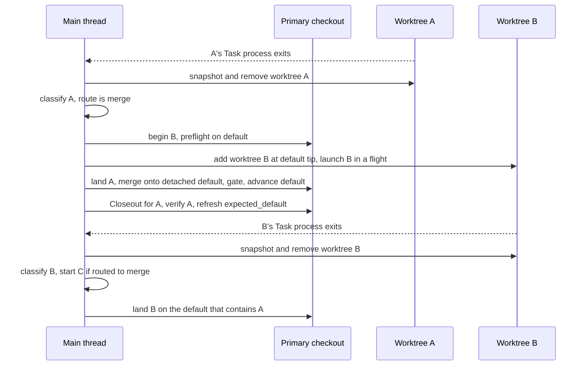
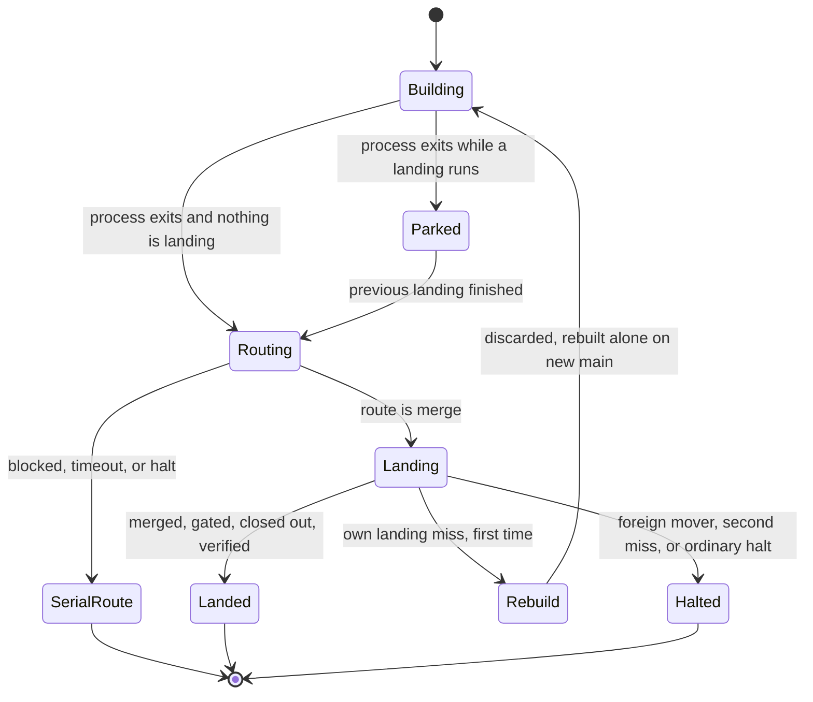
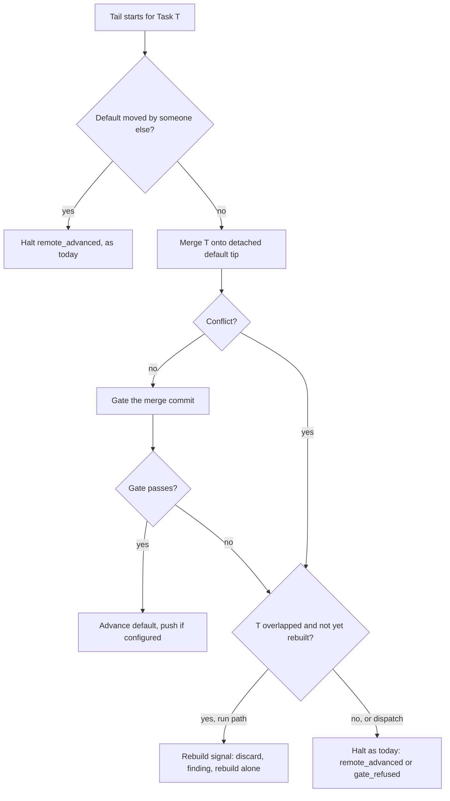
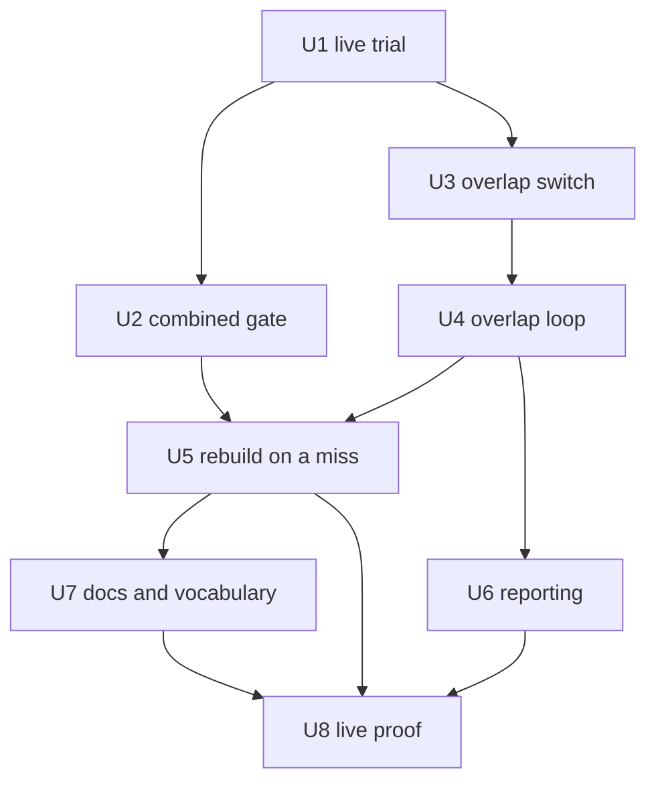

# Overlapped Landing - Plan

## Goal Capsule

- **Objective:** A burst of ready cards on a fed board clears sooner than it does when each card waits for the previous one to finish landing, and nothing lands that was not tested together with what landed before it.
- **Means:** The next card builds in a worktree while the previous card lands, the gate runs on the combined result, and a missed collision is rebuilt rather than halted (KTD1, KTD2, KTD4, KTD5, KTD6).
- **Product authority:** This plan, for normal `run` and Feeder runs. Three wide concurrency, the rolling window, and triple execution are not active scope.
- **Stop conditions:** U1, the live trial on support-workbench, must pass R14 before any other unit starts. A failed trial stops the plan, and its findings decide the next step.
- **Execution profile:** Runner code in `skills/relay/scripts/relay/`, Python standard library only. Every test runs on the stub. One live run against a throwaway target closes the build (U8).
- **Who finishes:** Built and merged locally by the implementing session. Pushing is a separate ask from Phillip.

---

## Product Contract

### Summary

When a card's Task process exits and its result is heading to a merge, Relay starts the next card's build in its own worktree while the first card lands. Landing now merges the card onto current main first and gates that combined result, and main only moves when the gate passes. A card that overlapped and then conflicts or fails the combined gate is discarded and rebuilt once, alone, on the new main, instead of halting the run. This is the default for new runs, and a Manifest can turn it off.

### Problem Frame

On iw-board over the week ending 2026-10-02, the median card spent about 26 minutes in its Task process and about 6 more landing. Landing means the gate on the Task branch, the merge, Closeout, and verify, measured across the 60 most recent landed records. Landing is about 17% of each card's time, and nothing else runs during it.

Bursts are common. 24 of 58 Cycles that launched work started with 6 or more cards available, and with `batch = 3` a Cycle of three cards takes about 96 minutes end to end. Feeder runs launch the `run` verb, which runs one Task at a time (`skills/relay/scripts/relay/feeder.py`, `run_cycle`), so the existing parallel dispatch never takes part in fed work. It could not overlap fed cards anyway, because the Feeder appends cards without `declared_paths` and the Scheduler serializes every Task that has none.

Development on this repo was paused on 2026-09-28 because each review round produced more cards. The chosen scope is deliberately the smallest change that recovers the idle landing time.

Product Contract preservation: changed, R11 now names the existing `parallel` dispatch policy's scheduling and triple execution as unchanged, because the combined gate (R15) applies to every local merge landing, `dispatch` included. R15 and R16 were added. R16 is the combined gate counterpart of R5, and R7's second miss clause covers a repeated combined gate failure. All three changes were confirmed by Phillip in the plan synthesis on 2026-10-02. Outstanding Questions were resolved into the Planning Contract and removed.

### Key Decisions

- **Overlap landing only, never two builds at once.** (session-settled: user-directed, chosen over three wide Cycles with a path prediction step, about 1.8x on a six card burst, and over a rolling window of three, about 2.4x, because it adds the least new surface while the repo is paused.) Governs R1, R2.
- **The next card starts when the previous Task process exits, not after the previous merge.** (session-settled: user-directed, chosen over waiting for the merge, which cannot conflict but recovers only the Closeout and verify time.) Governs R1, R5.
- **A missed collision is rebuilt, not halted and not resolved in place.** (session-settled: user-directed, chosen over halting on a conflict as today and over a process that edits the merge, because a rebuild keeps every landed change built and reviewed as itself.) Governs R5, R6, R7, R16.
- **On by default for new runs, with a Manifest switch to turn it off.** (session-settled: user-directed, chosen over opt in. This reverses KTD2 of `docs/plans/2026-09-18-1428-feat-conservative-single-backend-scheduling-plan.md`, under which unattended runs stayed fully serial unless someone chose otherwise.) Governs R9, R10.
- **A live trial gates the build.** (session-settled: user-directed, chosen over building straight through with the live proof at the end, because the worktree environment and host memory are the unknowns most likely to sink the feature.) Governs R13, R14.
- **The gate tests the combined result, for every local merge landing.** (session-settled: user-approved, chosen over gating the bare branch as today, which under overlap would land two cards that pass alone and break together without anyone testing them together. It also closes the same gap in `dispatch --policy parallel`.) Governs R15, R11.
- **A combined gate failure on an overlapped card is a missed collision.** (session-settled: user-approved, chosen over halting it as `gate_refused`, because the likeliest cause is the interaction with the card just landed, which a rebuild on the new main repairs.) Governs R16.
- **Overlap stays inside one run.** The last card of a Feeder Cycle has nothing behind it. Crossing Cycle boundaries is the rolling window, which is deferred. Governs R2.

### Requirements

**Overlap**

- R1. When a Task process exits, its result is routed to a merge, and the run has another Task to start, Relay starts that next Task's build in its own worktree while the first Task lands.
- R2. At most one Task builds and at most one Task lands at any moment, and both belong to the same run. A finished build waiting for its landing turn counts as neither.
- R3. Landings stay in Manifest order, and each Task's landing sequence (gate, merge, Closeout, verify) keeps its steps.
- R4. The gate, merge, and Closeout run only in the primary checkout, and the overlapping build never touches the primary checkout.

**Combined testing**

- R15. The gate runs on the Task's branch merged onto the current default branch, and the default branch moves only after that gate passes.

**Missed collision**

- R5. When an overlapped Task's merge conflicts with what this run landed after that Task's build began, Relay discards that Task's branch and worktree and rebuilds it from the new default branch with nothing overlapping it.
- R16. When an overlapped Task merges cleanly but fails the combined gate (R15), Relay treats it as a missed collision and rebuilds it as in R5.
- R6. A rebuild is not a halt. It does not stop the run, does not stop the Feeder, does not count toward `max_halts`, and is recorded on the Task's record as a finding that names the cause.
- R7. A conflict with any change this run did not land, a second miss on a rebuilt Task, and a gate failure on a Task that did not overlap all halt exactly as they halt today.

**Halts and interrupts**

- R8. When the landing Task halts, the build behind it follows the Manifest's `on_halt` setting. Continue past keeps it building. Otherwise it is ended, its worktree and branch are removed, and its record returns to pending, the way dispatch handles a sibling today.

**Default and control**

- R9. Overlap is on for every new normal run, including runs a Feeder launches, unless the Manifest turns it off.
- R10. A Runner or Feeder already running keeps the behavior of the code it started from. Overlap reaches a running Feeder only when it is restarted with `feed --pin`.
- R11. Triple execution and the scheduling of the existing `parallel` run policy keep their current behavior.

**Reporting**

- R12. `status`, the Follower, and the run summary stay truthful while two Tasks are active, and the summary names every rebuild.

**Trial gate**

- R13. Before any build work, a hand run trial on support-workbench runs real IW cards through the existing `dispatch --policy parallel` with hand written disjoint `declared_paths`, two in flight. It records whether a card can build and run its own tests inside a worktree, the host's free memory and swap during the overlap, and per card build and landing times.
- R14. Build work proceeds only if the trial shows worktree builds pass their own verification and the host stays usable with two sessions active. Otherwise the plan stops, and the trial findings decide the next step.

### Key Flow

- F1. A three card Cycle with overlap
  - **Trigger:** The Feeder appends three ready cards and launches a run.
  - **Steps:** Card 1 builds alone. Card 1's Task process exits and is routed to merge, card 2 starts building in a worktree, and card 1 lands. Card 2 exits, card 3 starts building, and card 2 lands. If card 2 conflicts with card 1's change or fails the combined gate, card 3 finishes and waits, card 2 is rebuilt alone, then card 2 and card 3 land in order. Card 3 lands last.
  - **Outcome:** The Cycle saves roughly one landing window per overlapped card, about 12 minutes on a 96 minute Cycle when nothing collides.
  - **Covered by:** R1, R2, R3, R5, R6, R15, R16

```mermaid
gantt
  dateFormat HH:mm
  axisFormat %H:%M
  section Today
  Card 1 build   :a1, 00:00, 26m
  Card 1 land    :a2, after a1, 6m
  Card 2 build   :a3, after a2, 26m
  Card 2 land    :a4, after a3, 6m
  Card 3 build   :a5, after a4, 26m
  Card 3 land    :a6, after a5, 6m
  section Overlapped
  Card 1 build   :b1, 00:00, 26m
  Card 1 land    :b2, after b1, 6m
  Card 2 build   :b3, after b1, 26m
  Card 2 land    :b4, after b3, 6m
  Card 3 build   :b5, after b3, 26m
  Card 3 land    :b6, after b5, 6m
```

### Acceptance Examples

- AE1. **Covers R1, R3.** Given cards A then B in a run, when A's Task process exits with a landed envelope, then B's build starts in a worktree before A's gate finishes, and B does not merge until A has landed.
- AE2. **Covers R5, R6.** Given B overlapped A and both changed the same lines, when B's merge conflicts, then B's branch and worktree are discarded, B rebuilds alone from the main that contains A, the Feeder keeps running, and B's record carries a rebuild finding rather than a halt.
- AE3. **Covers R7.** Given a rebuilt B, when its merge conflicts again, then B halts as a merge conflict halts today.
- AE4. **Covers R7.** Given B overlapped A, when B's merge conflicts with a commit someone else put on main during the run, then the run halts as it does today, with no rebuild.
- AE5. **Covers R8.** Given `continue_past_task_halt = false` and A's gate fails while B builds, then B is ended, its worktree and branch are removed, and its record reads pending.
- AE6. **Covers R9, R10.** Given a Manifest with no overlap setting, when a new run starts on code that has this feature, then it overlaps. A Feeder started before the feature landed keeps running one card at a time until it is restarted with `feed --pin`.
- AE7. **Covers R15, R16.** Given A and B each pass their own tests, when B merges cleanly onto main containing A and the combined gate fails, then main does not move, B is rebuilt once on the main containing A, and a second gate failure halts B as `gate_refused`.
- AE8. **Covers R15, R7.** Given a Task that did not overlap anything, when its gate fails, then it halts as `gate_refused` exactly as today and main does not move.
- AE9. **Covers R1.** Given A's Task process exits with no envelope inside the quick death window, when Relay classifies it, then B does not start until A's route and the usage limit check have run, as in a serial run today.

### Success Criteria

- On iw-board, a three card Cycle with no collision finishes about 12 minutes sooner than the roughly 96 minutes it takes today.
- The rebuild rate across overlapped cards stays under about one in four. Above that, the rebuild time (about 26 minutes each) outweighs the saved landing time (about 6 minutes per overlap), and the feature should be turned off for that board.

### Scope Boundaries

- Two builds at once, and any cap above one build plus one landing, are deferred. The original ask of up to three cards in flight stays open until the trial and this feature have run on a real board.
- The rolling window, which overlaps across Cycle boundaries, is deferred.
- A prediction step that infers `declared_paths` for fed cards is deferred. Nothing in this plan needs it.
- Resolving a conflict by editing the merge is out of scope.
- Changing the `parallel` run policy's scheduling, the Scheduler, or triple execution is out of scope. `dispatch` does not rebuild on a miss. It only gains the combined gate (R15).
- Considered and not built: correcting the `status` time estimate for overlap. Overlapping elapsed times make it overstate the time left, which errs safe, and no decision reads it. Evidence that an operator acted on a wrong estimate would change this.
- Considered and not built: a worktree prepare hook that installs a project environment into each Task's worktree. U1 decides whether one is needed. If it is, R14 stops the plan and that hook becomes its own plan.

#### Deferred to Follow-Up Work

- Rebuild on a miss for `dispatch --policy parallel` landings, if the combined gate shows real misses there.

### Dependencies / Assumptions

- The Mac running the boards has 18 GB of memory, and the median free memory when an iw-board card started was about 470 MB. Two sessions running test suites at once may not fit. U1 measures this before anything is built.
- A support-workbench worktree has no `venv/` of its own, so a Task process building there may not be able to run the project's tests. Open issue #129 records the related gap that the gate runs on the main checkout's installed environment. U1 checks whether builds still pass their own verification.
- The time estimates assume the build and landing medians above hold under overlap. A slower build caused by contention for memory or CPU shrinks the gain, and U1 measures it.
- The cards in one Feeder batch are independent by the Manifest's own independence sentence, since a card is listed only after everything it depends on is Done. Overlap relies on this and adds no dependency check of its own.

### Sources / Research

- `skills/relay/scripts/relay/gitwrite.py`, `local_merge_tail`: today the Task branch is gated in the primary checkout before the default branch is merged, and a merge conflict is aborted and returns `remote_advanced` at stage `merge`. Foreign movement stops the tail earlier, at the `fetch` or `baseline` stage.
- `skills/relay/scripts/relay/run.py`: the serial loop (`run`, `_one_task`, `_begin_task`, `_complete_task`, `_merge_route`) and the dispatch machinery (`_concurrent_loop`, `_concurrent_drive`, `_spawn_flight`, `_snapshot_and_remove`, `_abandon_build`, `_abort_siblings`, `_stop_flights`).
- `skills/relay/scripts/relay/feeder.py` and `limits.py`: Feeder Cycles launch `run`. `remote_advanced` is run scoped and stops the Feeder without counting. `max_halts` counts only records that end a run reading `halted`.
- `docs/solutions/logic-errors/local-merge-tail-compared-default-against-the-launch-baseline-so-dispatch-second-landing-halted-remote-advanced.md`: `expected_default` and the rule this plan amends.
- `docs/solutions/logic-errors/a-launch-off-the-main-thread-has-no-interrupt-forwarder-so-an-interrupted-dispatch-marked-live-builds-crashed.md`: interrupt handling for a build on a worker thread.
- `docs/solutions/logic-errors/stubbed-seams-agree-by-construction-first-live-run-found-five-contract-defects.md`: why U1 and U8 are live runs.
- `docs/plans/2026-09-17-feat-dual-manifest-dispatch-plan.md` and `docs/ideation/2026-09-08-parallel-builds-in-worktrees.md`: the worktree traps already paid for.
- Measurements: the iw-board Feeder log and run state for 2026-09-25 to 2026-10-02 (115 landed, 14 halted, 57 runs).

---

## Planning Contract

### Key Technical Decisions

- KTD1. **Build overlap into the serial `run` loop, borrowing dispatch's flight machinery, not into `dispatch`.** `dispatch` lands a Task before it fills the next slot (`drain(); fill()` in `_concurrent_drive`), it has no usage limit breaker, and the Feeder reads that breaker's `limit_passed_over`. The serial loop keeps the breaker, the per Task halt handling, and the Feeder's command line, and it reuses `_spawn_flight`, `_snapshot_and_remove`, `_abandon_build`, and `_stop_flights` for the one build in flight. Governs R1, R2, R9, R11.
- KTD2. **The successor starts after the predecessor is classified and routed to merge, not at the bare process exit.** Classification takes seconds and closes the case where a limit death or a blocked exit would otherwise start the next card on an exhausted account. Any route other than merge runs exactly as the serial loop runs it today before the next Task begins. Governs R1, AE9.
- KTD3. **With overlap on, every Task builds in a worktree, the first one included.** A Task process launched in the primary leaves it on the Task branch, and the successor's preflight then refuses `on_default`. Worktrees live under the run's state directory as in dispatch, and the transcript is found by the worktree path. Governs R4.
- KTD4. **The combined gate merges onto a detached copy of the default tip, gates it, then advances the default branch to that merge commit.** The default ref never moves before the gate passes, a conflict surfaces before the gate is spent, and the history is the same merge commit `merge --no-ff` writes today. For a branch built on the current default the gated tree equals the branch, so a non overlapped landing gates the same code it gates today. Governs R15, R11.
- KTD5. **An own landing miss is recognized from the tail's stage, not from a new halt class.** The tail reaches stage `merge` only when the default branch equals `expected_default`, so a conflict or a combined gate failure at that point, on a Task whose `baseline_sha` differs from `expected_default`, is a collision with this run's own landings. `_merge_route` turns it into a rebuild signal that is not a `_Halt`, so no halted Closeout launches and `_record_halt` is never consulted. Halt classes stay closed. The finding is a new finding class. Governs R5, R6, R7, R16.
- KTD6. **A rebuild waits for an in flight successor to finish, then runs alone.** The successor's build is never killed for a rebuild. It parks with its result, the rebuilt Task builds with nothing beside it, then both land in Manifest order. This keeps R2 and means the rebuild cannot collide a second time with anything but a foreign change. Governs R2, R5.
- KTD7. **The landing runs on the main thread and the build on a flight thread, with dispatch's interrupt contract.** The Closeout launch keeps its signal forwarder on the main thread. With overlap on, `release_on_interrupt` is false and an interrupt ends the flight through `_stop_flights` before the Leases are released, the way `_concurrent_loop` does. Governs R8.
- KTD8. **`expected_default` is set on the serial path only when overlap is on.** It is set to the default tip at run start, before the first Task begins, so a Task that overlapped nothing has a `baseline_sha` equal to it and KTD5 never reads it as a miss. It is then refreshed after every Task's route finishes, whatever the route (landed, blocked, timeout to blocked, or a halt that continues past), because a blocked or halted Closeout can commit a learning to the default branch too. That matches where dispatch's `drain` and `handle_halt` refresh it. With overlap off it stays unset, which keeps the rule in the `expected_default` solutions doc true for that case. That doc is amended to say so. Governs R5, R7.
- KTD9. **The switch is a Manifest key, `execution.overlap`, default true, read by `run` only.** A key needs no change to the Feeder's command, and a pinned extract picks it up on restart. `dispatch` and triple execution ignore it, and `validate` refuses an explicit `overlap` beside `mode = "triple"`. Governs R9, R10, R11.
- KTD10. **The stub gains a routing key so two processes on one backend can each take their own queued entry.** Overlap puts a claude Closeout on the main thread beside a claude Task in a flight thread, and the stub today matches entries by backend only. Governs test coverage for R1 to R8.

### High-Level Technical Design

The sequence of one overlap, from Task A's exit to Task B's landing. Prose in the units is authoritative where the two disagree.

The life of one Task under overlap.

How the landing tail decides a miss.

Where overlap applies.

| Launch | `execution.overlap` | Builds in a worktree | Overlaps landing | Combined gate | Rebuild on a miss |
|---|---|---|---|---|---|
| `run`, normal mode | true (default) | yes, every Task | yes | yes | yes |
| `run`, normal mode | false | no | no | yes | no |
| `dispatch`, any policy | ignored | yes, as today | no change | yes | no |
| `run`, triple mode | refused if set | as today | no change | yes, through the shared tail | no |

### Assumptions

- A Task that blocks with `merge_partial = true` reaches the merge route and so can be overlapped. Its partial merge goes through the same combined gate.
- The Closeout process for A and the build for B never write to the same path. B writes only under its worktree, which lives under `~/.relay`, and the Closeout's scope check resets the primary tree it owns.

### Sequencing

U1 gates everything. U2 and U3 are independent and can land in either order. U4 needs U3. U5 needs U2 and U4. U6 needs U4. U7 needs U5. U8 needs every other unit.

---

## Implementation Units

### U1. Live trial on support-workbench

**Goal:** Decide from real runs whether a support-workbench card can build and test in a worktree, and whether the host can carry two sessions, before any code is written.

**Requirements:** R13, R14.

**Dependencies:** None.

**Files:**
- Create: `docs/ideation/2026-10-NN-overlapped-landing-trial.md` (dated the day the trial runs), the trial record.

**Approach:**
1. Pick exactly two ready IW cards whose changes are clearly disjoint, and write a one off Manifest beside the iw-board one with hand written narrow `declared_paths` per card. `dispatch --policy parallel` has no concurrency cap and puts every disjoint card in one wave, so a third disjoint card would build three at once. Do not edit the iw-board Manifest.
2. Stop the iw-board Feeder between Cycles with `feed --stop`, or launch with `--wait-for-lease`, since both Manifests name the same repository and its Lease.
3. Run `dispatch --policy parallel` on the trial Manifest and confirm the printed schedule overlaps the cards.
4. While it runs, sample free memory and swap at a fixed interval. After it ends, read each record's `host_at_start` and `host_at_end`, `wall_seconds`, and the transcript for the test commands the Task process ran in its worktree and their results.
5. Separately from the dispatch run, run support-workbench's full gate in the primary while its full suite runs in a worktree at the same time, at least twice. support-workbench's test configuration points its databases and indexes at fixed `/tmp/workbench-test-*` paths, suffixed only by test worker number, so two suite runs on one machine share those files. Under overlap, the landing card's gate and the building card's own tests run at the same time, which is exactly this case.
6. Write the trial record: per card build and landing minutes against the 26 and 6 minute medians, whether each Task process ran the project's verification in its worktree and what happened, memory and swap through the overlap, the result of step 5, and a pass or fail against R14.

**Execution note:** This unit is a measurement, not a build. The pass bar is that every card's Task process ran its own verification in the worktree and passed, the gate passed in the primary, no card was killed or timed out, no overlapped build took more than about 1.5 times the 26 minute median, and step 5 showed no failure in one suite caused by the other. A miss on any of these stops the plan per R14. A cross suite failure is fixed by giving support-workbench's tests per checkout paths, which is an IW card in that repo, not runner code.

**Test expectation:** none, this unit changes no code.

**Verification:** The trial record exists, states pass or fail against R14 with the evidence, and Phillip has read it before U2 starts.

### U2. Combined gate in the local merge tail

**Goal:** Every local merge landing gates the Task merged onto the current default and moves the default only after that passes.

**Requirements:** R15, R11, R3, AE7, AE8. KTD4.

**Dependencies:** U1.

**Files:**
- Modify: `skills/relay/scripts/relay/gitwrite.py`
- Test: `tests/test_gitwrite.py`

**Approach:**
1. Keep the order of the existing checks ahead of the gate: branch existence, the `.claude/` backstop and the Task path bound on `baseline_sha..branch`, and the mover check against `expected_default` or `baseline_sha`.
2. Check out the default tip detached in the primary, merge the Task branch `--no-ff` with today's message, and on a conflict abort and return the tail result at stage `merge` with `conflict: True`, as today.
3. Run the gate on that detached merge commit, then the clean tree and Lease checks that follow the gate today.
4. Re check that the default ref still equals the SHA the merge was made on, check out the default, and fast forward it to the merge commit. Push as today when `pushes` is true.
5. On a gate failure leave the default untouched and return to the default checkout so the primary is left as today's `gate_refused` leaves it.
6. Carry enough evidence on the result for the caller to tell a combined gate failure from a branch only one: the SHA gated and whether it differed from the branch tip.

**Patterns to follow:** The existing `local_merge_tail` stage names and `TailResult` evidence. `DispatchExpectedDefault` and `NoPushTail` in `tests/test_gitwrite.py` for fixture shape.

**Test scenarios:**
- A branch built on the current default lands with the same merge commit shape and parents as today, under `pushes` true and false.
- Covers AE7. Two branches that each pass a fixture gate alone but fail it together: the second lands onto the first's merge, the combined gate fails, the default ref is unchanged, the primary is back on the default and clean, and the result is `gate_refused` with evidence naming the combined SHA.
- Covers AE8. A gate failure on a branch built on the current default leaves the default unchanged and returns `gate_refused` with evidence showing the gated tree equals the branch.
- A textual conflict is caught before the gate runs: the gate command is never invoked, the merge is aborted, no `MERGE_HEAD` remains, and the result is stage `merge` with `conflict: True`.
- The default ref is moved by a foreign commit between the merge and the advance: the tail does not advance and halts `remote_advanced`.
- A repo with `origin/HEAD` unset still lands correctly.
- The fixture git commands run with `GIT_DIR`, `GIT_WORK_TREE`, `GIT_INDEX_FILE`, and `GIT_CONFIG_PARAMETERS` scrubbed.

**Verification:** `tests/test_gitwrite.py` passes, and the existing dispatch and run landing tests pass unchanged.

### U3. The overlap switch

**Goal:** A Manifest carries `execution.overlap`, on by default, and `validate` and the docs say what it does.

**Requirements:** R9, R10, R11, AE6. KTD9.

**Dependencies:** U1.

**Files:**
- Modify: `skills/relay/scripts/relay/manifest.py`
- Modify: `docs/manifest-authoring.md`
- Modify: `skills/relay/SKILL.md`
- Modify: `docs/examples/*.toml` where an explicit `[execution]` table would teach the default
- Test: `tests/test_manifest.py`, `tests/test_examples.py`

**Approach:**
1. Add the field to the `Execution` dataclass, read with `pick` so an omitted key is recorded in `defaults_applied`.
2. In `validate`, refuse a non boolean value, and refuse an explicit `overlap` when `mode = "triple"`.
3. Document the key beside the run policy section of `docs/manifest-authoring.md`, including that `dispatch` ignores it and that a running Feeder sees it only after `feed --pin`.
4. Add it to the `/relay` skill's authoring questions and launch confirmation, so a person authoring a Manifest is told overlap is on and how to turn it off.

**Patterns to follow:** `execution.mode` and `[on_halt]` in `manifest.py` and in `docs/manifest-authoring.md`.

**Test scenarios:**
- A Manifest with no `[execution]` table loads with overlap true and lists it in `defaults_applied`.
- `overlap = false` loads false.
- `overlap = "yes"` is refused by `validate` with a message naming the key.
- `mode = "triple"` with `overlap = true` is refused. `mode = "triple"` with no `overlap` key validates.
- Every example Manifest still validates, and none spells a real project name.

**Verification:** `tests/test_manifest.py` and `tests/test_examples.py` pass.

### U4. The overlap loop in `run`

**Goal:** With overlap on, the serial loop starts the next Task's build in a worktree as soon as the current Task is routed to merge, and lands the current Task meanwhile.

**Requirements:** R1, R2, R3, R4, R8, AE1, AE5, AE9. KTD1, KTD2, KTD3, KTD7, KTD8, KTD10.

**Dependencies:** U3.

**Files:**
- Modify: `skills/relay/scripts/relay/run.py`
- Modify: `tests/stub-claude/_stub.py`
- Create: `tests/test_overlap.py`
- Test: `tests/test_run.py`, `tests/test_dispatch.py` (regression only)

**Approach:**
1. Split `_complete_task` at the point where classify has decided the route, so the loop can learn the route before the merge tail runs.
2. When overlap is on, launch every Task through `_spawn_flight` into a worktree from `worktree.path_for`. On a flight's exit, run `_snapshot_and_remove` before anything checks the branch out.
3. After the current Task is classified to the merge route, run `_begin_task` for the next Task while the primary is still on a clean default, add its worktree at the default tip, and spawn its flight. Then run the current Task's landing on the main thread. A halt raised by that `_begin_task`, or a skip it returns, is held until the current Task's landing ends and is then recorded as the serial loop records it today, so the current Task always lands first (R3).
4. Any route other than merge finishes exactly as today, including `_note_usage_limit`, before the next Task begins (KTD2).
5. A build that exits while a landing runs is parked with its result and routed after that landing ends.
6. When overlap is on, set `expected_default` at run start and refresh it after every Task's route finishes, per KTD8. Leave it unset when overlap is off.
7. Adopt dispatch's interrupt contract when overlap is on: `release_on_interrupt` false, and the loop's `BaseException` path ends the flight with `_stop_flights` and names any survivor before the Leases are released (KTD7).
8. On a halt that does not continue past, end the flight and `_abandon_build` it to pending (R8). On a halt that continues past, keep the flight.
9. Give the stub a routing key so a queued entry can be claimed by role or Task id, and keep every existing entry matching as today when the key is absent (KTD10).

**Execution note:** Start with a failing `tests/test_overlap.py` case that proves two stub processes overlap in time, using the `OVERLAP_LOG` stamping dispatch's tests already use.

**Patterns to follow:** `_concurrent_drive`'s flight handling and `_abort_siblings` in `run.py`. `DispatchCase` in `tests/test_dispatch.py` and `RunCase` in `tests/test_run.py`. The `RELAY_STUB_CHILD` guidance in `docs/solutions/logic-errors/relay-stub-child-reaches-every-stub-process-not-only-the-one-a-test-means-to-orphan.md` for the interrupt tests.

**Test scenarios:**
- Covers AE1. Two Tasks with a landed envelope each: B's start stamp precedes A's landing end stamp, A lands before B, both records read landed, and the primary ends on the default and clean.
- Three Tasks land in Manifest order with the cursor advancing after each landing.
- Covers AE9. A's process exits with no envelope inside the quick death window: B's start stamp follows A's route and the usage limit check, and `limit_passed_over` reads as it does in a serial run today.
- A's Task blocks with `merge_partial = false`: B starts only after A's blocked route completes.
- Covers AE5. `continue_past_task_halt = false` and A's gate fails while B builds: B's process group is ended, B's worktree and branch are gone, and B's record reads pending.
- `continue_past_task_halt = true` and A halts: B keeps building and lands.
- After one landing, Task A blocks and its stub Closeout commits a learning to the default branch: Task B then lands with no `remote_advanced` halt.
- `continue_past_task_halt = true`, A halts and its Closeout commits a learning: the in flight B still lands.
- B's preflight refuses `no_task_branch` while A is routed to merge: A lands first, then B's record reads halted with today's class.
- An interrupt while B builds and A lands: B's group is ended before the Leases are released, A's Closeout is ended through its own forwarder, and no record is marked crashed while its process is alive.
- With overlap off, the run launches every Task in the primary, never creates a worktree, and leaves `expected_default` unset, matching today's records.
- Every Task with overlap on is found by its transcript under its worktree path, with the stdout log fallback still used when the transcript is missing.
- Two claude processes overlapping, a Task and a Closeout, each take their own stub entry.

**Verification:** `tests/test_overlap.py`, `tests/test_run.py`, and `tests/test_dispatch.py` pass.

### U5. Rebuild on a miss

**Goal:** An overlapped Task that conflicts with or fails the combined gate against this run's own landings is discarded and rebuilt once, alone, as a finding and never as a halt.

**Requirements:** R5, R6, R7, R16, AE2, AE3, AE4, AE7. KTD5, KTD6.

**Dependencies:** U2, U4.

**Files:**
- Modify: `skills/relay/scripts/relay/run.py`
- Modify: `skills/relay/scripts/relay/contracts.py`
- Modify: `skills/relay/scripts/relay/summary.py` only if the finding needs fields the cause line does not already carry
- Test: `tests/test_overlap.py`, `tests/test_contracts.py`, `tests/test_feeder.py`, `tests/test_limits.py`

**Approach:**
1. In `_merge_route`, before the halt upsert, recognize the miss per KTD5: stage `merge` with a conflict, or a combined gate failure, on a Task whose `baseline_sha` differs from `expected_default` and whose id is not in the run's rebuilt set. Raise a rebuild signal that is not a `_Halt`.
2. Discard with `_abandon_build`: worktree first, then the branch named by `task_branch_for`, then the record back to its pre launch fields. Do not recapture the card baseline, so the relaunch's `launch_baseline` still reads the status before the first attempt.
3. Add the finding class and its cause line template in `contracts.py`, carried on `_Begun` the way `reassignment` is, so `_begin_task` and `_complete_task` both keep it.
4. Hold the rebuilt Task until any in flight successor exits and parks, then rebuild it with no flight beside it, then land it, then the parked successor (KTD6).
5. Add the Task to the run's rebuilt set. A second miss falls through to today's halt (R7).
6. Leave the Feeder unchanged. A rebuilt Task that lands reads landed, and one that halts on its second miss reads halted with today's class.

**Patterns to follow:** `_reassignment` and `_Begun.reassignment` in `run.py`. `FINDING_CLASSES`, `LINE_CLASSES`, and `HALT_LINES` in `contracts.py`. `task_branch_sh` in `tests/test_run.py` for writing two branches that conflict.

**Test scenarios:**
- Covers AE2. B overlapped A and both edit the same lines: B's first attempt is discarded, its worktree and branch are gone before the rebuild starts, B is rebuilt from the default containing A, lands, and its record reads landed with one rebuild finding naming the conflict.
- Covers AE7. B merges cleanly but fails the combined fixture gate: B is rebuilt once, and its record carries a rebuild finding naming the gate.
- Covers AE3. The rebuilt B conflicts again: B halts `remote_advanced` at stage `merge`, exactly as today.
- Covers AE4. A foreign commit lands on the default during the run, and B's tail stops at the mover check: B halts `remote_advanced` with no rebuild.
- A rebuild while C is building: C finishes and parks, B rebuilds with no other process alive, then B lands before C.
- The rebuild test runs without pre deleting B's branch, so a missed branch delete fails it on `no_task_branch`.
- The rebuilt Task's relaunch reads the card baseline captured before its first attempt.
- No halted Closeout launches for the discarded attempt, and the card receives no halt comment.
- Feeder: a Cycle whose run has a rebuilt Task that lands is settled as landed, counts no halt, does not stop, and leaves `limit_waits` unchanged.
- Limits: the rebuild's relaunch restamps `started_at`, and a quick death of the rebuild is timed from the rebuild's own launch.
- Contracts: the new finding class has a cause line, and no halt class was added.
- Covers AE8. The first Task of an overlapped run fails its gate: it halts `gate_refused` with no rebuild finding.

**Verification:** `tests/test_overlap.py`, `tests/test_contracts.py`, `tests/test_feeder.py`, and `tests/test_limits.py` pass.

### U6. Reporting with two Tasks active

**Goal:** The Follower prints both the landing Task's Closeout output and the building Task's output, and the summary names every rebuild.

**Requirements:** R12.

**Dependencies:** U4.

**Files:**
- Modify: `skills/relay/scripts/relay/tail.py`
- Test: `tests/test_tail.py`, `tests/test_summary.py`, `tests/test_cli.py`

**Approach:**
1. Change the Follower's cursor so a log that starts after a later Task's log is still read. The predecessor's Closeout log starts after the successor's Task log under overlap, and today the frontier skips it for good.
2. Keep the frontier as bytes past each reader's start, not file existence.
3. Confirm the summary renders the rebuild finding through the existing `finding:` line, and add a pending check only if the rendering needs one.

**Patterns to follow:** `FollowDuringTheRun` and `FollowAcrossBoundaries` in `tests/test_tail.py`. `docs/solutions/logic-errors/follower-frontier-must-be-bytes-past-start-not-file-exists.md`.

**Test scenarios:**
- A Follower beside an overlapped stub run prints A's Closeout lines after B's Task log has started.
- A rebuild's appended attempt in B's log is printed as a new attempt, not dropped.
- `status` during an overlapped run lists one Task building and one landing, and reads no ready source.
- The summary of a run with one rebuild prints one `finding:` line naming it.

**Verification:** `tests/test_tail.py`, `tests/test_summary.py`, and `tests/test_cli.py` pass.

### U7. Docs and vocabulary

**Goal:** No shipped document describes a merge conflict or the serial `expected_default` the way it worked before this plan.

**Requirements:** R6, R7, R9, R15.

**Dependencies:** U5.

**Files:**
- Modify: `skills/relay/SKILL.md` (the `remote_advanced` row of the halt table)
- Modify: `docs/solutions/logic-errors/local-merge-tail-compared-default-against-the-launch-baseline-so-dispatch-second-landing-halted-remote-advanced.md`
- Modify: `docs/solutions/workflow-issues/remote-advanced-hand-repair-needs-a-third-step-so-resume-does-not-relaunch-the-finished-task.md`
- Modify: `CONCEPTS.md`
- Modify: `README.md`

**Approach:**
1. The halt table's `remote_advanced` row says a conflict with this run's own landing is rebuilt once, and only a foreign change or a second miss reaches the hand repair.
2. The `expected_default` doc's rule becomes "unset when overlap is off" and names this plan.
3. The hand repair doc notes that the rebuild now covers the own landing case.
4. `CONCEPTS.md` gains an Overlapped landing entry covering the rebuild, and the Runner and Run policy entries are refined so a serial run is no longer described as one Task at a time when overlap is on. No real project names enter any shipped file.
5. `README.md` says a normal run overlaps landing by default and how to turn it off.

**Test expectation:** none beyond `tests/test_examples.py`'s leak scan over the shipped tree, which must still pass.

**Verification:** Every file above describes the built behavior, and the leak scan passes.

### U8. Live proof

**Goal:** Real processes, not the stub, prove the contracts this plan changed, before the feature reaches a real board.

**Requirements:** R1, R5, R6, R15, R16, Success Criteria.

**Dependencies:** U2, U3, U4, U5, U6, U7.

**Files:**
- Modify: `docs/ideation/2026-10-NN-overlapped-landing-trial.md`, appending the live proof and the first board results

**Approach:**
1. Make a throwaway git repository with a fixture gate. Write a three Task markdown tracker Manifest whose second Task edits the same lines as the first, so its first attempt must conflict.
2. Run it with real `claude` and confirm the timeline overlaps, the second Task is rebuilt once and lands, the third lands last, the Closeout for each Task ran while the next one built, and the summary names the rebuild.
3. Then restart the iw-board Feeder with `feed --pin` and read its first overlapped Cycles: Cycle wall time against the 96 minute baseline, rebuild count against the one in four bar, and host memory.

**Execution note:** Do not count a run of Relay landing this feature on itself as evidence. A Runner keeps the code it started with.

**Test expectation:** none, this unit is a live run.

**Verification:** The trial record shows the throwaway run passing each check in step 2, and the first board Cycles measured against the Success Criteria.

---

## Verification Contract

| Check | Command or evidence | Applies to |
|---|---|---|
| Full suite | `python3 -m unittest discover -s tests` from the repo root. About fourteen minutes, so allow a timeout of fifteen or more | Every unit that changes code, before it merges |
| Single module | `python3 -m unittest test_<name>` run from `tests/` | While building U2 to U6 |
| No network in tests | Every new test module imports `_paths` first | U4, U5, U6 |
| Leak scan | `tests/test_examples.py` passes over the shipped tree | U3, U7 |
| Trial | The trial record with a pass against R14 | U1, before anything else |
| Live proof | The throwaway run in U8 and the first fed Cycles | U8 |

---

## Definition of Done

- U1's trial passed R14 and Phillip read the record before U2 started.
- Every R and AE above is covered by a passing test or by U8's live proof.
- The full suite passes, and its test count in `CLAUDE.md` is updated to the new total.
- A run with `overlap = false` produces the same records and launches as before this plan.
- No new halt class exists, and the new finding class has a cause line.
- Every document U7 names describes the built behavior.
- No abandoned approach, unused helper, or experimental branch of the work remains in the diff.

---

## Risks

| Risk | Mitigation |
|---|---|
| Task processes in a worktree cannot run support-workbench's tests | U1 finds it before any code. R14 stops the plan |
| Two sessions push the host into heavy swap and slow every build | U1 and U8 measure it. Overlap can be turned off per Manifest |
| support-workbench's two concurrent test runs share fixed `/tmp` files and fail each other, which reads as false gate failures and false rebuilds | U1 step 5 runs the two suites at once on purpose. A failure stops the plan until support-workbench's tests use per checkout paths |
| The merge tail reorder (U2) breaks a landing case today's tests do not cover | U2's scenarios cover push and no push, a conflict, a foreign mover, and an unset `origin/HEAD`, and U8 runs it live |
| The stub agrees with the runner by construction and hides a contract defect | U8 runs real processes against a throwaway target before any board sees the feature |
| A running Feeder is mistaken for one running the new code | R10 and the docs in U3 say a Feeder sees overlap only after `feed --pin` |
