# Overlapped Landing - Plan

## Goal Capsule

- **Objective:** A burst of ready cards on a fed board clears sooner than it does when each card waits for the previous one to finish landing.
- **Means:** The next card starts building in a worktree as soon as the previous Task process exits, while the previous card lands. A missed collision is rebuilt instead of halting.
- **Product authority:** This plan, for normal runs and Feeder runs. Three wide concurrency, the rolling window, and triple execution are not active scope.
- **Open blockers:** A live trial on support-workbench (R13) must pass before any build work starts. Planning may proceed now.

---

## Product Contract

### Summary

When a card's Task process exits, Relay starts the next card's build in its own worktree while the first card goes through its gate, merge, Closeout, and verify. At most two cards are active at once, one building and one landing, and landings stay in Manifest order. A merge conflict caused by the card just landed rebuilds the later card alone on the new main rather than halting the run. This is the default for new runs, and a Manifest can turn it off.

### Problem Frame

On iw-board over the week ending 2026-10-02, the median card spent about 26 minutes in its Task process and about 6 more landing. Landing means the gate on the Task branch, the merge, Closeout, and verify, measured across the 60 most recent landed records. Landing is about 17% of each card's time, and nothing else runs during it.

Bursts are common. 24 of 58 Cycles that launched work started with 6 or more cards available, and with `batch = 3` a Cycle of three cards takes about 96 minutes end to end. Feeder runs launch the `run` verb, which runs one Task at a time (`skills/relay/scripts/relay/feeder.py`, `run_cycle`), so the existing parallel dispatch never takes part in fed work. It could not overlap fed cards anyway, because the Feeder appends cards without `declared_paths` and the Scheduler serializes every Task that has none.

Development on this repo was paused on 2026-09-28 because each review round produced more cards. The chosen scope is deliberately the smallest change that recovers the idle landing time.

### Key Decisions

- **Overlap landing only, never two builds at once.** (session-settled: user-directed, chosen over three wide Cycles with a path prediction step, about 1.8x on a six card burst, and over a rolling window of three, about 2.4x, because it adds the least new surface while the repo is paused.) Governs R1, R2.
- **The next card starts when the previous Task process exits, not after the previous merge.** (session-settled: user-directed, chosen over waiting for the merge, which cannot conflict but recovers only the Closeout and verify time.) Governs R1, R5.
- **A missed collision is rebuilt, not halted and not resolved in place.** (session-settled: user-directed, chosen over halting on a conflict as today and over a process that edits the merge, because a rebuild keeps every landed change built and reviewed as itself.) Governs R5, R6, R7.
- **On by default for new runs, with a Manifest switch to turn it off.** (session-settled: user-directed, chosen over opt in. This reverses KTD2 of `docs/plans/2026-09-18-1428-feat-conservative-single-backend-scheduling-plan.md`, under which unattended runs stayed fully serial unless someone chose otherwise.) Governs R9, R10.
- **A live trial gates the build.** (session-settled: user-directed, chosen over building straight through with the live proof at the end, because the worktree environment and host memory are the unknowns most likely to sink the feature.) Governs R13, R14.
- **Overlap stays inside one run.** The last card of a Feeder Cycle has nothing behind it. Crossing Cycle boundaries is the rolling window, which is deferred. Governs R2.

### Requirements

**Overlap**

- R1. When a Task process exits and the run has another Task to start, Relay starts that next Task's build in its own worktree while the first Task lands.
- R2. At most one Task builds and at most one Task lands at any moment, and both belong to the same run.
- R3. Landings stay in Manifest order, and each Task's landing sequence (gate, merge, Closeout, verify) is unchanged.
- R4. The gate, merge, and Closeout run only in the primary checkout, and the overlapping build never touches the primary checkout.

**Missed collision**

- R5. When an overlapped Task's merge conflicts with what the Task before it in the same run just landed, Relay discards that Task's branch and worktree and rebuilds it from the new default branch with nothing overlapping it.
- R6. A rebuild is not a halt. It does not stop the run, does not stop the Feeder, does not count toward `max_halts`, and is recorded on the Task's record as a finding that names the conflict.
- R7. A conflict with any change this run did not land, and a second conflict on a rebuilt Task, halt exactly as a merge conflict halts today.

**Halts and interrupts**

- R8. When the landing Task halts, the build behind it follows the Manifest's `on_halt` setting. Continue past keeps it building. Otherwise it is ended, its worktree and branch are removed, and its record returns to pending, the way dispatch handles a sibling today.

**Default and control**

- R9. Overlap is on for every new normal run, including runs a Feeder launches, unless the Manifest turns it off.
- R10. A Runner or Feeder already running keeps the behavior of the code it started from. Overlap reaches a running Feeder only when it is restarted with `feed --pin`.
- R11. Triple execution and the existing `parallel` run policy keep their current behavior.

**Reporting**

- R12. `status`, the Follower, and the run summary stay truthful while two Tasks are active, and the summary names every rebuild.

**Trial gate**

- R13. Before any build work, a hand run trial on support-workbench runs real IW cards through the existing `dispatch --policy parallel` with hand written disjoint `declared_paths`, two in flight. It records whether a card can build and run its own tests inside a worktree, the host's free memory and swap during the overlap, and per card build and landing times.
- R14. Build work proceeds only if the trial shows worktree builds pass their own verification and the host stays usable with two sessions active. Otherwise the plan stops, and the trial findings decide the next step.

### Key Flow

- F1. A three card Cycle with overlap
  - **Trigger:** The Feeder appends three ready cards and launches a run.
  - **Steps:** Card 1 builds alone. Card 1's Task process exits, card 2 starts building in a worktree, and card 1 lands. Card 2's process exits, card 3 starts building, and card 2 lands. If card 2's merge conflicts with card 1's change, card 2 is rebuilt alone and card 3 waits for it. Card 3 lands last.
  - **Outcome:** The Cycle saves roughly one landing window per overlapped card, about 12 minutes on a 96 minute Cycle when nothing conflicts.
  - **Covered by:** R1, R2, R3, R5, R6

```mermaid
gantt
  dateFormat HH:mm
  axisFormat %H:%M
  section Today
  Card 1 build   :a1, 00:00, 26m
  Card 1 land    :a2, after a1, 6m
  Card 2 build   :a3, after a2, 26m
  Card 2 land    :a4, after a3, 6m
  Card 3 build   :a5, after a4, 26m
  Card 3 land    :a6, after a5, 6m
  section Overlapped
  Card 1 build   :b1, 00:00, 26m
  Card 1 land    :b2, after b1, 6m
  Card 2 build   :b3, after b1, 26m
  Card 2 land    :b4, after b3, 6m
  Card 3 build   :b5, after b3, 26m
  Card 3 land    :b6, after b5, 6m
```

### Acceptance Examples

- AE1. **Covers R1, R3.** Given cards A then B in a run, when A's Task process exits, then B's build starts in a worktree before A's gate finishes, and B does not merge until A has landed.
- AE2. **Covers R5, R6.** Given B overlapped A and both changed the same lines, when B's merge conflicts, then B's branch and worktree are discarded, B rebuilds alone from the main that contains A, the Feeder keeps running, and B's record carries a rebuild finding rather than a halt.
- AE3. **Covers R7.** Given a rebuilt B, when its merge conflicts again, then B halts as a merge conflict halts today.
- AE4. **Covers R7.** Given B overlapped A, when B's merge conflicts with a commit someone else put on main during the run, then the run halts as it does today, with no rebuild.
- AE5. **Covers R8.** Given `continue_past_task_halt = false` and A's gate fails while B builds, then B is ended, its worktree and branch are removed, and its record reads pending.
- AE6. **Covers R9, R10.** Given a Manifest with no overlap setting, when a new run starts on code that has this feature, then it overlaps. A Feeder started before the feature landed keeps running one card at a time until it is restarted with `feed --pin`.

### Success Criteria

- On iw-board, a three card Cycle with no conflict finishes about 12 minutes sooner than the roughly 96 minutes it takes today.
- The rebuild rate across overlapped cards stays under about one in four. Above that, the rebuild time (about 26 minutes each) outweighs the saved landing time (about 6 minutes per overlap), and the feature should be turned off for that board.

### Scope Boundaries

- Two builds at once, and any cap above one build plus one landing, are deferred. The original ask of up to three cards in flight stays open until the trial and this feature have run on a real board.
- The rolling window, which overlaps across Cycle boundaries, is deferred.
- A prediction step that infers `declared_paths` for fed cards is deferred. Nothing in this plan needs it.
- Resolving a conflict by editing the merge is out of scope.
- Changing the `parallel` run policy, the Scheduler, or triple execution is out of scope.

### Dependencies / Assumptions

- The Mac running the boards has 18 GB of memory, and the median free memory when an iw-board card started was about 470 MB. Two sessions running test suites at once may not fit. R13 measures this before anything is built.
- A support-workbench worktree has no `venv/` of its own, so a Task process building there may not be able to run the project's tests. Open issue #129 records the related gap that the gate runs on the main checkout's installed environment. R13 checks whether builds still pass their own verification.
- The time estimates assume the build and landing medians above hold under overlap. A slower build caused by contention for memory or CPU shrinks the gain, and the trial measures it.
- A merge conflict today halts as `remote_advanced`, which is a run scoped class that stops the Feeder for a person. R6 depends on telling this run's own landing apart from a foreign change on main.

### Outstanding Questions

**Deferred to Planning**

- Whether overlap reuses the dispatch concurrent loop with a new kind of edge, or extends the plain `run` path.
- How a conflict caused by this run's own previous landing is told apart from a foreign change on main. The merge tail already tracks the default branch SHA this run expects.
- How `status` and the Follower present one building Task beside one landing Task.
- How the Feeder's usage limit reading, which treats a Cycle whose Tasks all die within ten minutes as a limit death, accounts for a rebuild inside the Cycle.
- Which Manifest key turns overlap off, and what `validate` says about it.

### Sources / Research

- `skills/relay/scripts/relay/gitwrite.py`, `local_merge_tail`: the Task branch is checked out and gated in the primary checkout before the default branch is checked out and merged, and a merge conflict is aborted and returns `remote_advanced`.
- `skills/relay/scripts/relay/run.py`, `_concurrent_drive`: a serial edge holds a successor until its predecessor has fully settled. Flights are keyed by Task id and there is no numeric cap.
- `skills/relay/scripts/relay/worktree.py`: detached worktrees under the run's state directory, removed before the merge tail checks the branch out.
- `skills/relay/scripts/relay/feeder.py`, `run_cycle`: Feeder Cycles launch `run`, never `dispatch`.
- `skills/relay/scripts/relay/manifestedit.py`, `append_tasks`: appended Tasks carry `id`, `model`, and `effort` only.
- `skills/relay/scripts/relay/contracts.py`: `remote_advanced` is in `RUN_SCOPED_HALT_CLASSES`. Halt classes are a closed set, so a rebuild is a finding, not a new class.
- `docs/plans/2026-09-17-feat-dual-manifest-dispatch-plan.md` and `docs/ideation/2026-09-08-parallel-builds-in-worktrees.md`: the worktree traps already paid for, including transcript lookup by worktree path and branch checkout across worktrees.
- `docs/solutions/logic-errors/local-merge-tail-compared-default-against-the-launch-baseline-so-dispatch-second-landing-halted-remote-advanced.md`: the prior defect where a run's own landing was read as a foreign mover.
- Measurements: the iw-board Feeder log and run state for 2026-09-25 to 2026-10-02 (115 landed, 14 halted, 57 runs).
